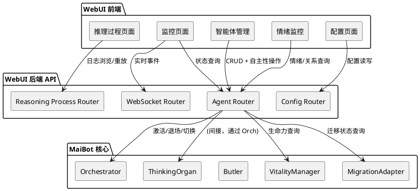
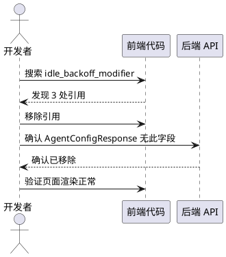
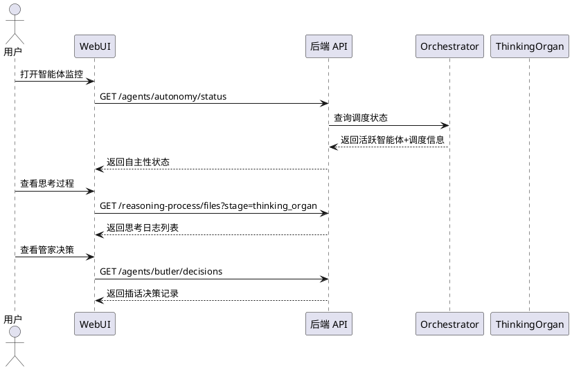

# 1. 组件定位

## 1.1 核心职责

本组件负责对 WebUI 进行全面清算，确保每一个界面、每一个按钮都与当前架构（ThinkingOrgan 迁移后）完全适配，消除失效引用、过时展示和缺失界面。

## 1.2 核心输入

1. 当前 WebUI 前端代码 — `dashboard/src/` 下所有 React 组件、API 客户端、类型定义
2. 当前 WebUI 后端 API — `src/webui/` 下所有路由、schema、服务
3. 架构变更上下文 — ThinkingOrgan 迁移、ChatManager 拆分、记忆系统范式迁移、回复系统 MessagePortV2 迁移
4. 已完成架构变更文档 — `.codeartsdoer/specs/think_organ/` 下的 spec/design/tasks

## 1.3 核心输出

1. 已修复的 WebUI 前端组件 — 移除失效引用、更新过时展示、新增缺失界面
2. 已修复的 WebUI 后端 API — 移除失效字段、新增缺失接口、对齐 schema
3. 已更新的前端类型定义 — 与后端实际返回数据结构一致

## 1.4 职责边界

- 不负责后端架构变更本身（ThinkingOrgan/Orchestrator/ChatManager 的代码修改）
- 不负责新增全新业务功能（仅对齐已有架构的展示和操作）
- 不负责 WebUI 的视觉重设计（仅修复功能性问题）
- 不负责配置文件模板的修改（仅涉及 WebUI schema 和展示层）

# 2. 领域术语

**清算审计**
: 对 WebUI 前后端代码进行逐项比对，识别与当前架构不一致的失效/过时/缺失项。

**失效引用**
: 前端代码引用了后端已删除的 API 端点、数据字段或事件类型，导致运行时报错或功能不可用。

**过时展示**
: 前端展示了旧架构的概念或字段（如 idle_backoff_modifier、timing_gate），这些概念在新架构中已不存在或语义已变更。

**缺失界面**
: 新架构引入的概念（ThinkingOrgan、Orchestrator、管家系统、生命力管理、记忆迁移状态）在 WebUI 中没有对应的展示或操作入口。

**ThinkingOrgan**
: 智能体的思维管道，替代旧 Planner。每个智能体拥有独立实例，支持工具循环、上下文注入、wait 暂停。

**Orchestrator**
: 智能体协调器，统一调度主回复/插话/提醒三条路径。替代旧 MaisakaReasoningEngine 的消息调度/去重/打断功能。

**管家系统（Butler）**
: 共居智能体的三层过滤协调系统，决定"谁看见了消息"和"谁先抢到键盘"。

**TimingGate**
: 旧架构的时机判断阶段，已在 ThinkingOrgan 迁移中移除。WebUI 仍有残留引用。

**IdleBackoffController**
: 旧架构的空闲退避控制器，已删除。其配置字段 idle_backoff_modifier 已从 AgentConfig 中移除。

**MessagePortV2**
: 统一消息发送端口协议，1 个方法 send_message，替代旧 MessagePort 的 7 方法接口。

**MigrationAdapter**
: 记忆系统范式迁移的 5 阶段状态机（LEGACY_ONLY→DUAL_WRITE→DUAL_READ→DATA_MIGRATION→NEW_INDEPENDENT）。

# 3. 角色与边界

## 3.1 核心角色

- **运维人员**：通过 WebUI 监控智能体状态、查看推理过程、管理配置
- **开发者**：通过 WebUI 调试推理过程、查看日志、验证架构变更效果

## 3.2 外部系统

- **MaiBot 后端**：提供 WebUI API，包含智能体管理、配置管理、推理过程浏览等接口
- **MaiSaka WebSocket**：推送实时推理事件（maisaka_monitor 主题）
- **A_Memorix**：记忆服务，通过 MemoryServicePort 访问

## 3.3 交互上下文

# 4. DFX约束

## 4.1 性能

- 清算修复不得引入新的性能退化
- 新增的 ThinkingOrgan/Orchestrator 监控接口响应时间不超过 500ms

## 4.2 可靠性

- 移除失效引用后，所有保留的 WebUI 功能必须可正常使用
- 修复过程中不得破坏现有可用的功能

## 4.3 安全性

- 新增的 API 端点必须继承现有的 require_auth 依赖
- WebSocket 事件订阅必须经过认证

## 4.4 兼容性

- 前端类型定义必须与后端 schema 严格对齐
- 已有的 WebUI API 契约（URL 路径、请求/响应格式）不得破坏性变更
- 新增字段必须有默认值，不影响旧版前端

## 4.5 可维护性

- 清算后的代码不得残留对已删除组件的注释引用
- 新增的监控页面应复用现有的组件模式（TanStack Query、useDataList 等）

# 5. 核心能力

## 5.1 失效引用清除

### 5.1.1 业务规则

1. **idle_backoff_modifier 字段必须从前端移除**：该字段已从 AgentConfig 中删除，前端 `AgentConfigInfo` 接口、`InnerWorldView.tsx` 的 `CollapsedParameters` 组件、`emotion-monitor/index.tsx` 的行为参数展示中仍引用此字段
   - 验收条件：前端代码中无 idle_backoff_modifier 引用 → 后端 AgentConfigResponse 无此字段 → WebUI 不再展示"退避系数"

2. **TimingGate 事件类型必须从前端移除或标记为历史**：TimingGate 已在 ThinkingOrgan 迁移中移除，但 `maisaka-monitor-client.ts` 仍定义 `TimingGateResultEvent`、`MaisakaTimingGateBlock`，`maisaka-monitor.tsx` 仍渲染 `TimingGateCard`
   - 验收条件：前端不再处理 timing_gate.result 事件 → 不再渲染 TimingGateCard → PlannerFinalizedEvent 的 timing_gate 字段标记为可选/历史

3. **旧 Planner/Replier 独立 API 路由必须验证可用性**：前端 `planner-api.ts` 调用 `/api/planner/*` 和 `/api/replier/*`，但后端 `routes.py` 中未注册这些路由（仅有 `/api/webui/reasoning-process/*`）。如果旧路由已删除，planner-monitor.tsx 和 replier-monitor.tsx 将完全不可用
   - 验收条件：确认旧 /api/planner 和 /api/replier 路由是否存在 → 若不存在，移除或重定向对应的监控页面

4. **REMOVED_STAGE_NAMES 中的 timing_gate 必须确认合理性**：reasoning-process.tsx 中 `REMOVED_STAGE_NAMES = ['timing_gate']` 和 `STAGE_LABELS` 中的 timing_gate 标签，需确认是否仍需要展示历史日志
   - 验收条件：历史日志中 timing_gate 阶段仍可查看 → 新日志中不再产生 timing_gate 阶段

### 5.1.2 交互流程

### 5.1.3 异常场景

1. **后端字段已删除但前端仍引用**
   - 触发条件：前端访问已不存在的后端字段（如 idle_backoff_modifier）
   - 系统行为：前端渲染 undefined/NaN
   - 用户感知：界面显示异常值或空白

2. **后端 API 路由已删除**
   - 触发条件：前端调用已不存在的 API 端点（如 /api/planner/overview）
   - 系统行为：请求返回 404
   - 用户感知：页面加载失败，显示错误提示

## 5.2 过时展示更新

### 5.2.1 业务规则

1. **智能体管理页面的"退避系数"展示必须替换**：InnerWorldView.tsx 的 CollapsedParameters 组件展示 idle_backoff_modifier，需替换为新架构的等价概念或移除
   - 验收条件：CollapsedParameters 不再展示 idle_backoff_modifier → 替换为生命力相关参数或直接移除

2. **情绪监控页面的"退避系数"展示必须替换**：emotion-monitor/index.tsx 展示 `×{selectedAgent.idle_backoff_modifier.toFixed(1)}`，需替换或移除
   - 验收条件：情绪监控行为参数区域不再展示退避系数

3. **MaiSaka 监控页面的阶段状态展示必须适配新架构**：当前展示的 stage 名称（如 planner、replyer、timing_gate）需适配 ThinkingOrgan 的新阶段命名
   - 验收条件：新架构产生的阶段名称在监控页面正确展示 → 旧阶段名称仍可查看历史数据

4. **推理过程页面的阶段标签必须适配**：STAGE_LABELS 中的 planner/replier 标签需确认与新架构的阶段命名一致
   - 验收条件：ThinkingOrgan 产生的日志阶段名称在推理过程页面正确展示和分类

5. **路由路径 /planner-monitor 命名应考虑更新**：当前路由路径和页面名称仍使用"Planner Monitor"，但实际已切换为 ThinkingOrgan
   - 验收条件：路由路径和导航菜单名称反映当前架构（可选，低优先级，需评估对用户书签的影响）

### 5.2.2 异常场景

1. **旧阶段名称与新阶段名称映射缺失**
   - 触发条件：ThinkingOrgan 产生新的阶段名称，但 STAGE_LABELS 中无对应标签
   - 系统行为：显示原始英文名称而非中文标签
   - 用户感知：阶段名称显示为英文原始值

## 5.3 缺失界面补充

### 5.3.1 业务规则

1. **ThinkingOrgan 思考状态必须可监控**：新架构中 ThinkingOrgan 替代旧 Planner，但 WebUI 缺少 ThinkingOrgan 专属的监控面板。当前 MaiSaka 监控页面的 planner.request/planner.response 事件需确认是否仍由 ThinkingOrgan 产生
   - ⚠️ **超出本次清算范围**：需新增后端查询接口，修改核心模块代码，待后续专项迭代

2. **Orchestrator 调度状态必须可监控**：Orchestrator 统一调度主回复/插话/提醒，但 WebUI 缺少 Orchestrator 专属的调度状态展示。当前智能体管理页面的自主性面板（autonomy）部分覆盖，但缺少调度决策的可视化
   - ⚠️ **超出本次清算范围**：需新增后端查询接口，待后续专项迭代

3. **管家系统（Butler）插话决策必须可监控**：管家三层过滤（规则过滤→管家LLM→角色LLM）的决策过程在 WebUI 中无展示
   - ⚠️ **超出本次清算范围**：需新增后端查询接口和决策日志持久化，待后续专项迭代

4. **记忆迁移状态必须在 WebUI 可查看和操作**：MigrationAdapter 的 5 阶段状态机（LEGACY_ONLY→DUAL_WRITE→DUAL_READ→DATA_MIGRATION→NEW_INDEPENDENT）在 WebUI 中无展示。后端已有 `/agents/migration/*` API，但前端未接入
   - 验收条件：记忆迁移当前阶段、历史阶段、推进操作在 WebUI 可查看和执行

5. **MessagePortV2 统一消息发送状态应可追踪**：回复系统迁移到 MessagePortV2 后，消息发送的 source（主回复/插话/提醒/插件）应在监控中可区分
   - 验收条件：MaiSaka 监控页面的消息发送事件可区分 source_kind

6. **ChatManager 拆分后的子模块状态应可查看**：ChatManager 已拆分为 6 个子模块（SessionStore/MessageRegistry/SessionNameCache/SessionResolver/BindingRestorer/SessionLifecycle），WebUI 的聊天管理页面需确认是否受影响
   - 验收条件：聊天管理页面的所有功能（会话列表、绑定管理、消息查看）正常工作

### 5.3.2 交互流程

### 5.3.3 异常场景

1. **新增监控接口后端未实现**
   - 触发条件：前端新增了监控面板但后端 API 不存在
   - 系统行为：请求返回 404
   - 用户感知：监控面板显示"暂无数据"或加载失败

2. **WebSocket 事件格式变更**
   - 触发条件：ThinkingOrgan 产生的事件格式与旧 Planner 不同
   - 系统行为：前端解析失败
   - 用户感知：监控页面不显示新事件

## 5.4 数据契约对齐

### 5.4.1 业务规则

1. **AgentConfigInfo 前端类型必须与后端 AgentConfigResponse 对齐**：当前前端 `AgentConfigInfo` 包含 `idle_backoff_modifier` 字段，但后端 `AgentConfigResponse` 已移除此字段
   - 验收条件：前端 AgentConfigInfo 的字段集合 ⊆ 后端 AgentConfigResponse 的字段集合

2. **MaisakaMonitorClient 事件类型必须与后端 WebSocket 事件对齐**：前端定义了 TimingGateResultEvent、PlannerRequestEvent、PlannerResponseEvent 等类型，需确认后端是否仍发送这些事件
   - 验收条件：前端监听的所有事件类型在后端仍有对应的事件发射点

3. **ReasoningPromptFile 前端类型必须与后端对齐**：推理过程日志的 stage 字段值需与 ThinkingOrgan 产生的日志目录名一致
   - 验收条件：前端默认 stage 参数（'planner'）能正确匹配 ThinkingOrgan 产生的日志

4. **CohabitantInfo 和 SessionAgentInfo 的 vitality_value 字段必须对齐**：前端定义为可选（`vitality_value?: number`），后端 schema 中 CohabitantInfo 无此字段、SessionAgentInfo 也无此字段
   - 验收条件：前端类型定义与后端 schema 完全一致

### 5.4.2 异常场景

1. **前端类型比后端多字段**
   - 触发条件：前端定义了后端不返回的字段（如 idle_backoff_modifier）
   - 系统行为：前端渲染 undefined
   - 用户感知：界面显示空白或 NaN

2. **后端返回了前端未定义的字段**
   - 触发条件：后端新增了字段但前端类型未更新
   - 系统行为：前端忽略该字段
   - 用户感知：新功能信息不可见

## 5.5 配置 Schema 适配

### 5.5.1 业务规则

1. **agent_autonomy.enabled 配置项的默认值变更必须在 WebUI 展示**：默认值已从 false 改为 true，WebUI 配置页面需反映此变更
   - 验收条件：配置页面中 agent_autonomy.enabled 的默认值显示为 true

2. **idle_backoff_modifier 配置项必须从 WebUI schema 中移除**：该配置项已从 AgentConfig 中移除，WebUI 的动态表单不应再展示此字段
   - 验收条件：配置页面中不出现 idle_backoff_modifier 字段

3. **新增的 ThinkingOrgan 相关配置项必须在 WebUI 可配置**：如工具循环最大轮次、思考相似度阈值等（如果后端 schema 已暴露）
   - 验收条件：新增配置项在 WebUI 配置页面可见可编辑

### 5.5.2 异常场景

1. **配置 schema 变更后前端表单渲染失败**
   - 触发条件：后端 schema 移除字段后前端仍尝试渲染
   - 系统行为：前端表单显示空白字段
   - 用户感知：配置页面出现空白或异常字段

# 6. 数据约束

## 6.1 AgentConfigInfo（前端类型，需修正）

1. **agent_id**：字符串，唯一标识
2. **display_name**：字符串，显示名称
3. **personality**：字符串，人设描述
4. **reply_style**：字符串，回复风格
5. **is_default**：布尔，是否默认智能体
6. **color**：字符串，颜色值
7. **emotion_baseline**：字典，情绪基线
8. **emotion_decay_rate**：浮点数，情绪衰减率
9. **relationship_growth_rate**：浮点数，关系增长率
10. **talk_value_modifier**：浮点数，发言值修正
11. **idle_backoff_modifier**：**需移除**，已从后端删除
12. **memory_focus_areas**：字符串列表，记忆关注领域
13. **internal_relationships**：内部关系列表
14. **anti_mechanization_rules**：字符串列表，反机械化规则

## 6.2 MaisakaMonitorEvent（前端类型，需适配）

1. **timing_gate.result**：**需移除或标记为历史**，TimingGate 已删除
2. **planner.request**：需确认 ThinkingOrgan 是否仍发射此事件
3. **planner.response**：需确认 ThinkingOrgan 是否仍发射此事件
4. **planner.finalized**：需确认 ThinkingOrgan 是否仍发射此事件
5. **replier.request**：需确认 replyer 管道是否仍发射此事件
6. **replier.response**：需确认 replyer 管道是否仍发射此事件

## 6.3 ReasoningPromptListParams（前端类型，需适配）

1. **stage**：默认值 'planner'，需确认 ThinkingOrgan 产生的日志目录名是否仍为 'planner'
2. **session**：默认值 'auto'，无需变更
3. **action**：过滤动作类型，需确认 ThinkingOrgan 的动作类型命名
