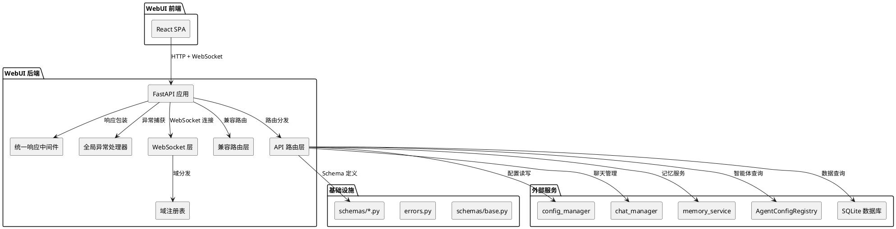
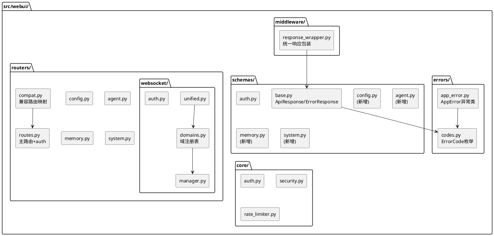
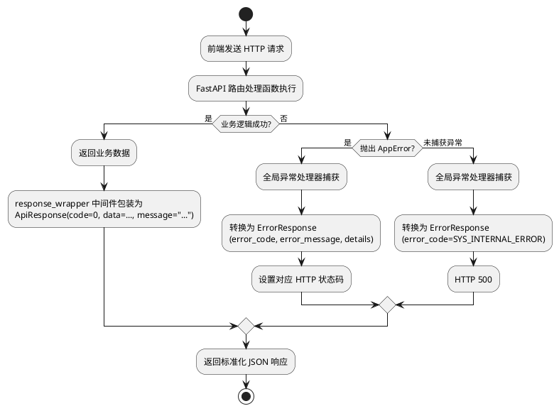
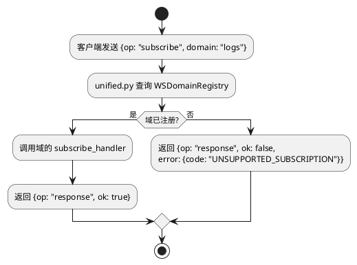
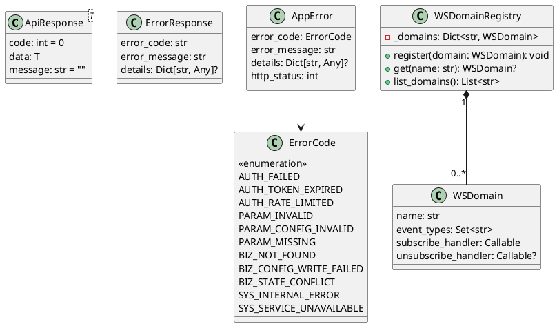

# WebUI 后端架构重构 — 增量设计文档

# 一、需求与存量功能关系分析

## 1.1 需求功能与存量功能对比

### 1.1.1 已实现功能

| 需求功能 | 存量功能 | 代码位置 | 匹配度 |
|---------|---------|---------|--------|
| 统一 WebSocket 入口端点 | 已有 `/ws` 统一端点，支持 subscribe/unsubscribe/call/ping/pong | `routers/websocket/unified.py:554` | 100% |
| WebSocket 操作码定义 | 已定义 subscribe/unsubscribe/call/response/event/ping/pong | `routers/websocket/unified.py:527-544` | 100% |
| WebSocket 域划分 | 已实现 logs/plugin_progress/maisaka_monitor/chat 四个域 | `routers/websocket/unified.py:186-196` | 100% |
| WebSocket 订阅确认响应 | 已实现 ok=True/False 的订阅确认 | `routers/websocket/manager.py:251-277` | 100% |
| WebSocket 心跳机制 | 已实现 ping/pong + 时间戳 | `routers/websocket/manager.py:310-323` | 100% |
| WebSocket 连接管理器 | UnifiedWebSocketManager 已实现连接池/订阅/广播/串行发送 | `routers/websocket/manager.py:28-346` | 100% |
| 认证依赖注入 | require_auth / verify_token_optional 已实现 | `dependencies.py:8-70` | 100% |
| Token 管理器 | TokenManager 已实现生成/验证/更新/重置 | `core/security.py` | 100% |
| 频率限制 | RateLimiter 已实现 | `core/rate_limiter.py` | 100% |
| CORS 配置 | 已配置多源 + credentials | `app.py:110-131` | 100% |
| 静态文件服务 | SPA 模式 + 路径遍历防护 | `app.py:179-235` | 100% |
| 配置 Schema 生成器 | ConfigSchemaGenerator 已实现 ConfigBase→前端表单 Schema | `config_schema.py:218-339` | 100% |
| 兼容路由机制 | config 和 memory 模块已有 compat_router | `routers/config.py:68`, `routers/memory.py:26` | 75% |
| 路由聚合注册 | `get_all_routers()` 已实现统一注册 | `routers/__init__.py:15-27` | 75% |
| Pydantic Schema 目录 | `schemas/` 目录已存在，含 auth/chat/emoji/plugin/statistics | `schemas/` | 50% |

### 1.1.2 需要扩展的功能

| 需求功能 | 存量功能 | 差异说明 | 扩展方向 |
|---------|---------|---------|---------|
| 统一响应体 {code, data, message} | 各端点返回格式不统一：有的返回 `{"success": True, ...}`，有的返回裸 Pydantic model，有的返回 `{"status": "healthy"}` | 缺少全局响应包装中间件/装饰器；agent.py 的 AgentListResponse 自带 success 字段但不是 code/data/message 格式 | 新增统一响应包装机制（中间件 + Pydantic 泛型模型），逐路由迁移 |
| 统一错误响应 {error_code, error_message, details} | 当前错误通过 HTTPException(detail=...) 返回，无结构化错误码，detail 为纯文本 | 缺少错误码分类体系（AUTH_*/PARAM_*/BIZ_*/SYS_*），无 details 字段 | 新增 AppError 异常类 + 全局异常处理器，定义错误码枚举 |
| API 路径规范化 /api/webui/{resource} | agent 路由在 /api/webui/agent/* 下（单数），chat 路由在 /api/chat/* 下（无 webui 前缀），config/memory 有 compat_router 但路径映射不完整 | agent 用单数名词，chat 缺少 webui 前缀，无统一的复数名词规范 | 新增规范化路由别名，保留旧路由作为兼容路由 |
| 兼容路由完整覆盖 | 仅 config 和 memory 有 compat_router，chat 路由直接挂载在 /api/chat/ 下无兼容层 | chat 路由的 prefix 是 `/api/chat` 而非 `/api/webui/chat`，缺少重定向 | 为 chat 路由新增 compat_router 或调整 prefix |
| Pydantic Schema 外迁 | routes.py 中内联定义了 TokenVerifyRequest/TokenVerifyResponse 等 6 个 Schema；config.py 中内联定义了 15+ 个 Schema | routes.py 的 auth Schema 已有 schemas/auth.py 副本但未使用；config.py 的 Schema 全部内联 | 将内联 Schema 迁移到 schemas/ 目录，路由文件只 import |
| response_model 声明 | 部分端点声明了 response_model（如 agent.py），部分未声明（如 health_check、logout） | 未声明的端点无法在 OpenAPI 文档中展示响应结构 | 补全所有端点的 response_model |
| WebSocket 域事件类型注册 | 事件类型为硬编码字符串（如 "entry"、"snapshot"、"stage.snapshot"） | 缺少枚举/常量定义，无注册机制，新增域需修改 unified.py | 新增域注册表 + 事件类型枚举，解耦域处理逻辑 |
| 配置写入统一入口 | config.py 部分端点通过 save_toml_with_format 写入，部分直接操作 tomlkit | 缺少 config_manager 统一入口，写入后未触发 reload | 统一通过 config_manager 写入，写入后触发 reload |

### 1.1.3 需要新增的功能或接口

**统一响应体模块**（`src/webui/schemas/base.py`）
- `ApiResponse[T]` 泛型模型：`code: int = 0`, `data: T`, `message: str`
- `ErrorResponse` 模型：`error_code: str`, `error_message: str`, `details: Optional[dict]`
- 响应包装中间件或依赖

**错误码体系**（`src/webui/errors.py`）
- `ErrorCode` 枚举：AUTH_FAILED / AUTH_TOKEN_EXPIRED / AUTH_RATE_LIMITED / PARAM_INVALID / PARAM_CONFIG_INVALID / PARAM_MISSING / BIZ_NOT_FOUND / BIZ_CONFIG_WRITE_FAILED / BIZ_STATE_CONFLICT / SYS_INTERNAL_ERROR / SYS_SERVICE_UNAVAILABLE
- `AppError` 异常类：封装 error_code + error_message + details + http_status
- 全局异常处理器：AppError → 统一错误响应，未捕获异常 → SYS_INTERNAL_ERROR

**兼容路由模块**（`src/webui/routers/compat.py`）
- 路径映射表：旧路径 → 新路径
- FastAPI 路由别名实现：兼容路由内部调用新路由的处理函数
- deprecation 日志记录

**WebSocket 域注册表**（`src/webui/routers/websocket/domains.py`）
- `WSDomain` 数据类：domain_name, event_types, subscribe_handler, unsubscribe_handler
- `WSDomainRegistry` 类：注册/查询域，解耦 unified.py 中的 if-elif 链
- 四个域的注册实例：LogsDomain, PluginProgressDomain, MaisakaMonitorDomain, ChatDomain

**测试基础设施**（`tests/webui/`）
- conftest.py：httpx AsyncClient fixture + 认证 fixture
- 断言工具：assert_api_response / assert_api_error
- 核心路由集成测试

## 1.2 存量功能详细分析

### 1.2.1 统一 WebSocket 架构（已实现，需扩展）

**接口契约**：
- 入口端点：`/ws`（通过 unified router 注册到 `/api/webui/ws`）
- 认证：query token 或 cookie token
- 消息格式：`{op, id?, domain?, topic?, event?, data?, ok?, error?, ts?}`

**业务规则**：
- 连接建立后发送 `{op: "event", domain: "system", event: "ready"}` 事件
- subscribe 时先发 response 确认，再发 snapshot 事件推送历史数据
- chat 域通过 call 操作码 + method 字段分发（session.open / session.close / message.send / session.update_nickname）
- 发送队列串行化：每个连接一个 asyncio.Queue + sender_task，避免并发写入 WebSocket

**扩展点**：
- 域处理逻辑硬编码在 `_handle_subscribe` 和 `_handle_call` 中（if-elif 链），新增域需修改 unified.py
- 事件类型为字符串字面量，无枚举约束

**约束**：
- 跨线程投递：WebUI 运行在独立线程事件循环中，`enqueue()` 通过 `run_coroutine_threadsafe` 跨 loop 投递
- 连接断开时需清理 chat_manager 和 websocket_manager 两处状态

### 1.2.2 路由注册机制（已实现，需扩展）

**接口契约**：
- `get_all_routers()` 返回需要独立注册的路由器列表
- 主路由器 prefix `/api/webui`，子路由器各自定义 prefix
- compat_router 独立注册，prefix 为旧路径（如 `/api/config`）

**业务规则**：
- config.py 的 compat_router prefix 为 `/api/config`，将旧路径请求转发到新路由
- memory.py 的 compat_router prefix 为 `/api`，覆盖 `/api/memory/*` 旧路径
- chat 路由 prefix 为 `/api/chat`，直接挂载，无 webui 前缀

**扩展点**：
- chat 路由缺少 compat_router，需新增
- agent 路由使用单数名词 `/agent`，需新增复数别名 `/agents`

**约束**：
- compat_router 必须与主路由器使用相同的依赖注入（`dependencies=[Depends(require_auth)]`）

### 1.2.3 配置管理（已实现，需统一入口）

**接口契约**：
- `save_toml_with_format(data, file_path)` — 格式化保存 TOML 文件
- `config_manager` — 全局配置管理器，持有 Config 和 ModelConfig 实例
- `ConfigSchemaGenerator` — 将 ConfigBase 子类转换为前端表单 Schema

**业务规则**：
- 配置读取：通过 `config_manager.global_config` 或 `config_manager.model_config` 读取
- 配置写入：部分端点通过 `save_toml_with_format` 直接写文件，部分通过 `config_manager` 间接写
- Schema 生成：ConfigSchemaGenerator 使用 `@lru_cache` 缓存 Schema，支持 A_memorix 字段可见性控制

**扩展点**：
- 写入后未统一触发 `config_manager.reload()`
- 部分端点直接操作 tomlkit 而非通过 config_manager

**约束**：
- 配置文件修改后需重启容器才能生效（Docker 环境），reload 只更新运行时配置
- save_toml_with_format 保留原文件注释和格式

### 1.2.4 认证与安全（已实现，无需改动）

**接口契约**：
- `require_auth` — 强制认证依赖，从 Cookie 获取 token 并验证
- `verify_token_optional` — 可选认证依赖，返回 bool
- `check_auth_rate_limit` — 认证频率限制

**约束**：
- Token+Cookie 机制保持不变（spec 明确不重新设计认证架构）
- WebSocket 认证复用同一套 token 验证逻辑

# 二、增量设计方案

## 2.1 实现模型

### 2.1.1 上下文视图



### 2.1.2 服务/组件总体架构



### 2.1.3 实现设计文档

#### 统一响应包装流程



#### WebSocket 域注册与分发流程



## 2.2 接口设计

### 2.2.1 总体设计

**接口分类**：
1. **统一响应接口**：所有 HTTP API 端点返回 `ApiResponse[T]` 或 `ErrorResponse`
2. **兼容路由接口**：旧路径转发到新路径，返回格式相同
3. **WebSocket 接口**：统一端点 + 域注册表

**接口变更策略**：
- 渐进式迁移：新端点直接使用统一响应体，旧端点通过中间件包装
- 兼容路由在过渡期内保留，日志记录使用情况
- WebSocket 协议不破坏现有消息格式，新字段为可选追加

| 接口分组 | 稳定性 | 说明 |
|---------|--------|------|
| ApiResponse / ErrorResponse | 稳定 | 统一响应体，所有端点必须使用 |
| ErrorCode 枚举 | 稳定 | 错误码定义，按领域分类前缀 |
| WSDomainRegistry | 稳定 | WebSocket 域注册表 |
| 兼容路由 | 废弃 | 过渡期保留，SSD2 完成后移除 |

### 2.2.2 接口清单

#### 统一响应体

```python
# src/webui/schemas/base.py

class ApiResponse(BaseModel, Generic[T]):
    """统一成功响应体"""
    code: int = 0
    data: T
    message: str = ""

class ErrorDetail(BaseModel):
    """错误详情"""
    code: str
    message: str

class ErrorResponse(BaseModel):
    """统一错误响应体"""
    error_code: str
    error_message: str
    details: Optional[Dict[str, Any]] = None
```

#### 错误码枚举

```python
# src/webui/errors/codes.py

class ErrorCode(str, Enum):
    # 认证类
    AUTH_FAILED = "AUTH_FAILED"
    AUTH_TOKEN_EXPIRED = "AUTH_TOKEN_EXPIRED"
    AUTH_RATE_LIMITED = "AUTH_RATE_LIMITED"
    # 参数类
    PARAM_INVALID = "PARAM_INVALID"
    PARAM_CONFIG_INVALID = "PARAM_CONFIG_INVALID"
    PARAM_MISSING = "PARAM_MISSING"
    # 业务类
    BIZ_NOT_FOUND = "BIZ_NOT_FOUND"
    BIZ_CONFIG_WRITE_FAILED = "BIZ_CONFIG_WRITE_FAILED"
    BIZ_STATE_CONFLICT = "BIZ_STATE_CONFLICT"
    # 系统类
    SYS_INTERNAL_ERROR = "SYS_INTERNAL_ERROR"
    SYS_SERVICE_UNAVAILABLE = "SYS_SERVICE_UNAVAILABLE"
```

#### 应用异常类

```python
# src/webui/errors/app_error.py

class AppError(Exception):
    """统一业务异常，携带错误码和 HTTP 状态码"""
    error_code: ErrorCode
    error_message: str
    details: Optional[Dict[str, Any]]
    http_status: int

    def __init__(
        self,
        error_code: ErrorCode,
        error_message: str = "",
        details: Optional[Dict[str, Any]] = None,
        http_status: int = 500,
    ) -> None: ...
```

#### WebSocket 域注册表

```python
# src/webui/routers/websocket/domains.py

class WSDomain:
    """WebSocket 域定义"""
    name: str
    event_types: set[str]
    subscribe_handler: Callable
    unsubscribe_handler: Optional[Callable]

class WSDomainRegistry:
    """WebSocket 域注册表"""
    _domains: Dict[str, WSDomain]

    def register(self, domain: WSDomain) -> None: ...
    def get(self, name: str) -> Optional[WSDomain]: ...
    def list_domains(self) -> list[str]: ...
```

#### WebSocket 事件类型枚举

```python
# src/webui/routers/websocket/domains.py

class LogsEventType(str, Enum):
    ENTRY = "entry"
    SNAPSHOT = "snapshot"

class PluginProgressEventType(str, Enum):
    UPDATE = "update"
    SNAPSHOT = "snapshot"

class MaisakaMonitorEventType(str, Enum):
    STAGE_SNAPSHOT = "stage.snapshot"
    STAGE_UPDATE = "stage.update"

class ChatEventType(str, Enum):
    MESSAGE = "message"
    TYPING = "typing"
    WELCOME = "welcome"
```

#### 兼容路由映射表

| 旧路径 | 新路径 | 实现方式 |
|--------|--------|---------|
| `/api/chat/*` | `/api/webui/chat/*` | compat_router prefix 重映射 |
| `/api/config/*` | `/api/webui/config/*` | 已有 compat_router |
| `/api/memory/*` | `/api/webui/memory/*` | 已有 compat_router |
| `/api/webui/agent/list` | `/api/webui/agents` | 路由别名 |
| `/api/webui/agent/{id}` | `/api/webui/agents/{id}` | 路由别名 |
| `/api/webui/agent/emotion/{id}` | `/api/webui/agents/{id}/emotion` | 路由别名 |
| `/api/webui/agent/relationship/{id}` | `/api/webui/agents/{id}/relationships` | 路由别名 |
| `/api/webui/agent/binding/session/{id}` | `/api/webui/agents/bindings/sessions/{id}` | 路由别名 |
| `/ws/logs` | 废弃（迁移到统一 WS） | 保留但标记 deprecated |

**兼容路由实现方式**：FastAPI 路由别名（在同一 Router 上注册多个路径指向同一处理函数），而非中间件重写。原因：
1. FastAPI 原生支持同一路由多个路径，无需额外中间件
2. 中间件重写会丢失原始路径的 OpenAPI 文档
3. 路由别名实现简单，性能开销为零

## 2.3 数据模型

### 2.3.1 设计目标

1. 所有 HTTP API 响应统一为 `ApiResponse[T]` 或 `ErrorResponse` 格式
2. 错误码按领域分类，前端可根据 error_code 前缀判断错误类型
3. WebSocket 消息格式保持现有结构，新增域和事件类型通过注册表管理
4. Schema 与路由分离，路由文件只 import 不定义

### 2.3.2 模型实现



**对象创建和销毁策略**：
- `WSDomainRegistry` 为模块级单例，应用启动时注册四个域
- `AppError` 在路由处理函数中按需创建，由全局异常处理器统一转换为 `ErrorResponse`
- `ApiResponse` 通过响应包装中间件自动创建，路由处理函数只需返回业务数据

**持久化策略**：
- 本重构不涉及数据库 Schema 变更
- 配置写入通过 config_manager 统一入口，持久化到 TOML 文件