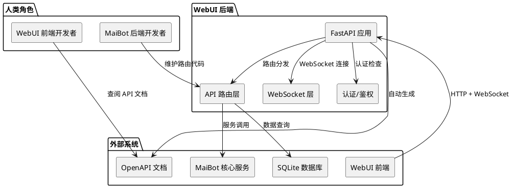
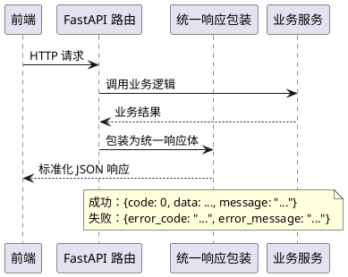
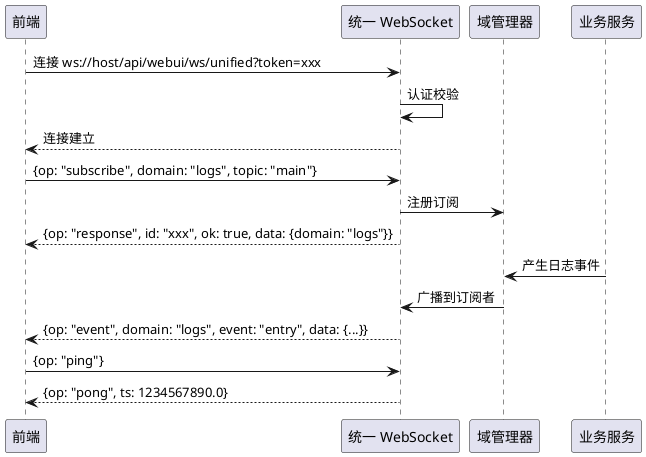
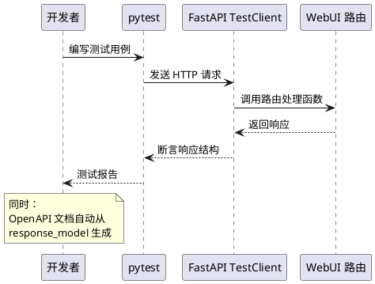
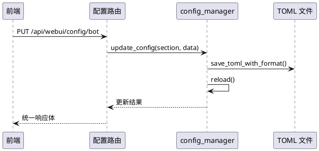

# **1. 组件定位**

## **1.1 核心职责**

本组件负责重构 MaiBot WebUI 后端架构，统一 API 设计规范、WebSocket 消息协议、工程化基础设施和配置管理，使后端 API 可维护、可测试、可演进。

## **1.2 核心输入**

1. **前端 HTTP 请求**：WebUI 前端发起的 REST API 调用（GET/POST/PUT/DELETE/PATCH）
2. **前端 WebSocket 连接**：WebUI 前端建立的统一 WebSocket 长连接（含订阅/调用/心跳）
3. **MaiBot 核心服务调用**：WebUI 路由对 chat_manager、config_manager、memory_service 等内部服务的调用请求
4. **配置文件变更**：bot_config.toml 和 model_config.toml 的读写请求

## **1.3 核心输出**

1. **标准化 API 响应**：统一格式的 JSON 响应体（含 code/data/message 结构）
2. **标准化错误响应**：统一格式的错误响应体（含 error_code/error_message/details）
3. **WebSocket 事件推送**：统一协议的实时事件（logs/plugin_progress/maisaka_monitor/chat 四个域）
4. **OpenAPI 文档**：自动生成的、完整的 API 文档（含所有端点的请求/响应 Schema）

## **1.4 职责边界**

1. 本组件不负责前端代码改动（前端适配在 SSD2 中处理）
2. 本组件不负责 MaiBot 核心服务层（chat_manager、memory_service 等）的接口变更
3. 本组件不负责 WebUI 认证/鉴权架构的重新设计（现有 Token+Cookie 机制保持不变）
4. 本组件不负责新增业务功能（只重构现有 API 的规范性，不新增端点）
5. 本组件不负责数据库 Schema 变更

# **2. 领域术语**

**API 端点**
: WebUI 后端暴露的 HTTP 接口，统一前缀 `/api/webui`，需认证后访问。

**统一响应体**
: 所有 API 端点返回的标准化 JSON 结构，包含 `code`（业务状态码）、`data`（业务数据）、`message`（人类可读消息）三个顶层字段。

**统一错误体**
: API 调用失败时返回的标准化 JSON 结构，包含 `error_code`（错误码字符串）、`error_message`（错误描述）、`details`（可选的详细信息）。

**WebSocket 域**
: WebSocket 事件推送的逻辑分区，当前包含 `logs`、`plugin_progress`、`maisaka_monitor`、`chat` 四个域。

**WebSocket 操作码**
: WebSocket 消息的操作类型标识，当前已定义 `subscribe`、`unsubscribe`、`call`、`response`、`event`、`ping`、`pong`。

**兼容路由**
: 为保持前端向后兼容而保留的旧路径映射（如 `/api/config/*` → `/api/webui/config/*`），在过渡期后移除。

**Pydantic Schema**
: 使用 Pydantic BaseModel 定义的请求/响应数据模型，用于自动校验输入和生成 OpenAPI 文档。

**配置 Schema 生成器**
: `ConfigSchemaGenerator` 类，将 ConfigBase 子类自动转换为前端可消费的表单 Schema。

# **3. 角色与边界**

## **3.1 核心角色**

- **WebUI 前端开发者**：通过 HTTP API 和 WebSocket 与后端交互，需要清晰的接口文档和稳定的 API 契约
- **MaiBot 后端开发者**：维护 WebUI 路由和服务代码，需要可维护的代码结构和可运行的测试

## **3.2 外部系统**

- **MaiBot 核心服务**：chat_manager、config_manager、memory_service、AgentConfigRegistry 等，WebUI 路由调用这些服务获取数据
- **MaiBot 数据库**：SQLite（SQLModel/SQLAlchemy），WebUI 路由直接查询数据库获取会话/消息/人物信息
- **FastAPI 框架**：提供路由、依赖注入、OpenAPI 文档生成等能力
- **WebUI 前端**：React 19 + Vite 7 应用，通过 HTTP 和 WebSocket 消费后端 API

## **3.3 交互上下文**

# **4. DFX约束**

## **4.1 性能**

1. API 响应时间不得因规范化改造而增加超过 10%（统一响应体包装的开销应小于 1ms）
2. WebSocket 消息序列化不得引入可感知的延迟（JSON 序列化耗时小于 1ms/条）
3. OpenAPI 文档生成不得影响应用启动时间（Schema 应在首次请求时惰性生成或缓存）

## **4.2 可靠性**

1. API 路由规范化不得改变现有业务行为（输入相同请求，输出相同的业务数据）
2. 兼容路由必须在过渡期内保持功能完全一致
3. WebSocket 协议变更必须支持渐进式迁移（新旧协议可同时运行）

## **4.3 安全性**

1. 统一错误响应不得泄露内部实现细节（如数据库错误信息、堆栈跟踪）
2. OpenAPI 文档端点必须受认证保护（与现有 API 端点一致）
3. 错误码不得暴露服务器内部状态（如文件路径、进程 ID）

## **4.4 可维护性**

1. 新增 API 端点必须遵循统一规范，无需额外文档说明
2. Pydantic Schema 必须与路由端点一一对应，可通过 OpenAPI 文档自动验证
3. 测试覆盖率目标：核心路由（config/agent/memory/system）> 50%

## **4.5 兼容性**

1. 现有 API 路径和响应格式必须保持向后兼容（前端不改动的情况下功能不变）
2. 新的统一响应体通过 API 版本前缀或请求头协商引入，旧端点行为不变
3. WebSocket 现有消息格式必须保持兼容，新字段为可选追加

# **5. 核心能力**

## **5.1 API 路由规范化**

统一 WebUI 后端 API 的命名规范、响应格式和错误处理，消除当前路由命名不一致、响应格式混乱、错误码缺失的问题。

### **5.1.1 业务规则**

1. **路径命名规范**：API 路径必须使用小写复数名词，单词间用下划线连接，资源层级用 `/` 分隔
   a. 验收条件：[检查所有路由的 prefix] → [符合 `/api/webui/{resource_name}` 模式，如 `/api/webui/agents`、`/api/webui/config`、`/api/webui/memories`]

2. **HTTP 方法语义规范**：必须正确使用 HTTP 方法语义（GET 查询、POST 创建/动作、PUT 全量更新、PATCH 部分更新、DELETE 删除）
   a. 验收条件：[检查所有路由端点的 HTTP 方法] → [无语义误用，如用 GET 执行写操作、用 POST 执行删除]

3. **统一响应体规范**：所有 API 端点必须返回统一的 JSON 响应结构，包含 `code`（整数，0 表示成功）、`data`（业务数据）、`message`（人类可读消息）三个顶层字段
   a. 验收条件：[调用任意 API 端点] → [响应体包含 code/data/message 三个字段，成功时 code=0]

4. **统一错误响应规范**：API 调用失败时必须返回统一的错误响应结构，包含 `error_code`（字符串，如 `AUTH_FAILED`）、`error_message`（人类可读描述）、`details`（可选详细信息）
   a. 验收条件：[触发任意 API 错误] → [响应体包含 error_code/error_message 字段，HTTP 状态码与错误类型匹配]

5. **错误码分类规范**：错误码必须按领域分类前缀，认证类 `AUTH_*`、参数类 `PARAM_*`、业务类 `BIZ_*`、系统类 `SYS_*`
   a. 验收条件：[检查所有错误码定义] → [均符合分类前缀规范]

6. **禁止项**：不得在路由处理函数中直接返回非标准格式的 JSON（如 `{"success": True, ...}` 不符合新规范）
   a. 验收条件：[检查所有路由返回值] → [均通过统一响应体包装，无裸字典返回]

### **5.1.2 交互流程**

### **5.1.3 异常场景**

1. **业务逻辑抛出未捕获异常**
   a. 触发条件：路由处理函数中业务代码抛出非 HTTPException 异常
   b. 系统行为：全局异常处理器捕获，转换为统一错误响应（error_code=`SYS_INTERNAL_ERROR`，HTTP 500）
   c. 用户感知：前端收到标准错误响应，日志记录完整堆栈

2. **旧端点兼容性冲突**
   a. 触发条件：规范化后的路径与现有前端硬编码路径不一致
   b. 系统行为：保留旧路径作为兼容路由（compat_router），内部转发到新路由
   c. 用户感知：旧前端功能不受影响，日志记录兼容路由使用情况

## **5.2 WebSocket 架构改进**

统一 WebSocket 消息格式和事件类型定义，消除多个端点职责不清、消息格式不统一的问题。

### **5.2.1 业务规则**

1. **单一入口规范**：所有 WebSocket 连接必须通过统一端点 `/api/webui/ws/unified` 接入，不得新增独立 WebSocket 端点
   a. 验收条件：[检查 WebSocket 路由注册] → [仅有 unified 一个 WebSocket 端点，旧 `/ws/logs` 和 `/ws/chat` 已废弃或重定向]

2. **消息格式规范**：所有 WebSocket 消息必须包含 `op`（操作码）字段，客户端→服务端支持 `subscribe`/`unsubscribe`/`call`/`ping`，服务端→客户端支持 `response`/`event`/`pong`
   a. 验收条件：[发送/接收任意 WebSocket 消息] → [消息体均包含 `op` 字段且值为合法操作码]

3. **域定义规范**：WebSocket 事件推送必须按域（domain）组织，当前定义的域为 `logs`、`plugin_progress`、`maisaka_monitor`、`chat`，新增域必须注册到域清单中
   a. 验收条件：[检查域清单定义] → [包含上述四个域，新增域有明确的注册流程]

4. **事件类型注册规范**：每个域的事件类型必须显式定义和注册，不得使用动态字符串作为事件类型
   a. 验收条件：[检查事件类型定义] → [每个域的事件类型为枚举或常量集合，无硬编码字符串]

5. **订阅确认规范**：客户端订阅域/主题后，服务端必须返回订阅确认响应（ok=True/False），订阅失败时必须说明原因
   a. 验收条件：[客户端发送 subscribe 请求] → [收到 response 消息，ok 字段明确指示订阅结果]

6. **禁止项**：不得在 WebSocket 消息中使用未在协议中定义的操作码或事件类型
   a. 验收条件：[检查所有 WebSocket 消息] → [op 值和 event 值均为已定义的合法值]

### **5.2.2 交互流程**

### **5.2.3 异常场景**

1. **客户端订阅不存在的域**
   a. 触发条件：客户端发送 `{op: "subscribe", domain: "unknown_domain"}`
   b. 系统行为：返回订阅失败响应（ok=False，error_code=`UNSUPPORTED_SUBSCRIPTION`）
   c. 用户感知：前端收到错误响应，可提示用户

2. **WebSocket 连接认证失败**
   a. 触发条件：客户端提供的 token 无效或已过期
   b. 系统行为：关闭连接（code=4001，reason="认证失败"）
   c. 用户感知：前端触发重新登录流程

3. **旧 WebSocket 端点访问**
   a. 触发条件：前端仍连接 `/ws/logs` 或 `/ws/chat` 旧端点
   b. 系统行为：旧端点保留但标记为 deprecated，日志记录 deprecation 警告
   c. 用户感知：功能暂不受影响，控制台显示弃用警告

## **5.3 工程化提升**

补全 Pydantic Schema、生成 OpenAPI 文档、建立基础测试框架，使 WebUI 后端具备工程化开发的基础能力。

### **5.3.1 业务规则**

1. **Schema 补全规范**：所有 API 端点必须声明 `response_model` 参数，请求体必须使用 Pydantic BaseModel，不得使用裸 `Dict[str, Any]` 作为请求/响应类型
   a. 验收条件：[检查所有路由端点定义] → [均有 response_model 声明，请求体均为 BaseModel 子类]

2. **Schema 归属规范**：Pydantic Schema 必须定义在 `src/webui/schemas/` 目录下，按功能模块分文件组织，不得在路由文件中内联定义 Schema
   a. 验收条件：[检查路由文件] → [无内联 BaseModel 定义，Schema 均在 schemas/ 目录]
   : 备注：当前 routes.py 中定义了 TokenVerifyRequest/TokenVerifyResponse 等 Schema，需迁移到 schemas/auth.py

3. **OpenAPI 文档规范**：FastAPI 应用必须配置完整的 OpenAPI 元信息（title、description、version），所有端点必须有 summary 和 description
   a. 验收条件：[访问 /docs 或 /openapi.json] → [所有端点有中文描述，请求/响应 Schema 完整]

4. **测试框架规范**：必须建立基于 pytest + httpx 的异步测试基础设施，提供认证 fixture 和通用断言工具
   a. 验收条件：[运行 `pytest tests/webui/`] → [测试框架可运行，核心路由有基础测试用例]

5. **测试覆盖规范**：核心路由（config、agent、memory、system）必须有基本的集成测试，覆盖正常流程和主要错误场景
   a. 验收条件：[运行 `pytest --cov=src/webui tests/webui/`] → [核心路由覆盖率 > 50%]

6. **禁止项**：不得在路由文件中定义 Pydantic Schema（当前 config.py 中有大量内联 Schema 定义，需迁移）
   a. 验收条件：[检查 config.py] → [无 BaseModel 子类定义，Schema 已迁移到 schemas/]

### **5.3.2 交互流程**

### **5.3.3 异常场景**

1. **Schema 迁移导致循环导入**
   a. 触发条件：将内联 Schema 迁移到 schemas/ 时，Schema 引用了路由中的类型
   b. 系统行为：重构 Schema 消除循环依赖，必要时提取共享类型到 schemas/base.py
   c. 用户感知：应用正常启动，无 ImportError

2. **测试环境缺少依赖服务**
   a. 触发条件：集成测试需要 chat_manager、database 等服务，但测试环境未初始化
   b. 系统行为：使用 mock/fixture 提供测试替身，核心逻辑可独立测试
   c. 用户感知：测试可在无完整服务依赖的情况下运行

## **5.4 配置管理统一化**

统一 bot_config.toml 和 model_config.toml 的读写逻辑，消除配置变更分散在多个路由中的问题。

### **5.4.1 业务规则**

1. **配置读写入口规范**：所有配置读写操作必须通过 config_manager 统一入口，路由不得直接操作 TOML 文件
   a. 验收条件：[检查路由中的 tomlkit/toml_utils 直接调用] → [配置写入均通过 config_manager，无直接文件操作]

2. **配置变更通知规范**：配置写入后必须触发 config_manager 的 reload 回调，确保运行时配置与文件一致
   a. 验收条件：[通过 API 修改配置] → [config_manager.reload() 被调用，运行时配置已更新]

3. **配置 Schema 一致性规范**：WebUI 配置 Schema 生成器（ConfigSchemaGenerator）生成的 Schema 必须与 config_manager 的 ConfigBase 模型保持一致
   a. 验收条件：[对比 Schema 生成结果与 ConfigBase 模型字段] → [字段名、类型、约束完全一致]

4. **配置分组规范**：配置 API 必须按逻辑分组返回配置（bot 配置、模型配置、记忆配置等），不得将所有配置混合在一个端点中
   a. 验收条件：[调用配置 API] → [响应按分组组织，如 bot/personality/chat/a_memorix 等分组]

5. **禁止项**：路由不得绕过 save_toml_with_format 直接写入配置文件（当前 config.py 中部分端点直接操作 TOML，需统一）
   a. 验收条件：[检查配置写入代码路径] → [均通过 save_toml_with_format 或 config_manager 写入]

### **5.4.2 交互流程**

### **5.4.3 异常场景**

1. **配置写入失败**
   a. 触发条件：TOML 文件被占用或磁盘空间不足
   b. 系统行为：返回统一错误响应（error_code=`BIZ_CONFIG_WRITE_FAILED`），不回滚运行时配置
   c. 用户感知：前端显示保存失败提示，运行时配置不变

2. **配置校验失败**
   a. 触发条件：前端提交的配置值不满足 ConfigBase 的 Pydantic 校验规则
   b. 系统行为：返回统一错误响应（error_code=`PARAM_CONFIG_INVALID`），包含具体校验错误字段
   c. 用户感知：前端高亮显示校验失败的字段

3. **并发配置修改冲突**
   a. 触发条件：多个前端用户同时修改同一配置项
   b. 系统行为：后写入覆盖先写入（last-write-wins），日志记录冲突
   c. 用户感知：最后提交的用户看到自己的修改生效

# **6. 数据约束**

## **6.1 统一响应体**

1. **code**：整数，0 表示成功，非 0 表示业务错误（与 HTTP 状态码独立）
2. **data**：任意 JSON 值，成功时包含业务数据，失败时为 null
3. **message**：字符串，人类可读的操作结果描述

## **6.2 统一错误体**

1. **error_code**：字符串，按 `AUTH_*`/`PARAM_*`/`BIZ_*`/`SYS_*` 分类前缀
2. **error_message**：字符串，人类可读的错误描述（简体中文）
3. **details**：可选的 JSON 对象，包含错误的补充信息（如校验失败的字段列表）

## **6.3 WebSocket 消息**

1. **op**：字符串，必填，操作码（subscribe/unsubscribe/call/response/event/ping/pong）
2. **id**：字符串，可选，请求 ID（用于 request-response 关联）
3. **domain**：字符串，条件必填，事件/订阅所属域（subscribe/event 消息必填）
4. **topic**：字符串，可选，主题名称（默认 "main"）
5. **event**：字符串，条件必填，事件类型（event 消息必填）
6. **data**：JSON 对象，可选，消息数据
7. **ok**：布尔值，条件必填，响应是否成功（response 消息必填）
8. **error**：JSON 对象，可选，错误信息（包含 code 和 message）
9. **ts**：浮点数，可选，时间戳（pong 消息必填）

## **6.4 错误码清单**

| 错误码 | HTTP 状态码 | 描述 |
|--------|------------|------|
| AUTH_FAILED | 401 | 认证失败 |
| AUTH_TOKEN_EXPIRED | 401 | Token 已过期 |
| AUTH_RATE_LIMITED | 429 | 认证请求过于频繁 |
| PARAM_INVALID | 400 | 请求参数无效 |
| PARAM_CONFIG_INVALID | 400 | 配置参数校验失败 |
| PARAM_MISSING | 400 | 缺少必填参数 |
| BIZ_NOT_FOUND | 404 | 资源不存在 |
| BIZ_CONFIG_WRITE_FAILED | 500 | 配置写入失败 |
| BIZ_STATE_CONFLICT | 409 | 业务状态冲突 |
| SYS_INTERNAL_ERROR | 500 | 系统内部错误 |
| SYS_SERVICE_UNAVAILABLE | 503 | 依赖服务不可用 |

## **6.5 API 路径映射（当前 → 规范化）**

| 当前路径 | 规范化路径 | 兼容路由 |
|---------|-----------|---------|
| /api/webui/agent/list | /api/webui/agents | 保留旧路径 |
| /api/webui/agent/{id} | /api/webui/agents/{id} | 保留旧路径 |
| /api/webui/agent/emotion/{id} | /api/webui/agents/{id}/emotion | 保留旧路径 |
| /api/webui/agent/relationship/{id} | /api/webui/agents/{id}/relationships | 保留旧路径 |
| /api/webui/agent/binding/session/{id} | /api/webui/agents/bindings/sessions/{id} | 保留旧路径 |
| /api/chat/* | /api/webui/chat/* | 保留 compat_router |
| /api/config/* | /api/webui/config/* | 保留 compat_router |
| /api/memory/* | /api/webui/memory/* | 保留 compat_router |
| /ws/logs | 废弃，迁移到统一 WS | 保留但标记 deprecated |