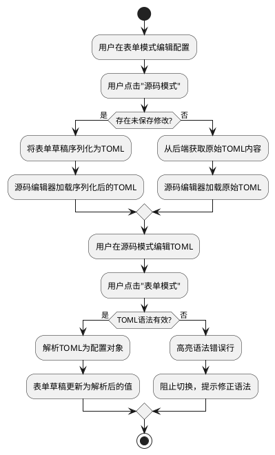
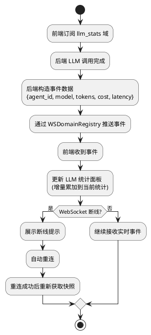
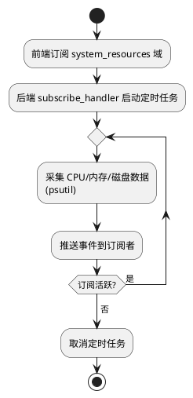
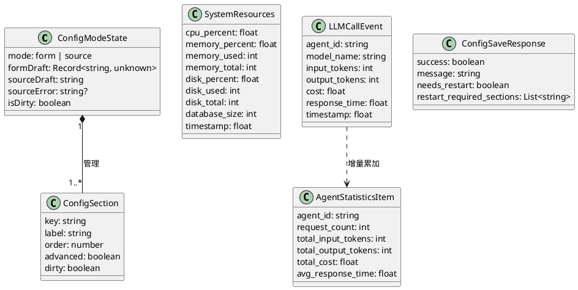

# MaiBot WebUI 功能增强（SSD3）— 增量设计文档

# 一、需求与存量功能关系分析

## 1.1 需求功能与存量功能对比

### 1.1.1 已实现功能

| 需求功能 | 存量功能 | 代码位置 | 匹配度 |
|---------|---------|---------|--------|
| Schema 驱动动态表单渲染 | `DynamicConfigForm` + `DynamicField` 已实现完整的 x-widget/type 渲染、嵌套 schema 递归、高级设置折叠 | `dashboard/src/components/dynamic-form/DynamicConfigForm.tsx`、`DynamicField.tsx` | 100% |
| 配置 Schema 生成 | `ConfigSchemaGenerator` 已实现 ConfigBase→前端表单 Schema，含 A_memorix 可见性控制、UI 元数据 | `src/webui/config_schema.py:218-339` | 100% |
| 配置表单编排（加载+草稿+脏跟踪） | `useConfigForm` 已实现并行加载 config+schema→seed 草稿→脏跟踪 | `dashboard/src/hooks/useConfigForm.ts` | 100% |
| Bot 配置按分组自动保存 | `useAutoSave` 已实现 debounce 自动保存 + `updateBotConfigSection` 按分组提交 | `dashboard/src/routes/config/bot/hooks/useAutoSave.ts` | 100% |
| 配置按分组独立保存 | 后端 `POST /api/webui/config/bot/section/{name}` 和 `POST /api/webui/config/model/section/{name}` 已实现 | `src/webui/routers/config.py` | 100% |
| 配置原始 TOML 读写 | `GET/POST /api/webui/config/bot/raw` 已实现 | `dashboard/src/lib/config-api.ts:163-181` | 100% |
| 首页卡片布局管理 | `HomeCardManager` 已实现拖拽排序、隐藏/显示、自适应宽度、插件卡片 | `dashboard/src/routes/home/HomeCardManager.tsx` | 90% |
| 首页数据 Hook | `useBotStatus`、`useDashboardData`、`useQuickShortcuts` 等已实现 | `dashboard/src/routes/home/hooks/` | 75% |
| 全局搜索 | `SearchDialog` 已实现导航项+配置字段搜索、键盘导航、最近搜索 | `dashboard/src/components/search-dialog.tsx` | 90% |
| WebSocket 域注册表 | `WSDomainRegistry` 已实现域注册/查询，4 个域已注册 | `src/webui/routers/websocket/domains.py` | 100% |
| 统一 WebSocket 客户端 | `UnifiedWebSocketClient` 已实现心跳/重连/订阅 | `dashboard/src/lib/unified-ws.ts` | 100% |
| LLM 调用统计 API | `GET /api/webui/statistics/dashboard`、`/summary`、`/models` 已实现 | `src/webui/routers/statistics.py` | 75% |
| 系统状态 API | `GET /api/webui/system/status`（运行时间、版本）、重启 API 已实现 | `src/webui/routers/system.py` | 75% |
| DeepSeek 监控面板 | Token 预算、前缀缓存、批处理、成本追踪已实现独立页面 | `dashboard/src/routes/deepseek-monitor/`、`dashboard/src/lib/deepseek-api.ts` | 100% |
| 侧边栏导航分组 | 4 个分组（概览/配置/资源/扩展）已实现 | `dashboard/src/components/layout/constants.ts` | 75% |
| 配置字段 Hook 系统 | `FieldHookRegistry` 已实现 replace/wrapper/hidden 模式 | `dashboard/src/lib/field-hooks.ts`、`dashboard/src/routes/config/bot/hooks/` | 100% |
| 统一响应体 | `ApiResponse[T]` + `ErrorResponse` + `AppError` + `ErrorCode` 已实现 | `src/webui/schemas/base.py`、`src/webui/errors/` | 100% |
| 请求客户端自动解包 | `backendApi` 已实现 ApiResponse 自动解包 + ErrorResponse 自动解析 | `dashboard/src/lib/http/` | 100% |

### 1.1.2 需要扩展的功能

| 需求功能 | 存量功能 | 差异说明 | 扩展方向 |
|---------|---------|---------|---------|
| 配置源码/表单模式切换 | 已有 `getBotConfigRaw`/`updateBotConfigRaw` 读写 TOML，但前端无模式切换 UI | 缺少表单↔源码模式切换组件；切换时未保存修改的保留逻辑未实现 | 新增 `ConfigModeSwitcher` 组件，管理两种模式的草稿同步 |
| 配置分组导航 | `DynamicConfigForm` 递归渲染嵌套 schema，但无左侧分组导航 | 当前配置页按 schema.nested 递归渲染为卡片堆叠，无独立的分组导航列表 | 新增 `ConfigSectionNav` 组件，从 schema 提取分组列表渲染为侧边导航 |
| 配置脏状态离开提示 | `useConfigForm.isDirty` 已实现脏跟踪，但未集成路由守卫 | 缺少页面离开/分组切换时的确认对话框 | 新增 `useUnsavedChangesGuard` hook，拦截路由跳转和分组切换 |
| 配置保存后重启提示 | 后端写入成功后无结构化字段标识"哪些配置需要重启" | 缺少 `needs_restart` 字段或配置级别的重启需求标记 | 后端在保存响应中增加 `needs_restart` 字段，前端展示提示 |
| 敏感字段掩码 | `DynamicField` 已支持 `x-widget: password` 渲染密码框 | 缺少"点击查看明文"交互；保存时未修改的掩码字段不应提交 | 扩展 `DynamicField` 的 password 渲染，增加明文切换和脏值过滤 |
| 前端校验增强 | `DynamicField` 对数值字段有 min/max 约束，但缺少 required/regex/自定义校验 | Schema 中的 required、pattern、enum 等约束未在前端校验 | 扩展 `DynamicField` 增加前端校验逻辑，校验失败高亮字段 |
| 首页概览卡片 | `HomeCardManager` 支持自定义卡片，但缺少系统状态/智能体/LLM/聊天流四类核心卡片 | 当前首页卡片由各模块自行注册，缺少统一的状态概览卡片 | 新增 4 个内置卡片组件，注册到 HomeCardManager |
| 快捷操作入口 | `useQuickShortcuts` 已实现快捷操作定义，但缺少重启、编辑配置等核心操作 | 当前快捷操作列表不完整，缺少重启确认流程 | 扩展 `useQuickShortcuts` 增加重启、编辑配置等操作 |
| 侧边栏导航整合 | 4 个分组已实现，但分组名称和排序与 spec 不完全一致 | spec 要求概览/配置/资源/扩展四组，当前分组名略有差异 | 微调 `menuSections` 常量的分组标题和排序 |
| 系统资源监控 | `system.py` 有数据库大小统计，但无 CPU/内存/磁盘占用率 | 缺少 psutil 等系统资源采集；无实时推送 | 后端新增系统资源采集端点 + WebSocket 域，前端新增资源监控卡片 |
| LLM 调用统计增强 | `statistics.py` 有按模型统计，但缺少按智能体维度和时间范围筛选 | 缺少 agent_id 维度聚合；前端无趋势图表；无 WebSocket 实时推送 | 后端扩展统计 API 增加智能体维度，新增 llm_stats WebSocket 域 |
| LLM 调用实时推送 | WebSocket 已有 4 个域，但无 LLM 调用事件域 | 缺少 llm_stats 域的注册和事件推送 | 新增 `LLMStatsDomain`，在 LLM 调用完成时推送事件 |
| 聊天流状态监控 | `chat-management-api.ts` 有聊天流列表，但无状态监控面板 | 缺少独立的聊天流状态监控视图（活跃时间、消息数、排序） | 新增聊天流状态监控页面，复用现有 chat API 数据 |
| 统计数据时间范围 | `statistics.py` 的 `hours` 参数支持任意值，但前端无时间范围选择器 | 缺少 1h/6h/24h/7d/30d 预设选择器 | 前端新增 `TimeRangeSelector` 组件 |
| 统计数据导出 | 无 CSV 导出功能 | 缺少后端导出端点和前端导出按钮 | 后端新增 CSV 导出端点，前端新增导出按钮 |

### 1.1.3 需要新增的功能或接口

**配置模式切换组件**（`dashboard/src/components/dynamic-form/ConfigModeSwitcher.tsx`）
- 表单模式↔源码模式切换 UI
- 模式切换时的草稿同步逻辑（表单修改→同步到源码，源码修改→同步到表单）
- 源码模式的 TOML 语法校验

**配置分组导航组件**（`dashboard/src/components/dynamic-form/ConfigSectionNav.tsx`）
- 从 Schema 的 nested 和 uiOrder 提取分组列表
- 分组激活高亮、点击切换右侧表单内容
- 分组的脏状态标记

**脏状态路由守卫**（`dashboard/src/hooks/useUnsavedChangesGuard.ts`）
- 拦截 TanStack Router 的 beforeLeave 事件
- 弹出确认对话框（保存/放弃/取消）
- 集成 useConfigForm.isDirty

**系统资源采集端点**（`src/webui/routers/system.py` 扩展）
- `GET /api/webui/system/resources` — CPU/内存/磁盘占用率
- 后端使用 `psutil` 采集系统资源数据

**系统资源 WebSocket 域**（`src/webui/routers/websocket/domains.py` 扩展）
- `system_resources` 域 — 定时推送 CPU/内存/磁盘数据（5 秒间隔）

**LLM 调用统计增强端点**（`src/webui/routers/statistics.py` 扩展）
- `GET /api/webui/statistics/agents` — 按智能体维度聚合
- `GET /api/webui/statistics/export` — CSV 导出

**LLM 调用 WebSocket 域**（`src/webui/routers/websocket/domains.py` 扩展）
- `llm_stats` 域 — LLM 调用完成时推送事件（agent_id、model、tokens、cost、latency）

**聊天流状态监控页面**（`dashboard/src/routes/monitor/chat-stream-monitor.tsx`）
- 聊天流状态列表（会话名、绑定智能体、最后活跃时间、今日消息数）
- 排序（按活跃时间、消息数）
- 虚拟化渲染（@tanstack/react-virtual）

**时间范围选择器**（`dashboard/src/components/monitor/TimeRangeSelector.tsx`）
- 预设时间范围：1h/6h/24h/7d/30d
- 默认 24h

**LLM 统计趋势图表**（`dashboard/src/components/monitor/LLMStatsChart.tsx`）
- 按智能体/模型/时间维度的趋势图表
- 使用 recharts 渲染

## 1.2 存量功能详细分析

### 1.2.1 DynamicConfigForm + DynamicField（已实现，需扩展）

**接口契约**：
- `DynamicConfigForm`：接收 `schema`/`values`/`onChange`/`hooks`/`advancedVisible`/`level`，递归渲染嵌套 schema
- `DynamicField`：接收 `schema`/`value`/`onChange`/`fieldPath`，根据 x-widget/type 渲染 shadcn/ui 组件
- `FieldHookRegistry`：支持 replace/wrapper/hidden 三种模式自定义字段渲染

**业务规则**：
- x-widget 优先于 type 决定渲染组件
- 高级字段（advanced=true）默认折叠，由 `AdvancedSettingsButton` 控制
- A_memorix 字段通过 ConfigSchemaGenerator 的可见性控制过滤
- 嵌套 schema 递归渲染为 Card 组件

**扩展点**：
- 缺少 required/pattern/enum 前端校验
- 缺少敏感字段的明文/掩码切换
- password widget 只有密码框，无"查看明文"按钮

**约束**：
- 字段渲染必须由 Schema 驱动，不得硬编码字段列表
- Hook 系统是扩展字段渲染的唯一机制

### 1.2.2 useConfigForm + useAutoSave（已实现，需集成路由守卫）

**接口契约**：
- `useConfigForm<TDraft, TConfig, TSchema>`：返回 `draft/schema/setDraft/isDirty/reset/reload/isLoading/error`
- `useAutoSave`：返回 `triggerAutoSave/saveNow/cancelPendingAutoSave`
- 草稿 seed 逻辑：config 查询的 `dataUpdatedAt` 作版本标记，渲染期重置草稿

**业务规则**：
- 脏跟踪用 `JSON.stringify(draft) !== seededSnapshot`
- 自动保存 debounce 2 秒
- Bot 配置按分组独立保存（每个分组独立的草稿和保存状态）

**扩展点**：
- isDirty 未与路由守卫集成
- 缺少保存后重启提示
- 缺少源码模式的草稿管理

**约束**：
- useConfigForm 只管"加载+草稿+脏跟踪"，不管理保存/自动保存/源码模式（页面自行管理）
- 多分组配置页（bot/model）的草稿管理超出 useConfigForm 范围

### 1.2.3 HomeCardManager（已实现，需增加内置卡片）

**接口契约**：
- `HomeCardDefinition`：`id/title/description/width/source/render`
- `HomeCardManager`：接收 `cards`/`pluginCards`，管理拖拽排序、隐藏/显示、行高切换
- 布局持久化：localStorage `maibot-home-card-layout-v1`

**业务规则**：
- 卡片宽度：small(2)/medium(3)/large(5)/wide(7)/full(10)，10 列网格
- 拖拽使用 @dnd-kit/sortable
- 插件卡片通过 PluginHomeCard 协议注入

**扩展点**：
- 缺少系统状态/智能体/LLM/聊天流四类核心卡片
- 缺少快捷操作卡片

**约束**：
- 卡片布局由用户自定义（拖拽排序），不硬编码
- 首屏渲染 < 2 秒，卡片数据应并行加载

### 1.2.4 WSDomainRegistry + UnifiedWebSocketClient（已实现，需新增域）

**接口契约**：
- `WSDomain`：`name/event_types/subscribe_handler/unsubscribe_handler/call_handler`
- `WSDomainRegistry`：`register/get/list_domains`
- `UnifiedWebSocketClient`：`connect/subscribe/unsubscribe/call`，内置心跳和重连

**业务规则**：
- 当前 4 个域：logs/plugin_progress/maisaka_monitor/chat
- 订阅时先发 response 确认，再发 snapshot 事件
- 发送队列串行化

**扩展点**：
- 缺少 system_resources 域（系统资源定时推送）
- 缺少 llm_stats 域（LLM 调用实时推送）

**约束**：
- 新增域只需注册 WSDomain 实例，无需修改 unified.py
- 前端通过 UnifiedWebSocketClient 的 subscribe 订阅新域

### 1.2.5 统计服务（已实现，需扩展维度和导出）

**接口契约**：
- `get_dashboard_statistics(hours)` → `DashboardData`（summary/model_stats/hourly_data/daily_data/recent_activity/agent_stats）
- `get_summary_statistics(start_time, end_time)` → `StatisticsSummary`
- `get_model_statistics(start_time, end_time)` → `ModelStatistics[]`
- 缓存：local_storage 持久化，20 分钟 TTL

**业务规则**：
- 数据来源：ModelUsage/OnlineTime/Messages/ToolRecord 数据库表
- agent_stats 由 AgentConfigRegistry 计算（total_agents/active_agents/total_active_sessions）

**扩展点**：
- 缺少按智能体维度的统计聚合（agent_id 维度）
- 缺少 CSV 导出端点
- 缺少 LLM 调用事件的实时推送触发点

**约束**：
- 统计查询可能耗时（30 天数据），需控制查询超时
- 缓存策略需与实时推送配合（历史数据走 API，实时增量走 WebSocket）

# 二、增量设计方案

## 2.1 实现模型

### 2.1.1 上下文视图

```plantuml
@startuml
skinparam componentStyle rectangle

package "WebUI 前端" {
    package "配置页面 (routes/config/)" {
        [ConfigModeSwitcher] as mode_switch
        [ConfigSectionNav] as section_nav
        [DynamicConfigForm] as form
        [CodeEditor] as code_editor
    }

    package "首页 (routes/home/)" {
        [HomeCardManager] as card_mgr
        [SystemStatusCard] as sys_card
        [AgentStatusCard] as agent_card
        [LLMOverviewCard] as llm_card
        [ChatStreamCard] as chat_card
    }

    package "监控页面 (routes/monitor/)" {
        [SystemResourceMonitor] as res_monitor
        [LLMStatsPanel] as llm_panel
        [ChatStreamMonitor] as cs_monitor
        [TimeRangeSelector] as time_sel
        [LLMStatsChart] as llm_chart
    }

    package "共享组件" {
        [SearchDialog] as search
        [Sidebar] as sidebar
        [useUnsavedChangesGuard] as guard
    }
}

package "WebUI 后端" {
    package "API 路由" {
        [Config API] as config_api
        [Statistics API] as stats_api
        [System API] as system_api
        [Agent API] as agent_api
    }

    package "WebSocket 域" {
        [system_resources 域] as ws_sys
        [llm_stats 域] as ws_llm
    }
}

package "外部服务" {
    [config_manager] as cm
    [statistics_service] as stat_svc
    [psutil] as psutil_lib
    [AgentConfigRegistry] as agent_reg
}

运维人员 --> mode_switch : 切换编辑模式
运维人员 --> section_nav : 切换配置分组
运维人员 --> card_mgr : 查看首页概览
运维人员 --> llm_panel : 查看 LLM 统计

mode_switch --> form : 表单模式
mode_switch --> code_editor : 源码模式
section_nav --> form : 切换分组内容

card_mgr --> sys_card : 系统状态
card_mgr --> agent_card : 智能体状态
card_mgr --> llm_card : LLM 概览
card_mgr --> chat_card : 聊天流概览

res_monitor --> system_api : 获取资源数据
res_monitor --> ws_sys : 订阅实时资源
llm_panel --> stats_api : 获取统计数据
llm_panel --> ws_llm : 订阅实时调用
cs_monitor --> agent_api : 聊天流状态

config_api --> cm : 配置读写
stats_api --> stat_svc : 统计查询
system_api --> psutil_lib : 系统资源
ws_sys --> psutil_lib : 定时采集
ws_llm --> stat_svc : 调用事件

@enduml
```



### 2.1.2 服务/组件总体架构

```plantuml
@startuml
skinparam componentStyle rectangle

package "前端组件层" {
    package "配置编辑" {
        [ConfigModeSwitcher\n模式切换+草稿同步] as cms
        [ConfigSectionNav\n分组导航] as csn
        [DynamicConfigForm\n(已有)Schema驱动表单] as dcf
        [DynamicField\n(已有)字段渲染] as df
        [SensitiveFieldWrapper\n敏感字段包装] as sfw
        [ConfigValidationIndicator\n校验状态指示] as cvi
    }

    package "首页概览" {
        [HomeCardManager\n(已有)卡片布局] as hcm
        [SystemStatusCard\n系统状态卡片] as ssc
        [AgentStatusCard\n智能体状态卡片] as asc
        [LLMOverviewCard\nLLM概览卡片] as loc
        [ChatStreamCard\n聊天流概览卡片] as csc
    }

    package "实时监控" {
        [SystemResourceMonitor\n系统资源监控] as srm
        [LLMStatsPanel\nLLM统计面板] as lsp
        [ChatStreamMonitor\n聊天流监控] as csm
        [TimeRangeSelector\n时间范围选择] as trs
        [LLMStatsChart\n统计趋势图] as lsc
        [CSVExportButton\n导出按钮] as ceb
    }
}

package "前端 Hook 层" {
    [useUnsavedChangesGuard\n脏状态路由守卫] as gu
    [useSystemResources\n系统资源数据] as usr
    [useLLMStats\nLLM统计数据] as uls
    [useChatStreamStatus\n聊天流状态] as ucs
    [useConfigMode\n配置模式管理] as ucm
}

package "后端 API 层" {
    [GET /system/resources\n系统资源] as api_res
    [GET /statistics/agents\n智能体统计] as api_agent
    [GET /statistics/export\nCSV导出] as api_export
    [POST /config/bot\nneeds_restart字段] as api_cfg
}

package "后端 WebSocket 域" {
    [system_resources域\n5秒推送] as ws_res
    [llm_stats域\n调用完成推送] as ws_llm
]

@enduml
```

### 2.1.3 实现设计文档

#### 配置模式切换流程



#### LLM 调用实时推送流程



#### 系统资源监控推送流程



## 2.2 接口设计

### 2.2.1 总体设计

**接口分类**：
1. **配置增强接口**：模式切换、分组导航、脏状态守卫、敏感字段、校验增强
2. **首页概览接口**：核心状态卡片、快捷操作
3. **监控增强接口**：系统资源、LLM 统计增强、聊天流状态、CSV 导出
4. **WebSocket 新增域**：system_resources、llm_stats

**接口变更策略**：
- 后端新增端点遵循 SSD1 规范（ApiResponse 统一响应体、/api/webui/ 路径前缀）
- 前端新增组件遵循 SSD2 架构（backendApi 自动解包、领域 Hook 抽取）
- WebSocket 新增域通过 WSDomainRegistry 注册，不修改 unified.py
- 配置保存响应扩展 `needs_restart` 字段，向后兼容

| 接口分组 | 稳定性 | 说明 |
|---------|--------|------|
| ConfigModeSwitcher | 稳定 | 配置模式切换组件 |
| ConfigSectionNav | 稳定 | 配置分组导航组件 |
| useUnsavedChangesGuard | 稳定 | 脏状态路由守卫 hook |
| GET /system/resources | 稳定 | 系统资源采集端点 |
| GET /statistics/agents | 稳定 | 智能体维度统计 |
| GET /statistics/export | 稳定 | CSV 导出端点 |
| system_resources WS 域 | 稳定 | 系统资源实时推送 |
| llm_stats WS 域 | 稳定 | LLM 调用实时推送 |

### 2.2.2 接口清单

#### 配置模式切换组件

```typescript
// dashboard/src/components/dynamic-form/ConfigModeSwitcher.tsx

interface ConfigModeSwitcherProps {
  /** 当前模式 */
  mode: 'form' | 'source'
  /** 模式切换回调 */
  onModeChange: (mode: 'form' | 'source') => void
}

interface ConfigModeManagerResult {
  /** 当前模式 */
  mode: 'form' | 'source'
  /** 切换模式（含草稿同步确认） */
  switchMode: (target: 'form' | 'source') => Promise<void>
  /** 源码模式草稿 */
  sourceDraft: string
  /** 更新源码草稿 */
  setSourceDraft: (value: string) => void
  /** 源码模式 TOML 语法错误 */
  sourceError: string | null
}
```

**业务说明**：管理表单/源码两种编辑模式的切换和草稿同步。切换时，表单草稿序列化为 TOML 填充源码编辑器，源码修改解析为配置对象同步到表单草稿。

**前置条件**：配置数据已加载（useConfigForm 的 draft 不为 undefined）。

**后置条件**：模式切换后，目标模式的草稿包含源模式的未保存修改。

**异常映射**：TOML 语法错误 → 阻止切换到表单模式，高亮错误行。

#### 配置分组导航组件

```typescript
// dashboard/src/components/dynamic-form/ConfigSectionNav.tsx

interface ConfigSection {
  /** 分组键名（对应 schema.nested 的 key） */
  key: string
  /** 分组显示名称 */
  label: string
  /** 分组排序权重 */
  order: number
  /** 是否为高级分组 */
  advanced: boolean
  /** 分组是否有未保存修改 */
  dirty: boolean
}

interface ConfigSectionNavProps {
  /** 分组列表 */
  sections: ConfigSection[]
  /** 当前激活的分组 key */
  activeKey: string
  /** 分组切换回调 */
  onSectionChange: (key: string) => void
}
```

**业务说明**：从 Schema 的 nested 和 uiOrder/uiLabel/uiAdvanced 提取分组列表，渲染为左侧导航。当前激活分组高亮，有未保存修改的分组显示脏标记。

#### 脏状态路由守卫

```typescript
// dashboard/src/hooks/useUnsavedChangesGuard.ts

interface UseUnsavedChangesGuardOptions {
  /** 是否有未保存修改 */
  isDirty: boolean
  /** 保存回调 */
  onSave?: () => Promise<void>
  /** 放弃回调 */
  onDiscard?: () => void
}

function useUnsavedChangesGuard(options: UseUnsavedChangesGuardOptions): void
```

**业务说明**：拦截 TanStack Router 的路由跳转和浏览器 beforeunload 事件。有未保存修改时弹出确认对话框，用户可选择保存、放弃或取消。

**前置条件**：isDirty 状态由 useConfigForm 或页面自行管理。

**后置条件**：用户确认后允许跳转，取消则阻止跳转。

#### 敏感字段包装

```typescript
// 扩展 DynamicField 的 password 渲染

interface SensitiveFieldState {
  /** 是否显示明文 */
  visible: boolean
  /** 原始值（用于保存时判断是否修改） */
  originalValue: string
}
```

**业务说明**：扩展 DynamicField 的 password widget 渲染，增加"查看明文"按钮。保存时如果用户未修改该字段（值仍为掩码），不提交该字段以避免覆盖原始值。

**前置条件**：Schema 中字段标记为 `x-widget: password`。

**后置条件**：敏感字段默认掩码显示，用户点击可查看明文；未修改的掩码值不参与保存提交。

#### 系统资源采集端点

```python
# src/webui/routers/system.py 扩展

# GET /api/webui/system/resources
class SystemResourcesResponse(BaseModel):
    cpu_percent: float          # CPU 占用率（百分比）
    memory_percent: float      # 内存占用率（百分比）
    memory_used: int           # 已用内存（字节）
    memory_total: int          # 总内存（字节）
    disk_percent: float        # 磁盘占用率（百分比）
    disk_used: int             # 已用磁盘（字节）
    disk_total: int            # 总磁盘（字节）
    database_size: int         # 数据库大小（字节）
    timestamp: float           # 采集时间戳
```

**业务说明**：使用 psutil 采集系统资源数据。数据库大小复用已有的 `_get_database_size()` 逻辑。

**前置条件**：psutil 已安装（Docker 镜像中已包含）。

**后置条件**：返回当前时刻的系统资源快照。

**异常映射**：psutil 不可用 → `SYS_SERVICE_UNAVAILABLE`，字段返回 -1。

#### 智能体维度统计端点

```python
# src/webui/routers/statistics.py 扩展

# GET /api/webui/statistics/agents?hours=24
class AgentStatisticsItem(BaseModel):
    agent_id: str
    request_count: int
    total_input_tokens: int
    total_output_tokens: int
    total_cost: float
    avg_response_time: float

class AgentStatisticsResponse(BaseModel):
    agents: list[AgentStatisticsItem]
    hours: int
```

**业务说明**：按智能体维度聚合 LLM 调用统计，从 ModelUsage 表按 agent_id 分组查询。

**前置条件**：ModelUsage 表有 agent_id 字段。

**后置条件**：返回指定时间范围内每个智能体的统计汇总。

#### CSV 导出端点

```python
# src/webui/routers/statistics.py 扩展

# GET /api/webui/statistics/export?hours=24&format=csv
# 返回 StreamingResponse，Content-Type: text/csv
# Content-Disposition: attachment; filename=llm_stats_{timestamp}.csv
```

**业务说明**：导出 LLM 调用统计数据为 CSV 格式。字段包括：时间、智能体、模型、输入Token、输出Token、费用、延迟。

**前置条件**：hours 参数有效（1/6/24/168/720）。

**后置条件**：浏览器下载 CSV 文件。

#### system_resources WebSocket 域

```python
# src/webui/routers/websocket/domains.py 扩展

class SystemResourcesEventType(str, Enum):
    UPDATE = "update"
    SNAPSHOT = "snapshot"

# 域注册
system_resources_domain = WSDomain(
    name="system_resources",
    event_types={"update", "snapshot"},
    subscribe_handler=subscribe_system_resources,
    unsubscribe_handler=unsubscribe_system_resources,
)
```

**业务说明**：订阅后立即推送一次 snapshot（当前资源快照），之后每 5 秒推送 update 事件。取消订阅时停止定时推送任务。

**前置条件**：psutil 可用。

**后置条件**：订阅者每 5 秒收到一次系统资源更新。

**异常映射**：psutil 不可用 → snapshot 中字段值为 -1，update 不推送。

#### llm_stats WebSocket 域

```python
# src/webui/routers/websocket/domains.py 扩展

class LLMStatsEventType(str, Enum):
    CALL_COMPLETED = "call_completed"
    SNAPSHOT = "snapshot"

# 域注册
llm_stats_domain = WSDomain(
    name="llm_stats",
    event_types={"call_completed", "snapshot"},
    subscribe_handler=subscribe_llm_stats,
    unsubscribe_handler=unsubscribe_llm_stats,
)
```

**业务说明**：订阅后推送一次 snapshot（最近 24 小时统计摘要），之后每次 LLM 调用完成时推送 call_completed 事件。事件数据包含 agent_id、model_name、input_tokens、output_tokens、cost、response_time。

**前置条件**：LLM 调用链路中已集成事件推送触发点。

**后置条件**：前端实时更新 LLM 统计面板。

**触发点**：在 `LLMOrchestrator._call_llm()` 完成后，通过 `ws_domain_registry` 投递事件。

#### 配置保存响应扩展

```python
# src/webui/schemas/config.py 扩展

class ConfigSaveResponse(BaseModel):
    """配置保存响应（扩展 needs_restart 字段）"""
    success: bool
    message: str
    needs_restart: bool = False
    restart_required_sections: list[str] = []
```

**业务说明**：配置保存成功后，后端判断修改的配置项是否需要重启才能生效，在响应中标记 `needs_restart`。需要重启的配置节包括：BotConfig（基础）、DatabaseConfig、LogConfig、WebUIConfig 等（运行时不可热加载的配置）。

**前置条件**：配置写入成功。

**后置条件**：前端根据 `needs_restart` 展示"部分配置需要重启生效"提示。

#### 前端监控 Hook

```typescript
// dashboard/src/hooks/useSystemResources.ts

interface SystemResources {
  cpu_percent: number
  memory_percent: number
  memory_used: number
  memory_total: number
  disk_percent: number
  disk_used: number
  disk_total: number
  database_size: number
  timestamp: number
}

interface UseSystemResourcesResult {
  data: SystemResources | null
  isConnected: boolean
  error: Error | null
  refetch: () => void
}

function useSystemResources(): UseSystemResourcesResult
```

**业务说明**：通过 WebSocket 订阅 system_resources 域获取实时数据，断线时回退到 API 轮询（30 秒间隔）。首次加载通过 API 获取快照。

```typescript
// dashboard/src/hooks/useLLMStats.ts

interface LLMCallEvent {
  agent_id: string
  model_name: string
  input_tokens: number
  output_tokens: number
  cost: number
  response_time: number
  timestamp: number
}

interface UseLLMStatsResult {
  /** 按智能体维度统计 */
  agentStats: AgentStatisticsItem[]
  /** 按模型维度统计 */
  modelStats: ModelStatistics[]
  /** 时间序列数据 */
  timeSeriesData: TimeSeriesData[]
  /** 是否正在加载 */
  isLoading: boolean
  /** WebSocket 连接状态 */
  isConnected: boolean
  /** 当前时间范围（小时） */
  hours: number
  /** 切换时间范围 */
  setHours: (hours: number) => void
  /** 导出 CSV */
  exportCSV: () => Promise<void>
}

function useLLMStats(defaultHours?: number): UseLLMStatsResult
```

**业务说明**：整合 API 历史数据查询和 WebSocket 实时增量更新。切换时间范围时重新获取历史数据，实时事件增量累加到当前统计。WebSocket 断线时展示断线提示，重连后重新获取快照。

## 2.3 数据模型

### 2.3.1 设计目标

1. 配置编辑支持表单/源码双模式，模式切换时草稿不丢失
2. 首页概览卡片数据并行加载，首屏渲染 < 2 秒
3. 监控数据采用"API 历史 + WebSocket 增量"混合模式，避免高频轮询
4. 前端不缓存超过 1 小时的实时数据，历史数据从后端 API 获取
5. 新增后端端点遵循 SSD1 统一响应体规范

### 2.3.2 模型实现



**对象创建和销毁策略**：
- `ConfigModeState` 由 `useConfigMode` hook 管理，页面卸载时销毁
- `SystemResources` 由 `useSystemResources` hook 管理，WebSocket 断线时清空
- `LLMCallEvent` 由 `useLLMStats` hook 管理，时间范围切换时重新获取历史数据后清空增量
- `ConfigSaveResponse` 由后端路由处理函数创建，一次性消费

**持久化策略**：
- 配置模式偏好（form/source）存入 localStorage
- 首页卡片布局已有 localStorage 持久化（HomeCardManager）
- 监控数据不持久化（实时数据，页面刷新后重新获取）