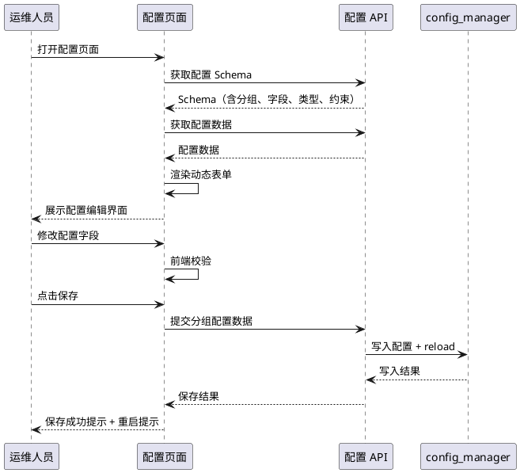
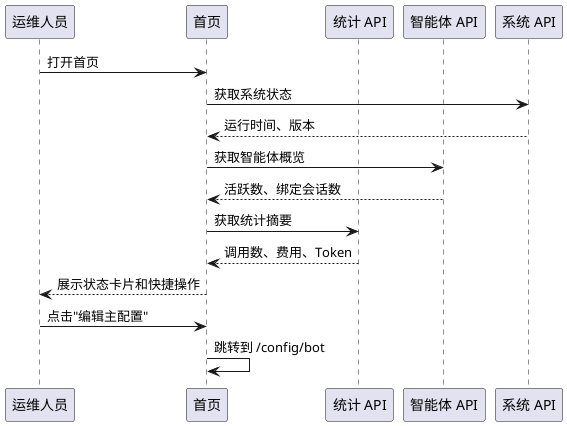
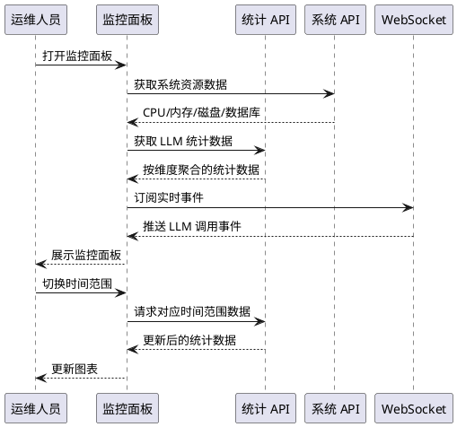

# **1. 组件定位**

## **1.1 核心职责**

本组件负责增强 MaiBot WebUI 的功能体验，实现配置可视化编辑、统一管理入口整合和实时监控增强，使运维人员可通过 WebUI 完成核心操作而无需手动编辑 TOML 文件或登录服务器。

## **1.2 核心输入**

1. **运维人员的配置编辑操作**：通过 WebUI 表单修改 bot_config.toml / model_config.toml 中的配置项
2. **运维人员的监控查看操作**：通过 WebUI 查看系统资源、LLM 调用统计、聊天流状态等实时信息
3. **运维人员的管理操作**：通过统一入口执行智能体绑定、会话管理、插件管理等操作
4. **后端配置 Schema**：ConfigSchemaGenerator 生成的、基于 ConfigBase 模型的动态表单 Schema（含字段类型、约束、分组、可见性）
5. **后端实时事件**：WebSocket 推送的日志、监控、聊天等域事件
6. **后端统计数据**：LLM 调用统计、系统资源占用、会话活跃度等聚合数据

## **1.3 核心输出**

1. **可视化配置编辑界面**：基于 Schema 驱动的动态表单，支持按分组编辑、实时校验、部分保存和源码模式切换
2. **统一管理仪表盘**：整合分散在各页面的管理功能，提供全局状态概览和快捷操作入口
3. **实时监控面板**：展示系统资源、LLM 调用统计、聊天流状态等实时数据，支持时间范围筛选和趋势图表
4. **配置变更通知**：配置保存后提示运维人员是否需要重启生效

## **1.4 职责边界**

1. 本组件不负责后端 API 的新增端点设计（后端 API 扩展在 design 阶段定义）
2. 本组件不负责 MaiBot 核心服务层（chat_manager、memory_service 等）的接口变更
3. 本组件不负责认证/鉴权架构的改动（沿用 SSD1 的 Token+Cookie 机制）
4. 本组件不负责设计系统（maibot-webui-design）本身的改动
5. 本组件不负责 Electron 壳层改动
6. 本组件不负责配置文件模板（bot_config.toml / model_config.toml）的版本管理逻辑变更，只消费已有的 ConfigSchemaGenerator 和 config_manager
7. 本组件不负责新增业务功能（只增强现有功能的可视化和管理体验）

# **2. 领域术语**

**配置可视化**
: 将 bot_config.toml / model_config.toml 中的配置项通过 WebUI 动态表单进行可视化编辑，替代手动编辑 TOML 文件。表单由后端 ConfigSchemaGenerator 生成的 Schema 驱动，前端 DynamicConfigForm 组件渲染。

**配置分组（Config Section）**
: 配置按逻辑模块划分的组织单元，如 BotConfig（基础）、PersonalityConfig（人格）、ChatConfig（聊天）、AMemorixConfig（记忆）等。每个分组对应一个 ConfigBase 子类，拥有独立的 Schema 和保存端点。

**配置可见性（Config Visibility）**
: 配置字段在 WebUI 中的展示级别，分为 basic（基础，默认展示）和 advanced（高级，需展开查看）。A_memorix 相关字段有独立的可见性控制（AMEMORIX_BASIC_FIELD_PATHS / AMEMORIX_ADVANCED_FIELD_PATHS / AMEMORIX_EXCLUDED_FIELD_PATHS）。

**配置脏跟踪（Config Dirty Tracking）**
: 追踪配置表单中哪些分组已被修改但尚未保存的状态。当前 bot 配置页按分组独立追踪脏状态，支持按分组自动保存。

**统一管理入口**
: 将分散在侧边栏多个导航项中的管理功能整合为统一入口页面，提供全局状态概览和快捷操作。

**实时监控**
: 通过 WebSocket 推送和定时轮询获取系统运行时状态，包括系统资源占用、LLM 调用统计、聊天流活跃度等，在 WebUI 中以图表和指标卡片形式展示。

**WebSocket 域**
: WebSocket 事件推送的逻辑分区，当前包含 logs、plugin_progress、maisaka_monitor、chat 四个域。SSD1 已实现域注册表（WSDomainRegistry），新增域只需注册。

**LLM 调用统计**
: 按智能体和模型维度聚合的 LLM 调用数据，包括调用次数、Token 消耗、费用、延迟、缓存命中率等指标。当前由 DeepSeek 监控页面和统计 API 提供。

**聊天流状态**
: 每个聊天会话（ChatSession）的运行时状态，包括绑定智能体、消息数、最后活跃时间、会话类型（群聊/私聊）等。当前由聊天管理页面提供。

# **3. 角色与边界**

## **3.1 核心角色**

- **MaiBot 运维人员**：通过 WebUI 管理 MaiBot 配置、监控运行状态、执行管理操作的主要用户，需要直观的配置编辑界面和实时状态概览

## **3.2 外部系统**

- **SSD1 后端 API**：已迁移到统一响应体和路由规范化的后端服务，提供配置读写、智能体管理、统计查询等 API
- **SSD2 前端架构**：已完成请求客户端适配、API 模块迁移、领域 Hook 抽取的前端代码
- **ConfigSchemaGenerator**：后端配置 Schema 生成器，将 ConfigBase 子类自动转换为前端可消费的表单 Schema
- **WSDomainRegistry**：WebSocket 域注册表，管理实时事件的订阅和分发
- **config_manager**：全局配置管理器，持有 Config 和 ModelConfig 实例，提供配置读写和 reload 能力

## **3.3 交互上下文**

```plantuml
@startuml
skinparam componentStyle rectangle

package "人类角色" {
    [MaiBot 运维人员] as operator
}

package "WebUI 前端" {
    [配置可视化页面] as config_page
    [统一管理仪表盘] as dashboard
    [实时监控面板] as monitor
}

package "WebUI 后端" {
    [配置 API] as config_api
    [智能体 API] as agent_api
    [统计 API] as stats_api
    [系统 API] as system_api
    [WebSocket 服务] as ws
}

package "外部服务" {
    [ConfigSchemaGenerator] as schema_gen
    [config_manager] as cm
    [WSDomainRegistry] as ws_reg
]

operator --> config_page : 编辑配置
operator --> dashboard : 查看概览/执行操作
operator --> monitor : 查看实时状态

config_page --> config_api : 读写配置
config_page --> schema_gen : 获取表单 Schema
dashboard --> agent_api : 智能体管理
dashboard --> stats_api : 统计数据
monitor --> stats_api : 统计数据
monitor --> ws : 实时事件订阅
monitor --> system_api : 系统资源

config_api --> cm : 配置读写
ws --> ws_reg : 域分发

@enduml
```

# **4. DFX约束**

## **4.1 性能**

1. 配置页面首次加载时间（含 Schema + 配置数据）不得因增强改造而增加超过 500ms
2. 配置保存操作的响应时间不得增加超过 200ms（含后端校验和写入）
3. 实时监控面板的数据刷新间隔不得低于 5 秒，WebSocket 推送不得导致前端渲染卡顿
4. 配置 Schema 缓存命中率应 > 90%（Schema 在配置类不变时应命中 lru_cache）
5. 统一管理仪表盘的首次内容渲染时间应 < 2 秒

## **4.2 可靠性**

1. 配置编辑不得因前端异常导致配置数据丢失——未保存的修改必须在页面刷新前提示用户
2. 配置保存失败时必须保留用户的编辑内容，不得清空表单
3. 实时监控数据中断（WebSocket 断线）时必须显示断线提示，不得展示过期数据为当前数据
4. 配置写入必须通过 config_manager 统一入口，写入后必须触发 reload

## **4.3 安全性**

1. 配置编辑页面必须受认证保护（沿用 SSD1 的 require_auth 依赖）
2. 敏感配置字段（如 API Key）在表单中必须默认以掩码展示，不得明文显示
3. 配置变更操作必须记录审计日志（谁在什么时间修改了什么配置）
4. 前端不得在控制台中输出完整的配置数据

## **4.4 可维护性**

1. 新增配置分组只需在 official_configs.py 中定义 ConfigBase 子类并注册到 Config 类，WebUI 自动生成对应的编辑表单
2. 新增监控指标只需在统计 API 中添加端点，前端监控面板通过配置添加对应的展示组件
3. 统一管理仪表盘的卡片和快捷操作必须可配置，新增入口只需修改配置而非硬编码

## **4.5 兼容性**

1. 配置可视化编辑必须与现有的源码模式（TOML 原始编辑）共存，用户可自由切换
2. 配置 API 的请求/响应格式必须与 SSD1 规范化后的格式保持一致
3. 实时监控增强不得破坏现有监控页面（情绪监控、关系监控、DeepSeek 监控、MaiSaka 监控）的功能
4. 导航结构变更必须保持向后兼容——旧路径必须通过 TanStack Router 重定向到新路径

# **5. 核心能力**

## **5.1 配置可视化编辑增强**

增强现有的 bot 配置和模型配置页面，使配置编辑体验更直观、更安全、更高效。

### **5.1.1 业务规则**

1. **配置分组导航规范**：配置页面左侧必须展示分组导航列表，分组顺序与 Schema 中的 uiOrder 一致；当前激活的分组必须高亮显示
   a. 验收条件：[打开配置页面] → [左侧展示所有分组，点击分组切换右侧表单内容]

2. **配置字段渲染规范**：DynamicConfigForm 必须根据 Schema 中的 x-widget 类型渲染对应的表单控件——input 渲染文本输入、select 渲染下拉选择、switch 渲染开关、custom 渲染自定义组件
   a. 验收条件：[加载配置页面] → [每个字段渲染为对应类型的控件，与 Schema 定义一致]

3. **配置字段可见性规范**：标记为 basic 的字段默认展示，标记为 advanced 的字段折叠在"高级设置"区域中，用户点击展开后可见；标记为 excluded 的字段不得展示
   a. 验收条件：[加载配置页面] → [基础字段直接可见，高级字段需展开，排除字段不展示]

4. **配置字段校验规范**：表单提交前必须根据 Schema 中的约束（类型、范围、必填、正则等）进行前端校验，校验失败时高亮对应字段并展示错误信息；后端校验失败时同样高亮对应字段
   a. 验收条件：[提交包含无效值的配置] → [对应字段高亮，错误信息清晰可读]

5. **配置部分保存规范**：bot 配置必须支持按分组独立保存，修改某个分组的配置后只需保存该分组，无需保存全部配置；模型配置必须支持按 API Provider、Model 等子节独立保存
   a. 验收条件：[修改 BotConfig 分组并保存] → [仅该分组的数据被提交，其他分组不受影响]

6. **配置自动保存规范**：bot 配置页面必须支持按分组自动保存，用户修改配置后延迟一定时间自动提交，避免频繁手动保存
   a. 验收条件：[修改配置后等待] → [配置自动保存成功，页面显示保存状态]

7. **配置脏状态提示规范**：页面存在未保存的修改时，离开页面或切换分组前必须提示用户保存或放弃修改
   a. 验收条件：[修改配置后尝试离开页面] → [弹出确认对话框，提示存在未保存的修改]

8. **配置源码模式规范**：配置页面必须支持切换到源码模式，直接编辑 TOML 原始内容；源码模式与表单模式可自由切换，切换时未保存的修改必须保留
   a. 验收条件：[在表单模式修改配置 → 切换到源码模式] → [源码中包含表单修改的内容]

9. **配置保存后提示规范**：配置保存成功后必须提示用户部分配置需要重启 MaiBot 才能生效
   a. 验收条件：[保存需要重启的配置] → [页面显示"部分配置需要重启生效"提示]

10. **敏感字段掩码规范**：标记为敏感的配置字段（如 API Key、Secret）在表单中必须默认以掩码展示，用户点击后才可查看明文；保存时如果用户未修改该字段，不得提交掩码值覆盖原始值
    a. 验收条件：[查看包含 API Key 的配置] → [Key 以掩码显示；未修改 Key 时保存不覆盖原始值]

11. **禁止项**：配置可视化编辑不得绕过 config_manager 直接写入 TOML 文件；不得在前端硬编码配置字段列表（必须由 Schema 驱动）
    a. 验收条件：[检查配置写入代码路径] → [均通过 config_manager 写入]；[检查前端配置表单] → [字段由 Schema 动态生成，无硬编码字段]

### **5.1.2 交互流程**



### **5.1.3 异常场景**

1. **配置 Schema 加载失败**
   a. 触发条件：ConfigSchemaGenerator 生成 Schema 时抛出异常，或 API 请求失败
   b. 系统行为：配置页面展示错误提示，提供重试按钮；不得展示空白页面
   c. 用户感知：页面显示"配置 Schema 加载失败，请重试"

2. **配置保存校验失败**
   a. 触发条件：用户提交的配置值不满足 ConfigBase 的 Pydantic 校验规则
   b. 系统行为：后端返回 PARAM_CONFIG_INVALID 错误，前端高亮对应字段并展示错误信息
   c. 用户感知：对应字段高亮，错误信息清晰可读，其他字段内容保留

3. **配置保存写入失败**
   a. 触发条件：TOML 文件被占用或磁盘空间不足
   b. 系统行为：后端返回 BIZ_CONFIG_WRITE_FAILED 错误，前端展示保存失败提示
   c. 用户感知：页面显示"保存失败"，表单内容保留，可重新保存

4. **源码模式 TOML 语法错误**
   a. 触发条件：用户在源码模式中输入了无效的 TOML 语法
   b. 系统行为：前端实时校验 TOML 语法，错误时高亮错误行并展示错误信息
   c. 用户感知：源码编辑器下方显示语法错误提示，无法保存直到语法正确

5. **并发配置修改冲突**
   a. 触发条件：多个运维人员同时修改同一配置项
   b. 系统行为：后写入覆盖先写入（last-write-wins），日志记录冲突
   c. 用户感知：最后提交的用户看到自己的修改生效

## **5.2 统一管理入口**

将分散在侧边栏多个导航项中的管理功能整合为统一入口页面，提供全局状态概览和快捷操作。

### **5.2.1 业务规则**

1. **首页概览卡片规范**：首页必须展示以下核心状态卡片——系统运行状态（运行时间、版本）、智能体状态（活跃数、绑定会话数）、LLM 调用概览（今日调用数、费用、Token 消耗）、聊天流概览（活跃会话数、今日消息数）
   a. 验收条件：[打开首页] → [展示上述四类状态卡片，数据实时更新]

2. **快捷操作入口规范**：首页必须提供以下快捷操作入口——重启 MaiBot、编辑主配置、编辑模型配置、管理智能体、查看日志；每个入口必须包含图标、标题和简要描述
   a. 验收条件：[打开首页] → [展示快捷操作入口，点击跳转到对应功能页面]

3. **状态卡片数据刷新规范**：首页状态卡片的数据必须定时刷新，刷新间隔不得低于 30 秒；用户可手动触发刷新
   a. 验收条件：[打开首页等待 30 秒] → [状态卡片数据自动更新]；[点击刷新按钮] → [数据立即更新]

4. **侧边栏导航整合规范**：侧边栏导航分组必须清晰反映功能类别，当前分组为——概览（首页、智能体管理、各类监控、聊天管理）、配置（主程序配置、模型配置、Prompt 管理）、资源（表情包、表达方式、黑话、行为学习、知识库）、扩展（插件配置、插件市场、MCP 设置）
   a. 验收条件：[检查侧边栏菜单] → [分组与上述规范一致，每组内的导航项按使用频率排序]

5. **全局搜索规范**：侧边栏必须支持搜索功能，用户输入关键词后展示匹配的导航项和配置项，点击搜索结果跳转到对应页面
   a. 验收条件：[在搜索框输入"模型"] → [展示模型配置、模型管理等搜索结果，点击跳转]

6. **禁止项**：统一管理入口不得替代现有的专项管理页面（如智能体管理、聊天管理），只提供概览和快捷跳转；不得在首页加载大量数据导致首屏渲染超过 2 秒
   a. 验收条件：[打开首页] → [首屏渲染 < 2 秒]；[点击智能体卡片] → [跳转到智能体管理页面，而非在首页内展开]

### **5.2.2 交互流程**



### **5.2.3 异常场景**

1. **首页部分数据加载失败**
   a. 触发条件：统计 API 或智能体 API 请求失败
   b. 系统行为：失败的状态卡片展示错误提示和重试按钮，其他卡片正常展示
   c. 用户感知：部分卡片显示"加载失败"，其他卡片正常展示数据

2. **重启操作确认**
   a. 触发条件：用户点击"重启 MaiBot"快捷操作
   b. 系统行为：弹出确认对话框，用户确认后发送重启请求
   c. 用户感知：确认后页面展示重启进度，重启完成后自动刷新

## **5.3 实时监控增强**

增强 WebUI 的实时监控能力，包括系统资源监控、LLM 调用统计增强和聊天流状态监控。

### **5.3.1 业务规则**

1. **系统资源监控规范**：监控面板必须展示以下系统资源指标——CPU 占用率、内存占用率、磁盘占用率、数据库大小；指标必须以数值和趋势图表两种形式展示
   a. 验收条件：[打开监控面板] → [展示 CPU/内存/磁盘/数据库大小指标和趋势图表]

2. **LLM 调用统计增强规范**：LLM 调用统计必须支持以下维度——按智能体维度（每个智能体的调用次数、Token、费用、延迟）、按模型维度（每个模型的调用次数、Token、费用）、按时间维度（小时/天/周的趋势图表）；必须支持自定义时间范围筛选
   a. 验收条件：[打开 LLM 统计面板] → [展示按智能体/模型/时间维度的统计，支持时间范围筛选]

3. **LLM 调用实时推送规范**：LLM 调用事件必须通过 WebSocket 实时推送到前端，前端收到事件后更新统计面板；WebSocket 断线时必须展示断线提示并自动重连
   a. 验收条件：[LLM 调用发生] → [统计面板实时更新]；[WebSocket 断线] → [展示断线提示，重连后恢复更新]

4. **聊天流状态监控规范**：监控面板必须展示所有聊天流的状态列表——会话名称（群名/私聊名）、绑定智能体、最后活跃时间、今日消息数、会话类型（群聊/私聊）；列表必须支持按活跃时间、消息数排序
   a. 验收条件：[打开聊天流监控] → [展示所有聊天流状态，支持排序]

5. **监控数据时间范围规范**：监控面板必须支持以下时间范围——最近 1 小时、6 小时、24 小时、7 天、30 天；默认时间范围为 24 小时
   a. 验收条件：[切换时间范围] → [统计图表和指标更新为对应时间范围的数据]

6. **监控数据导出规范**：LLM 调用统计数据必须支持导出为 CSV 格式，导出内容包含时间、智能体、模型、Token、费用、延迟等字段
   a. 验收条件：[点击导出按钮] → [下载包含完整统计数据的 CSV 文件]

7. **DeepSeek 优化面板整合规范**：现有的 DeepSeek 监控页面（Token 预算、前缀缓存、批处理、成本追踪）必须保持独立页面，同时在统一监控面板中提供概览卡片和跳转入口
   a. 验收条件：[打开统一监控面板] → [展示 DeepSeek 概览卡片，点击跳转到 DeepSeek 监控页面]

8. **禁止项**：实时监控不得通过高频轮询实现（必须优先使用 WebSocket 推送）；不得在前端缓存超过 1 小时的实时数据（历史数据从后端 API 获取）
   a. 验收条件：[检查前端监控代码] → [使用 WebSocket 接收实时数据，历史数据从 API 获取]

### **5.3.2 交互流程**



### **5.3.3 异常场景**

1. **系统资源数据获取失败**
   a. 触发条件：系统 API 请求失败或返回异常数据
   b. 系统行为：资源指标卡片展示"暂无数据"和重试按钮，其他面板正常展示
   c. 用户感知：资源卡片显示"暂无数据"，可点击重试

2. **WebSocket 实时推送中断**
   a. 触发条件：WebSocket 连接断开
   b. 系统行为：监控面板展示断线提示，自动尝试重连；重连成功后补发断线期间的快照数据
   c. 用户感知：面板显示"实时数据已断开，正在重连"，重连后数据恢复

3. **统计数据查询超时**
   a. 触发条件：大时间范围（30 天）的统计数据查询耗时过长
   b. 系统行为：后端返回超时错误，前端展示加载超时提示，建议缩小时间范围
   c. 用户感知：面板显示"数据加载超时，请尝试缩小时间范围"

4. **聊天流列表数据量过大**
   a. 触发条件：活跃聊天流数量超过 100 个
   b. 系统行为：聊天流列表使用虚拟化渲染，避免页面卡顿
   c. 用户感知：列表滚动流畅，无卡顿

# **6. 数据约束**

## **6.1 配置 Schema**

1. **className**：字符串，ConfigBase 子类的类名（如 "BotConfig"、"PersonalityConfig"）
2. **classDoc**：字符串，配置分组的中文描述
3. **fields**：数组，每个字段包含 name、type、label、description、visibility、widget、default、constraints 等
4. **nested**：对象，嵌套的配置分组 Schema
5. **uiLabel**：字符串，配置分组在 UI 中的显示名称
6. **uiParent**：字符串，配置分组的父分组（用于构建分组层级）
7. **uiOrder**：整数，配置分组的排序权重
8. **uiAdvanced**：布尔值，是否为高级配置分组

## **6.2 配置数据**

1. **配置数据格式**：JSON 对象，键为配置字段名，值为配置值；嵌套配置为嵌套 JSON 对象
2. **配置数据来源**：bot_config.toml 或 model_config.toml 解析后的结构化数据
3. **配置数据约束**：每个字段的值必须满足 Schema 中定义的类型和约束

## **6.3 统计数据**

1. **时间范围参数**：整数，单位为小时，默认 24，可选值 1/6/24/168/720
2. **LLM 调用统计维度**：按智能体（agent_id）、按模型（model_name）、按时间（timestamp）
3. **LLM 调用统计指标**：调用次数（request_count）、输入 Token（input_tokens）、输出 Token（output_tokens）、费用（cost）、平均延迟（avg_response_time）
4. **系统资源指标**：CPU 占用率（百分比）、内存占用率（百分比）、磁盘占用率（百分比）、数据库大小（字节）

## **6.4 聊天流状态**

1. **session_id**：字符串，会话唯一标识
2. **session_name**：字符串，会话显示名称（群名称或"xxx的私聊"）
3. **primary_agent_id**：字符串，绑定智能体 ID
4. **is_group_session**：布尔值，是否为群聊会话
5. **last_active_time**：浮点数，最后活跃时间戳
6. **today_message_count**：整数，今日消息数
7. **platform**：字符串，会话所属平台