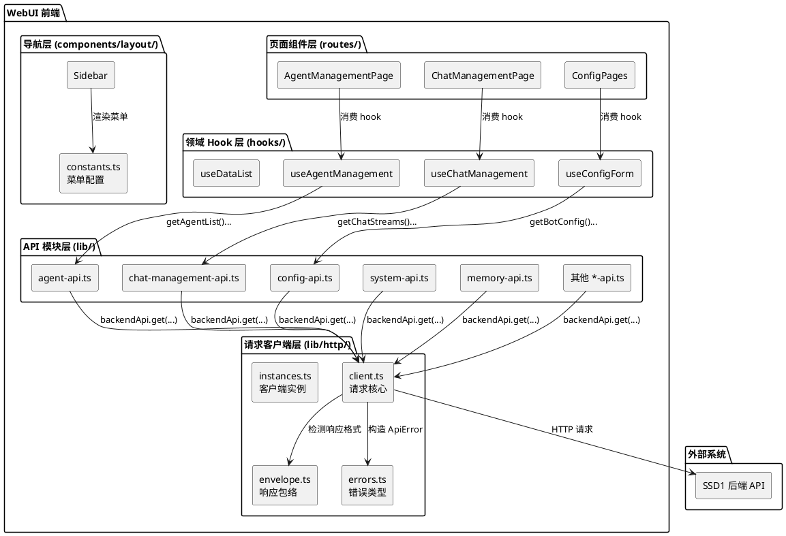
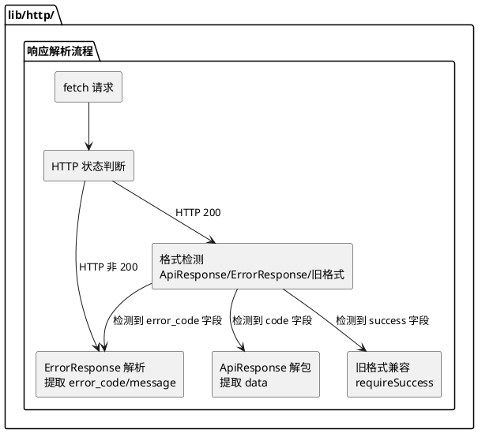
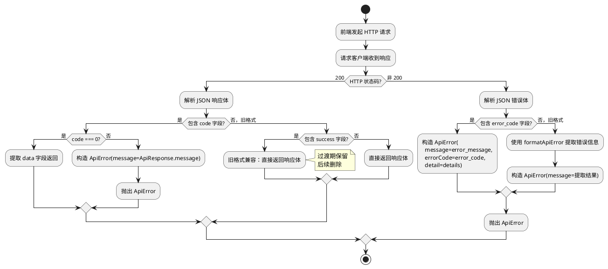
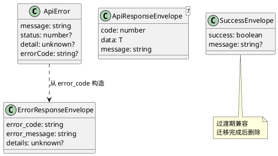

# WebUI 前端架构重构 — 增量设计文档

# 一、需求与存量功能关系分析

## 1.1 需求功能与存量功能对比

### 1.1.1 已实现功能（无需改动）

| 需求功能 | 存量功能 | 代码位置 | 匹配度 |
|---------|---------|---------|--------|
| 请求客户端深模块 | `createApiClient` 已实现，收编 base URL、认证、响应解析、错误格式化 | `lib/http/client.ts` | 100% |
| ApiError 统一错误类型 | `ApiError` 已实现，含 message/status/detail | `lib/http/errors.ts` | 100% |
| 请求客户端多实例 | `backendApi`/`statsApi`/`authApi` 三个实例已实现 | `lib/http/instances.ts` | 100% |
| TanStack Query 全局配置 | `createQueryClient()` 已实现，查询不重试、变更失败弹 toast | `lib/query.ts` | 100% |
| TanStack Router 路由系统 | 基于 `createRouter` 的路由树已实现，支持 lazy loading | `router.tsx` | 100% |
| 侧边栏导航组件 | `Sidebar`/`NavItem`/`useMenuSections` 已实现 | `components/layout/` | 90% |
| 统一 WebSocket 客户端 | `UnifiedWebSocketClient` 已实现，含心跳/重连/订阅 | `lib/unified-ws.ts` | 100% |
| 领域 hook 基础设施 | `useConfigForm`/`useDataList`/`usePendingOperation` 已实现 | `hooks/` | 80% |
| 虚拟化渲染依赖 | `@tanstack/react-virtual` 已安装 | `package.json` | 100% |

### 1.1.2 需要扩展的功能

| 需求功能 | 存量功能 | 差异说明 | 扩展方向 |
|---------|---------|---------|---------|
| ApiResponse[T] 自动解包 | 请求客户端直接 `JSON.parse` 返回原始响应体，各 API 模块手动 `requireSuccess()` 解包 | 缺少对 `{code, data, message}` 格式的自动检测和提取；当前 `envelope.ts` 的 `requireSuccess` 只处理 `{success: boolean}` 旧格式 | 在请求客户端的响应解析流程中增加 ApiResponse 格式检测，自动提取 data 字段 |
| ErrorResponse 自动解析 | 请求客户端在 HTTP 错误时用 `formatApiError` 从 `detail`/`message` 字段提取错误信息 | 缺少对 `{error_code, error_message, details}` 格式的结构化解析；当前 `formatApiError` 是通用文本提取，无法区分错误码分类 | 在请求客户端的错误解析流程中增加 ErrorResponse 格式检测，提取 error_code/error_message/details |
| API 路径迁移 | agent-api.ts 使用 `/api/webui/agent/*`（单数），chat-management-api.ts 使用 `/api/chat/*`（无 webui 前缀） | 路径与 SSD1 规范化路径不一致 | 修改各 API 模块的路径常量 |
| 领域 hook 覆盖 | 仅 `useConfigForm`/`useDataList`/`usePendingOperation` 三个通用 hook；大部分页面逻辑内联 | 智能体管理、聊天管理、情绪监控等页面逻辑耦合严重，无领域 hook | 为复杂页面抽取领域 hook |
| 导航分组 | 当前 4 个分组（概览/配置/资源/扩展），部分导航项路径不规范 | 导航路径与路由定义基本一致，但 agent 路由路径为 `/agents` 已正确 | 微调导航分组和排序 |

### 1.1.3 需要新增的功能或接口

**ApiResponse 解包层**（`lib/http/envelope.ts` 扩展）
- `ApiResponseEnvelope<T>` 类型：`{code: number, data: T, message: string}`
- `ErrorResponseEnvelope` 类型：`{error_code: string, error_message: string, details?: unknown}`
- `isApiResponseEnvelope()` 类型守卫
- `isErrorResponseEnvelope()` 类型守卫
- `unwrapApiResponse<T>()` 解包函数

**错误码分类处理**（`lib/http/errors.ts` 扩展）
- `ApiError.errorCode` 字段：存储后端返回的 error_code 字符串
- `isAuthError(error)` / `isParamError(error)` / `isBizError(error)` / `isSysError(error)` 分类判断函数

**领域 hook**（`hooks/` 目录新增）
- `useAgentManagement`：智能体管理页面状态机
- `useChatManagement`：聊天管理页面状态机
- `useEmotionMonitor`：情绪监控页面状态机
- `useRelationshipMonitor`：关系监控页面状态机

## 1.2 存量功能详细分析

### 1.2.1 请求客户端架构（已实现，需扩展响应解析）

**接口契约**：
- `ApiClient.request<T>(method, path, options)` → `Promise<T>`
- `ApiClient.get/post/put/patch/delete` → 便捷方法
- 响应解析流程：`fetch → text() → JSON.parse → 直接返回 T`

**扩展点**：
- 当前 `request()` 在 HTTP 200 时直接 `JSON.parse(rawText) as T` 返回，不检测响应体格式
- 需要在 `JSON.parse` 后增加格式检测：如果响应体包含 `code` 字段且 `code === 0`，提取 `data` 字段返回；如果 `code !== 0`，视为业务失败抛出 ApiError
- 如果响应体包含 `error_code` 字段，视为 ErrorResponse 格式，提取 `error_message` 和 `error_code`

**约束**：
- 旧格式 `{success: boolean, ...}` 在过渡期内必须继续支持
- 解包逻辑不应增加可感知的延迟（< 0.1ms/请求）
- 类型安全：`request<T>` 的返回值类型 T 应该是 `data` 字段的类型，而非整个 ApiResponse

### 1.2.2 API 模块层（已实现，需迁移路径和解包方式）

**接口契约**：
- 各 API 模块（agent-api.ts、config-api.ts 等）导出业务函数
- 业务函数调用 `backendApi.get/post/...` 发起请求
- 业务函数内部使用 `requireSuccess()` 解包旧格式响应

**扩展点**：
- `requireSuccess()` 调用需删除（解包逻辑下沉到请求客户端）
- 路径常量需迁移（如 `API_BASE = '/api/webui/agent'` → `'/api/webui/agents'`）
- 响应类型需调整（如 `AgentListResponse` 中的 `success` 字段需删除，改为 data 层级的类型）

**约束**：
- 迁移按模块逐个进行，每迁移一个模块验证功能正常
- 迁移期间旧格式和新格式必须同时支持

### 1.2.3 导航与路由（已实现，需微调）

**接口契约**：
- `menuSections` 常量定义导航分组和菜单项
- `router.tsx` 定义路由树
- `NavItem` 组件渲染菜单项

**扩展点**：
- 导航分组可微调排序和命名
- 路由路径已基本正确（agent 路由为 `/agents`）

**约束**：
- 不做大规模路由重组，避免破坏用户书签和肌肉记忆

# 二、增量设计方案

## 2.1 实现模型

### 2.1.1 上下文视图



### 2.1.2 服务/组件总体架构



### 2.1.3 实现设计文档

#### ApiResponse 自动解包流程



## 2.2 接口设计

### 2.2.1 总体设计

**接口分类**：
1. **请求客户端响应解析接口**：自动检测和解包 ApiResponse/ErrorResponse
2. **API 模块迁移接口**：路径常量更新 + 响应类型更新
3. **领域 Hook 接口**：页面状态机的标准接口

**接口变更策略**：
- 渐进式迁移：请求客户端先增加 ApiResponse 检测能力，API 模块逐个迁移
- 旧格式兼容：请求客户端同时支持旧格式和新格式，过渡期后移除旧格式支持
- 类型安全：所有接口变更保持 TypeScript 类型安全

| 接口分组 | 稳定性 | 说明 |
|---------|--------|------|
| ApiResponseEnvelope / ErrorResponseEnvelope | 稳定 | 统一响应体类型定义 |
| unwrapApiResponse | 稳定 | ApiResponse 解包函数 |
| ApiError.errorCode | 稳定 | 错误码字段 |
| isAuthError / isParamError / isBizError / isSysError | 稳定 | 错误码分类判断 |
| 领域 Hook 接口 | 稳定 | 页面状态机接口 |

### 2.2.2 接口清单

#### 统一响应体类型

```typescript
// lib/http/envelope.ts 扩展

/** SSD1 后端统一成功响应体 */
export interface ApiResponseEnvelope<T> {
  code: number
  data: T
  message: string
}

/** SSD1 后端统一错误响应体 */
export interface ErrorResponseEnvelope {
  error_code: string
  error_message: string
  details?: unknown
}

/** 类型守卫：判断响应体是否为 ApiResponse 格式 */
export function isApiResponseEnvelope(data: unknown): data is ApiResponseEnvelope<unknown> {
  return (
    data !== null &&
    typeof data === 'object' &&
    'code' in data &&
    typeof (data as ApiResponseEnvelope<unknown>).code === 'number'
  )
}

/** 类型守卫：判断错误体是否为 ErrorResponse 格式 */
export function isErrorResponseEnvelope(data: unknown): data is ErrorResponseEnvelope {
  return (
    data !== null &&
    typeof data === 'object' &&
    'error_code' in data &&
    typeof (data as ErrorResponseEnvelope).error_code === 'string'
  )
}

/** 解包 ApiResponse：提取 data 字段，code !== 0 时抛出 ApiError */
export function unwrapApiResponse<T>(data: ApiResponseEnvelope<T>, fallback: string): T {
  if (data.code !== 0) {
    throw new ApiError(data.message || fallback, { detail: data })
  }
  return data.data
}
```

#### ApiError 扩展

```typescript
// lib/http/errors.ts 扩展

export class ApiError extends Error {
  readonly status?: number
  readonly detail?: unknown
  /** SSD1 后端错误码（如 AUTH_FAILED、PARAM_CONFIG_INVALID） */
  readonly errorCode?: string

  constructor(
    message: string,
    options: { status?: number; detail?: unknown; cause?: unknown; errorCode?: string } = {}
  ) {
    super(message, options.cause === undefined ? undefined : { cause: options.cause })
    this.name = 'ApiError'
    this.status = options.status
    this.detail = options.detail
    this.errorCode = options.errorCode
  }
}

/** 判断是否为认证类错误 */
export function isAuthError(error: unknown): boolean {
  return error instanceof ApiError && error.errorCode?.startsWith('AUTH_') === true
}

/** 判断是否为参数类错误 */
export function isParamError(error: unknown): boolean {
  return error instanceof ApiError && error.errorCode?.startsWith('PARAM_') === true
}

/** 判断是否为业务类错误 */
export function isBizError(error: unknown): boolean {
  return error instanceof ApiError && error.errorCode?.startsWith('BIZ_') === true
}

/** 判断是否为系统类错误 */
export function isSysError(error: unknown): boolean {
  return error instanceof ApiError && error.errorCode?.startsWith('SYS_') === true
}
```

#### 请求客户端响应解析扩展

```typescript
// lib/http/client.ts 中 request() 函数的响应解析流程扩展

// 在 HTTP 200 且 parse === 'json' 时：
// 1. JSON.parse(rawText)
// 2. 如果 isApiResponseEnvelope(parsed)，则 unwrapApiResponse(parsed, errorMessage)
// 3. 否则直接返回 parsed（兼容旧格式和纯数据响应）

// 在 HTTP 非 200 时：
// 1. JSON.parse(rawText)
// 2. 如果 isErrorResponseEnvelope(parsed)，则构造 ApiError(message=error_message, errorCode=error_code, detail=details)
// 3. 否则走现有的 formatApiError 逻辑
```

#### API 路径迁移映射

| API 模块 | 旧路径常量 | 新路径常量 |
|---------|-----------|-----------|
| agent-api.ts | `API_BASE = '/api/webui/agent'` | `API_BASE = '/api/webui/agents'` |
| chat-management-api.ts | 硬编码 `/api/chat/...` | `API_BASE = '/api/webui/chat'` |

#### 领域 Hook 接口

```typescript
// hooks/useAgentManagement.ts
export interface UseAgentManagementReturn {
  agents: AgentConfigInfo[]
  isLoading: boolean
  error: Error | null
  reloadAgents: () => Promise<void>
  bindSessionAgent: (sessionId: string, agentId: string) => Promise<void>
  unbindSessionAgent: (sessionId: string) => Promise<void>
  // ... 其他操作
}

export function useAgentManagement(): UseAgentManagementReturn

// hooks/useChatManagement.ts
export interface UseChatManagementReturn {
  streams: ChatStream[]
  isLoading: boolean
  error: Error | null
  refreshStreams: () => Promise<void>
  deleteStream: (sessionId: string) => Promise<void>
  // ... 其他操作
}

export function useChatManagement(): UseChatManagementReturn
```

## 2.3 数据模型

### 2.3.1 设计目标

1. 请求客户端自动解包 ApiResponse，API 模块层无需手动处理响应格式
2. ApiError 携带结构化错误码，前端可按错误码分类处理
3. 领域 hook 封装完整的状态机，页面组件只负责渲染
4. 旧格式兼容期结束后，`requireSuccess` 和 `SuccessEnvelope` 可安全删除

### 2.3.2 模型实现



**对象创建和销毁策略**：
- `ApiResponseEnvelope` / `ErrorResponseEnvelope` 是类型守卫检测的接口，不实例化
- `ApiError` 在请求客户端的响应解析流程中按需创建
- `SuccessEnvelope` 在过渡期保留，迁移完成后删除

**迁移策略**：
- 阶段1：请求客户端增加 ApiResponse/ErrorResponse 检测能力（向后兼容）
- 阶段2：API 模块逐个迁移路径和解包方式
- 阶段3：领域 hook 抽取（与阶段2可并行）
- 阶段4：删除旧格式兼容代码（`requireSuccess`、`SuccessEnvelope`）
- 阶段5：性能优化和导航微调