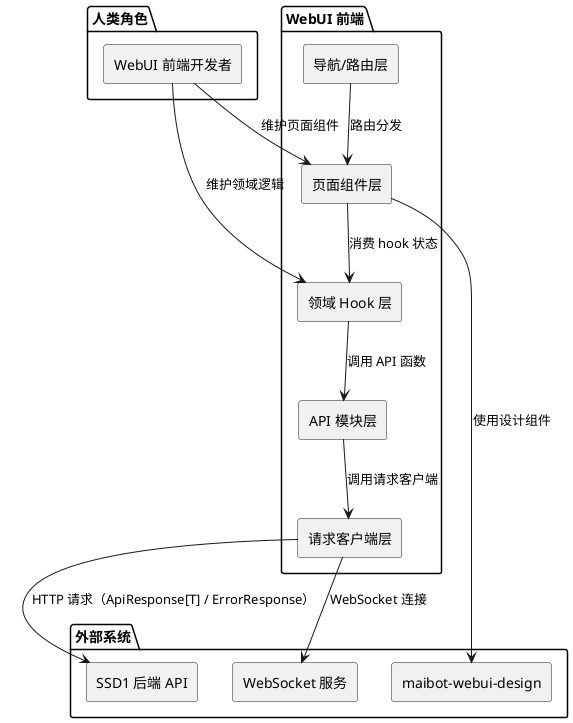
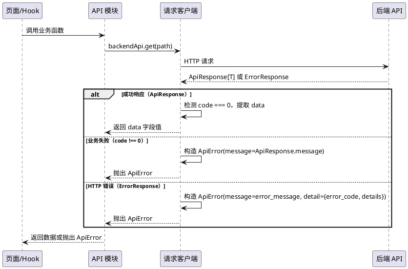
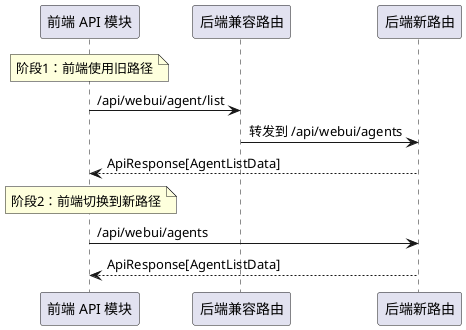
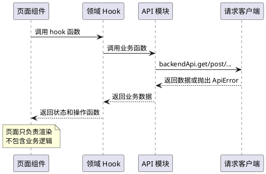

# **1. 组件定位**

## **1.1 核心职责**

本组件负责重构 MaiBot WebUI 前端架构，适配 SSD1 后端 API 规范化改造（统一响应体 ApiResponse[T]、统一错误体 ErrorResponse、路由规范化），同时解决前端现有组件耦合、性能瓶颈和导航结构混乱的问题，使前端代码可维护、可测试、可演进。

## **1.2 核心输入**

1. **SSD1 后端统一响应体**：所有 API 返回 `ApiResponse[T]` 格式 `{code: 0, data: T, message: "..."}`
2. **SSD1 后端统一错误体**：API 失败返回 `ErrorResponse` 格式 `{error_code: "XXX", error_message: "...", details: ...}`
3. **SSD1 后端路由规范化**：`/api/webui/agents`（复数）、`/api/webui/chat/*`（统一前缀）等新路径
4. **SSD1 后端 WebSocket 域注册表**：新增域只需注册，事件类型有枚举约束
5. **SSD1 后端配置写入自动 reload**：配置 API 写入后运行时配置自动更新
6. **现有前端代码**：React 19 + Vite 7 + Tailwind v4 + shadcn/ui 应用，含 30+ 路由页面

## **1.3 核心输出**

1. **适配统一响应体的 API 客户端层**：前端请求客户端自动解包 `ApiResponse[T]`，统一处理 `ErrorResponse`
2. **解耦的页面组件**：巨型页面拆分为领域 hook + 展示层，组件职责单一
3. **统一导航结构**：侧边栏菜单按业务领域分组，路由路径与导航一致
4. **适配后端路由规范化的 URL**：前端 API 调用路径从旧路径迁移到新路径
5. **性能优化**：减少不必要的重渲染，大数据量场景使用虚拟化

## **1.4 职责边界**

1. 本组件不负责后端代码改动（后端改造在 SSD1 中已完成）
2. 本组件不负责新增业务功能（只重构现有前端代码的架构和适配）
3. 本组件不负责 Electron 壳层改动
4. 本组件不负责设计系统（maibot-webui-design）本身的改动
5. 本组件不负责 i18n 翻译内容的增补（只调整翻译 key 的组织方式）

# **2. 领域术语**

**ApiResponse[T]**
: SSD1 后端统一成功响应体，包含 `code`（整数，0 表示成功）、`data`（业务数据）、`message`（人类可读消息）三个顶层字段。

**ErrorResponse**
: SSD1 后端统一错误响应体，包含 `error_code`（字符串，如 `AUTH_FAILED`）、`error_message`（人类可读描述）、`details`（可选详细信息）三个顶层字段。

**请求客户端（ApiClient）**
: 由 `createApiClient` 实例化的 HTTP 请求深模块，收编 base URL 解析、认证、响应解析、错误格式化与诊断。当前有三个实例：`backendApi`（主后端）、`statsApi`（统计服务）、`authApi`（认证流程）。

**ApiError**
: 请求失败时由请求客户端抛出的错误，`message` 已格式化为可直接渲染的简体中文，携带 HTTP `status` 与原始 `detail`。

**业务包络（SuccessEnvelope）**
: 当前部分后端端点在 HTTP 200 响应体中额外携带 `success: boolean` 标记的旧格式。SSD1 迁移后，此格式被 `ApiResponse[T]` 取代。

**领域 hook（Domain Hook）**
: 从巨型页面抽出的、承载某一 tab/领域完整状态机（state + 副作用 + API）的 hook；抽出后页面/tab 退化为消费 hook 的展示层。

**查询键（queryKey）**
: 服务端状态缓存的分层标识，以领域名开头（如 `['agents', 'list', 参数]`），写操作成功后按前缀整体失效。

**兼容路由**
: SSD1 后端保留的旧路径映射（如 `/api/webui/agent/list` → `/api/webui/agents`），在过渡期后移除。

**WebSocket 域**
: WebSocket 事件推送的逻辑分区，当前包含 `logs`、`plugin_progress`、`maisaka_monitor`、`chat` 四个域。SSD1 新增域注册表，新增域只需注册。

# **3. 角色与边界**

## **3.1 核心角色**

- **WebUI 前端开发者**：维护前端组件和 API 调用代码，需要清晰的 API 契约和可维护的组件结构
- **MaiBot 后端开发者**：维护 WebUI 后端路由和服务代码，SSD1 已完成后端改造

## **3.2 外部系统**

- **SSD1 后端 API**：已迁移到统一响应体和路由规范化的后端服务
- **maibot-webui-design**：WebUI 设计系统技能，包含三套主题、Design Token 体系
- **TanStack Router**：前端路由框架，基于文件系统的路由定义
- **TanStack Query**：服务端状态管理，查询/变更/queryKey 体系

## **3.3 交互上下文**

# **4. DFX约束**

## **4.1 性能**

1. API 客户端层解包 ApiResponse 的开销应小于 0.1ms/请求
2. 页面组件拆分不得引入额外的渲染开销（领域 hook 应使用 useMemo/useCallback 优化）
3. 大数据量列表（如聊天流列表、日志列表）必须使用虚拟化渲染（@tanstack/react-virtual）
4. 路由切换的首次内容渲染时间不得因重构而增加超过 50ms

## **4.2 可靠性**

1. API 响应格式迁移不得改变现有业务行为（前端展示的数据与重构前一致）
2. 旧 API 路径的兼容期必须覆盖到所有前端代码迁移完成
3. 错误处理必须覆盖所有 SSD1 定义的错误码（AUTH_*/PARAM_*/BIZ_*/SYS_*）

## **4.3 安全性**

1. 前端不得在日志或控制台中输出完整的 ErrorResponse.details（可能包含内部信息）
2. 认证失败（401）必须统一跳转登录页，不得停留在需要认证的页面

## **4.4 可维护性**

1. 新增 API 端点的前端适配只需修改对应的 API 模块文件，无需改动请求客户端核心
2. 新增页面的路由注册只需在 router.tsx 中添加一条路由定义
3. 领域 hook 必须与页面组件一一对应，hook 内不包含 UI 逻辑

## **4.5 兼容性**

1. 前端 API 路径迁移必须与后端兼容路由同步——前端先切换到新路径，确认功能正常后后端再移除兼容路由
2. 旧版 `SuccessEnvelope`（`{success: boolean, ...}`）格式在过渡期内必须继续支持
3. WebSocket 消息格式变更必须向后兼容（新字段为可选追加）

# **5. 核心能力**

## **5.1 API 客户端层适配统一响应体**

适配 SSD1 后端的 `ApiResponse[T]` 和 `ErrorResponse` 格式，消除当前前端对旧格式 `{success: boolean, ...}` 的依赖。

### **5.1.1 业务规则**

1. **ApiResponse 解包规范**：请求客户端在 HTTP 200 响应中检测到 `code` 字段时，自动提取 `data` 字段返回给调用方；`code !== 0` 时视为业务失败，抛出 ApiError
   a. 验收条件：[调用任意返回 ApiResponse 的端点] → [调用方直接拿到 data 字段的值，无需手动解包]

2. **ErrorResponse 解析规范**：请求客户端在 HTTP 非 200 响应中检测到 `error_code` 字段时，使用 `error_message` 作为 ApiError.message，`error_code` 和 `details` 附加到 ApiError
   a. 验收条件：[触发任意 API 错误] → [ApiError.message 为后端返回的 error_message，ApiError.detail 包含 error_code 和 details]

3. **旧格式兼容规范**：在过渡期内，请求客户端必须同时支持旧格式 `{success: boolean, ...}` 和新格式 `{code: 0, data: ..., message: ...}`
   a. 验收条件：[调用尚未迁移到 ApiResponse 的端点] → [功能不变，旧格式正常解包]

4. **错误码前端处理规范**：前端必须根据 `error_code` 前缀分类处理错误——AUTH_* 跳转登录、PARAM_* 高亮字段、BIZ_* 展示业务提示、SYS_* 展示系统错误
   a. 验收条件：[收到 AUTH_FAILED 错误] → [跳转登录页]；[收到 PARAM_CONFIG_INVALID 错误] → [高亮对应配置字段]

5. **禁止项**：API 模块层（*-api.ts）不得再手动调用 `requireSuccess()` 解包旧格式；解包逻辑统一由请求客户端层处理
   a. 验收条件：[检查所有 *-api.ts 文件] → [无 requireSuccess 调用，无手动 success 检查]

### **5.1.2 交互流程**

### **5.1.3 异常场景**

1. **后端返回混合格式**
   a. 触发条件：部分端点已迁移到 ApiResponse，部分仍返回旧格式
   b. 系统行为：请求客户端自动检测响应格式，按对应规则解包
   c. 用户感知：功能不受影响，无需区分新旧格式

2. **ApiResponse 中 code !== 0 但 HTTP 200**
   a. 触发条件：后端返回 `{code: 1, data: null, message: "配置校验失败"}`
   b. 系统行为：请求客户端视为业务失败，抛出 ApiError(message="配置校验失败")
   c. 用户感知：页面展示错误提示，与 HTTP 错误体验一致

## **5.2 API 路径迁移**

将前端 API 调用路径从旧路径迁移到 SSD1 规范化的新路径，与后端兼容路由协同工作。

### **5.2.1 业务规则**

1. **路径迁移映射规范**：前端 API 模块中的路径常量必须按以下映射迁移
   a. `/api/webui/agent/*` → `/api/webui/agents/*`（复数名词）
   b. `/api/chat/*` → `/api/webui/chat/*`（统一前缀）
   c. `/api/webui/config/*` 保持不变（已在正确路径下）
   d. `/api/webui/memory/*` 保持不变（已在正确路径下）
   e. 验收条件：[检查所有 *-api.ts 文件的路径常量] → [均使用规范化路径]

2. **渐进式迁移规范**：路径迁移按 API 模块逐个进行，每迁移一个模块后验证功能正常
   a. 验收条件：[每迁移一个 API 模块] → [对应页面功能测试通过]

3. **禁止项**：不得在前端代码中硬编码旧路径作为兼容方案
   a. 验收条件：[检查前端代码] → [无硬编码的旧路径]

### **5.2.2 交互流程**

### **5.2.3 异常场景**

1. **前端路径迁移后后端兼容路由已移除**
   a. 触发条件：前端使用新路径，但后端已移除兼容路由且新路由未就绪
   b. 系统行为：请求客户端检测到 404，抛出 ApiError 含路由未命中诊断
   c. 用户感知：页面展示错误提示，开发者可通过诊断信息快速定位问题

## **5.3 页面组件解耦**

将当前耦合严重的页面组件拆分为领域 hook + 展示层，使页面逻辑可测试、可复用。

### **5.3.1 业务规则**

1. **领域 hook 抽取规范**：超过 200 行的页面组件必须抽取领域 hook，hook 承载完整的状态机（state + 副作用 + API 调用），页面组件退化为纯展示层
   a. 验收条件：[检查超过 200 行的页面组件] → [均有对应的领域 hook，页面组件行数 < 150 行]

2. **hook 命名规范**：领域 hook 以 `use` 开头，以页面功能名结尾，如 `useAgentManagement`、`useChatManagement`
   a. 验收条件：[检查 hooks/ 目录] → [hook 命名遵循规范]

3. **hook 与 API 模块的边界规范**：hook 调用 API 模块函数，API 模块调用请求客户端；hook 不直接调用请求客户端
   a. 验收条件：[检查领域 hook 代码] → [无 backendApi 直接调用，均通过 API 模块函数]

4. **禁止项**：不得在页面组件中直接调用 API 函数（除简单的 useQuery/useMutation 调用外）；复杂状态逻辑必须抽取到领域 hook
   a. 验收条件：[检查页面组件代码] → [无复杂的 useState/useEffect + API 调用组合]

### **5.3.2 交互流程**

### **5.3.3 异常场景**

1. **页面组件拆分后状态丢失**
   a. 触发条件：将页面中的 useState/useEffect 迁移到 hook 时，状态初始化时机变化
   b. 系统行为：hook 使用 TanStack Query 的 queryKey 管理服务端状态，本地状态通过 useState 初始化
   c. 用户感知：页面功能不变，无状态丢失

## **5.4 导航结构重组**

统一侧边栏导航的分组和路由路径，消除当前导航结构混乱的问题。

### **5.4.1 业务规则**

1. **导航分组规范**：侧边栏导航必须按业务领域分组，当前分组调整为：
   a. 概览：首页、智能体管理、情绪监控、关系监控、子智能体监控、DeepSeek 监控、MaiSaka 监控、聊天管理
   b. 配置：麦麦主程序配置、模型配置、Prompt 管理
   c. 资源：表情包、表达方式、黑话、行为学习、知识库
   d. 扩展：插件配置、插件市场、MCP 设置
   e. 验收条件：[检查侧边栏菜单] → [分组与上述规范一致]

2. **路由路径与导航一致规范**：路由路径必须与导航项的 path 属性一致，不得出现导航指向 `/agents` 但路由定义为 `/agent` 的情况
   a. 验收条件：[检查 router.tsx 和 constants.ts] → [所有导航路径与路由定义匹配]

3. **导航项排序规范**：同一分组内的导航项按使用频率排序，高频项在前
   a. 验收条件：[检查侧边栏菜单] → [分组内导航项按使用频率排序]

4. **禁止项**：不得在导航中添加指向不存在路由的菜单项
   a. 验收条件：[检查 constants.ts 中所有 path] → [均在 router.tsx 中有对应路由定义]

### **5.4.2 交互流程**

（导航结构重组为静态配置变更，无运行时交互流程变化）

### **5.4.3 异常场景**

1. **导航路径变更导致书签失效**
   a. 触发条件：用户浏览器收藏了旧路径的书签
   b. 系统行为：TanStack Router 的 404 处理自动跳转到首页
   c. 用户感知：旧书签跳转到首页，可从侧边栏导航到目标页面

## **5.5 性能优化**

减少不必要的重渲染，优化大数据量场景的渲染性能。

### **5.5.1 业务规则**

1. **大数据量列表虚拟化规范**：超过 100 条数据的列表必须使用虚拟化渲染（@tanstack/react-virtual）
   a. 验收条件：[在聊天流列表、日志列表等页面加载 1000+ 条数据] → [页面滚动流畅，无卡顿]

2. **查询缓存优化规范**：频繁访问的只读数据（如智能体列表、配置 Schema）必须使用 TanStack Query 的 staleTime 缓存，避免重复请求
   a. 验收条件：[在多个页面间切换] → [已缓存的查询不重新请求]

3. **组件重渲染优化规范**：领域 hook 返回的对象和函数必须使用 useMemo/useCallback 包裹，避免不必要的子组件重渲染
   a. 验收条件：[使用 React DevTools Profiler 检查] → [无因 hook 返回值引用变化导致的级联重渲染]

4. **禁止项**：不得在渲染路径中创建新的内联对象或函数（如 `style={{}}`、`onClick={() => ...}`），应提取为常量或使用 useCallback
   a. 验收条件：[使用 React DevTools Profiler 检查] → [无因内联引用导致的重渲染]

### **5.5.2 交互流程**

（性能优化为代码层面改进，无运行时交互流程变化）

### **5.5.3 异常场景**

1. **虚拟化列表与动态高度冲突**
   a. 触发条件：列表项高度不固定时，虚拟化计算出现偏差
   b. 系统行为：使用动态高度估算 + 测量修正策略
   c. 用户感知：列表滚动正常，无内容重叠或空白

# **6. 数据约束**

## **6.1 统一响应体（前端视角）**

1. **code**：整数，0 表示成功，非 0 表示业务错误；前端请求客户端自动检测并解包
2. **data**：任意 JSON 值，成功时包含业务数据；前端调用方直接拿到此值
3. **message**：字符串，人类可读的操作结果描述；业务失败时作为 ApiError.message

## **6.2 统一错误体（前端视角）**

1. **error_code**：字符串，按 `AUTH_*`/`PARAM_*`/`BIZ_*`/`SYS_*` 分类前缀；前端根据前缀分类处理
2. **error_message**：字符串，人类可读的错误描述（简体中文）；直接作为 ApiError.message
3. **details**：可选的 JSON 对象，包含错误的补充信息；附加到 ApiError.detail

## **6.3 API 路径迁移映射**

| 旧路径（前端当前使用） | 新路径（SSD1 规范化） | API 模块 |
|---------|-----------|---------|
| `/api/webui/agent/list` | `/api/webui/agents` | agent-api.ts |
| `/api/webui/agent/{id}` | `/api/webui/agents/{id}` | agent-api.ts |
| `/api/webui/agent/emotion/{id}` | `/api/webui/agents/{id}/emotion` | agent-api.ts |
| `/api/webui/agent/relationship/{id}` | `/api/webui/agents/{id}/relationships` | agent-api.ts |
| `/api/webui/agent/binding/session/{id}` | `/api/webui/agents/bindings/sessions/{id}` | agent-api.ts |
| `/api/webui/agent/binding/group` | `/api/webui/agents/bindings/groups` | agent-api.ts |
| `/api/webui/agent/sessions/{id}` | `/api/webui/agents/{id}/sessions` | agent-api.ts |
| `/api/webui/agent/reload` | `/api/webui/agents/reload` | agent-api.ts |
| `/api/chat/*` | `/api/webui/chat/*` | chat-management-api.ts |

## **6.4 前端错误码处理策略**

| 错误码前缀 | 前端处理方式 |
|------------|-------------|
| AUTH_* | 跳转登录页（与当前 401 处理一致） |
| PARAM_* | 高亮对应输入字段，展示 error_message |
| BIZ_* | 展示业务错误提示（toast 或页面内提示） |
| SYS_* | 展示系统错误页面或全局 toast |

## **6.5 需要解包迁移的 API 模块**

| API 模块 | 旧格式依赖 | 迁移内容 |
|---------|-----------|---------|
| agent-api.ts | `requireSuccess()` + `{success: boolean, ...}` 响应类型 | 删除 requireSuccess 调用，响应类型改为 ApiResponse 内部 data 类型 |
| chat-management-api.ts | `{success: boolean, ...}` 响应类型 + 手动 success 检查 | 响应类型改为 ApiResponse 内部 data 类型，删除手动检查 |
| config-api.ts | `unwrapConfigResponse()` 手动解包 | 简化解包逻辑，利用请求客户端自动解包 |
| system-api.ts | 部分 `{success: boolean, ...}` 响应类型 | 响应类型迁移 |
| memory-api.ts | `{success: boolean, ...}` 响应类型 | 响应类型迁移 |
| unified-ws.ts | `{success: boolean, token?: string}` WS token 获取 | 适配 ApiResponse 格式 |