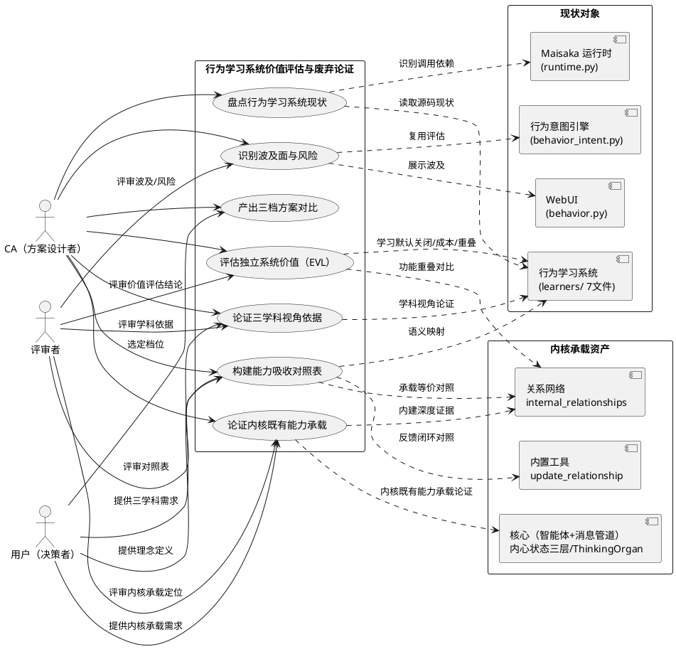
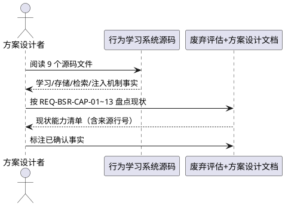
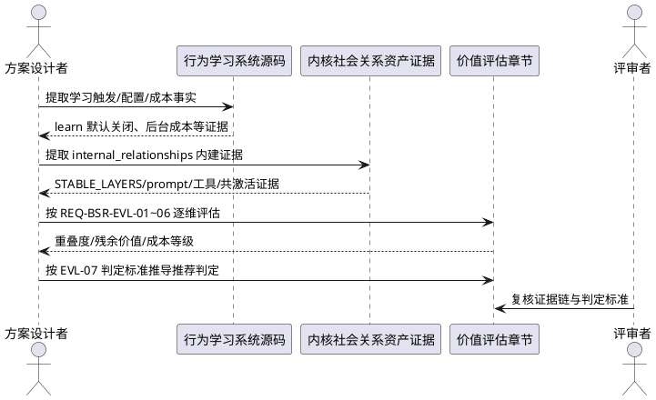
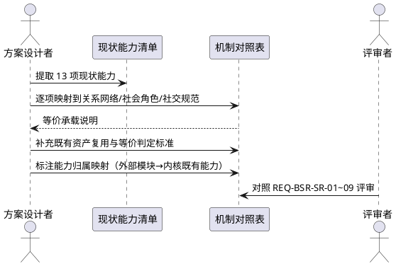
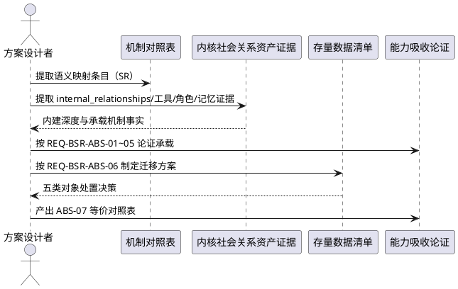
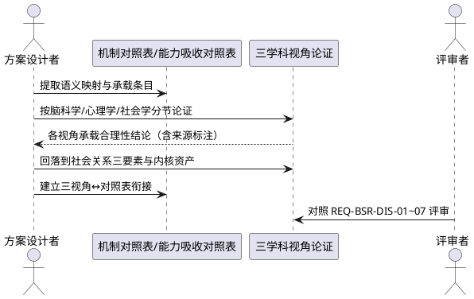
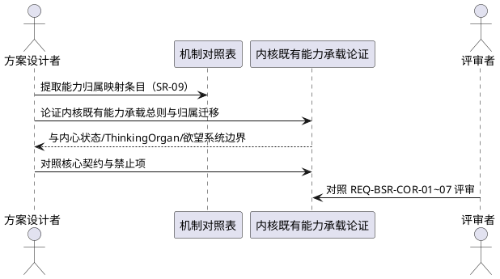
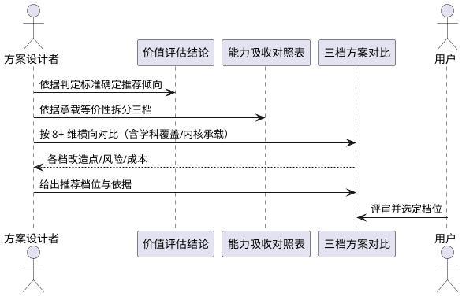
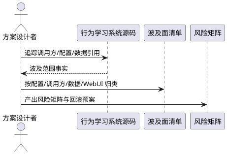
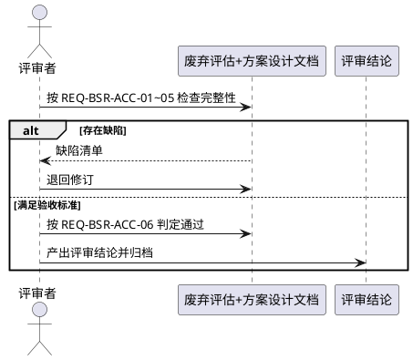

# 行为学习系统社会关系替代研究 — 需求规格（spec.md）

> 特征标识：`behavior_social_replacement`
> 所属主线：ZG 铸骨计划
> 文档性质：需求规格（EARS 格式），仅覆盖"废弃评估+方案设计文档"的验收要求，不含设计、不含代码
> 状态：待评审
>
> **版本变更记录**
>
> | 版本 | 日期 | 变更内容 |
> |------|------|---------|
> | v1.0 | 2026-07-31 | 初版：覆盖 CAP（现状盘点）/ SR（社会关系机制）/ OPT（三档对比）/ RSK（波及风险）/ ACC（验收）五域，41 条需求 |
> | v2.0 | 2026-07-31 | 新增 **DIS**（三学科视角依据）与 **COR**（内核内建定位）两个需求域；SR 域新增"外部 learners 模块 → 内核内建能力"映射要素（SR-09）；OPT-05 对比维度扩展至 8 维；ACC-01 章节完整性更新为七章；数据约束新增学科依据与内核内建对象 |
> | v3.0 | 2026-07-31 | **方向变更**：由"社会关系替代（迁移保留）"转为"**价值评估 → 倾向废弃独立行为学习系统 → 行为得体由已有的内核社会关系资产承载**"。新增 **EVL**（价值评估）与 **ABS**（能力吸收）两个需求域（各 7 条）；三档方案重定义（保守=保留独立系统仅停 learn、均衡=废弃独立系统+能力吸收、激进=完全移除+行为得体由社会关系天然承载）；COR 域明确"行为学习作为内核能力"主要指"行为得体是关系网络+角色的自然推论"（internal_relationships 已是内核既有深度内建能力），而非新建内核子系统；ACC 验收更新为废弃评估文档的验收。共 70 条需求 |

# **1. 组件定位**

## **1.1 核心职责**

本组件负责评估 MaiBot 行为学习系统（"社会约束"机制）作为独立子系统的**价值与必要性**，论证其**废弃路径**，并论证"行为得体"如何由**已有的内核社会关系资产**承载，产出一份可评审的**废弃评估+方案设计文档**（含价值评估结论、能力吸收等价对照表、存量数据迁移方案、波及面、风险与三档方案对比），供用户决策是否进入落码规划阶段。

方向判断（须在方案文档中以证据链验证，而非预设结论）：**额外的行为学习系统可能没有价值**。已确认的支撑事实包括：

1. **关系网络已是内核深度内建能力**：`internal_relationships` 定义于智能体配置（`config.py`）、经 `internal_relationships_prompt` 注入 prompt（`prompt_builder.py`）、位列 DeepSeek 前缀缓存稳定层 STABLE_LAYERS（`prefix_cache.py`）、由内置工具 `update_relationship` 动态更新（含 Hebbian 共激活增强）、参与内心世界共激活计算（`inner_world.py`）、有 WebUI 关系管理（`webui/routers/agent.py`）。
2. **行为学习 learn 默认关闭**：`get_behavior_config_for_chat` 默认返回 `(True, False)`——use 开、learn 关，仅靠存量数据"使用"、默认不"学习"（测试确认）。
3. **后台 LLM 学习成本**：行为学习是 `runtime.py` 中与表达学习、黑话学习并列的后台学习者之一，由裁切历史后台任务触发，持续产生 LLM 调用成本。
4. **历史补偿定位**：行为参考注入 planner 是"角色+关系+记忆"健全前的历史补偿机制，而关系网络等内核资产现已健全。

研究须满足两条硬约束：

1. **三学科视角**：行为得体由社会关系资产承载的论证，须从脑科学、心理学、社会学三个学科视角论证合理性，为设计阶段提供理论框架；三学科视角服务于"社会关系"核心理念的落地，不是并列的另一套机制。
2. **内核既有能力承载**："行为学习作为内核能力"主要指"行为得体是关系网络+社会角色的自然推论"（`internal_relationships` 关系网络已是内核既有深度内建能力），**而非新建内核子系统**。

## **1.2 核心输入**

1. **用户需求边界**：本阶段仅交付废弃评估+方案设计文档；废弃深度取向须提供保守/均衡/激进三档由用户选择；用户理念定义（社会关系 = 关系网络、社会角色、社交规范）；用户新增需求（三学科视角论证、行为学习作为内核既有能力的承载论证）。
2. **行为学习系统源码现状**：`learners/` 下 7 个文件（behavior_generic_tags / behavior_learner / behavior_pattern_maintenance / behavior_pattern_store / behavior_scenario / behavior_scene_cluster_store / behavior_selector）、`maisaka/agent_autonomy/behavior_intent.py`、`webui/routers/behavior.py`（共 9 文件，废弃评估基线）。
3. **内核社会关系资产源码证据**：`maisaka/agent/config.py`（internal_relationships 定义与 prompt）、`maisaka/deepseek/prefix_cache.py`（STABLE_LAYERS）、`maisaka/builtin_tool/update_relationship.py`（内置工具）、`maisaka/agent_interaction/relationship_manager.py`（共激活）、`maisaka/agent_autonomy/inner_world.py`、`maisaka/agent_autonomy/prompt_builder.py`、`maisaka/agent_autonomy/butler.py`、`webui/routers/agent.py`、`webui/routers/deepseek.py`。
4. **learn 默认关闭运行事实**：`pytests/common_test/test_chat_config_utils.py` 确认 `get_behavior_config_for_chat` 默认返回 `(True, False)`、`enable_behavior_learning is False`。
5. **债务全景**：`.codeartsdoer/specs/memo/zg_cast_bone_research.md` 中行为学习系统定位（DEPRECATED，ThinkingOrgan 思考-行动分离"⚠️ 部分替代"）。
6. **上一阶段交接**：`.shared/handoff/ca2cc_component_audit_social_behavior_0731.md`（任务 2 原由 CA 负责；三元协作协调中枢交接后由 CC 主导推进，见 `ca2cc_coordinator_transition_0731.md`）。
7. **项目架构哲学**：核心定义（智能体 + 消息管道，`receive/think/respond`）、内心状态三层（情绪/欲望/记忆）、欲望系统为规则引擎、Agent-owns-Thinking（ThinkingOrgan）、目标核心管道。

## **1.3 核心输出**

1. **本需求规格（spec.md）**：规定废弃评估+方案设计文档必须满足的研究覆盖范围与验收标准。
2. **废弃评估+方案设计文档**（下游阶段产出物，本 spec 为其定义验收要求）：含现状能力盘点（CAP）、价值评估结论（EVL）、社会关系语义映射（SR）、能力吸收等价对照表（ABS）、三学科视角依据（DIS）、内核既有能力承载定位（COR）、波及面清单、风险矩阵、三档方案对比与推荐（OPT）、存量数据迁移方案。

## **1.4 职责边界**

本组件**不负责**：

1. 不编写任何业务代码或修改行为学习系统。
2. 不生成 design.md / tasks.md（由 spec-design-agent、spec-task-agent 承担）。
3. 不代替用户决定废弃深度档位（方案文档须给出三档对比，最终由用户选择）。
4. 不评估行为学习系统之外的组件（表达学习、黑话学习、高频词学习不在本研究范围）。
5. 不承诺废弃后的行为效果等价性（等价性论证是方案文档的内容，须由用户评审确认）。
6. 不裁定三学科理论本身的学术正确性（学科依据须可溯源引用，但理论争鸣不属于本研究裁决范围）。
7. **不新建内核子系统**："行为得体由内核承载"必须论证 `internal_relationships` 等**既有**内核社会关系资产的承载能力，不得主张新增独立的内核行为学习模块。
8. 不预设"必须废弃"的结论（价值评估须以证据链推导出保留/废弃/部分保留判定，最终由用户决策）。

# **2. 领域术语**

**行为学习系统**
: MaiBot 中从聊天历史中学习"场景-行为-结果"经验路径（行为表现模式）并用于影响回复风格的机制，属"社会约束"机制，配置入口为 `ExperimentalConfig` 的 4 个字段。

**行为经验路径（BehaviorExperiencePath）**
: 行为学习系统存储的最小学习单元，记录主体（actor_type）、学习类型（learning_type）、行为（action）、预期结果（outcome）、所属场景簇、来源证据、反馈历史与评分。

**场景画像（BehaviorScenarioProfile）**
: 对一次学习/选择窗口的抽象描述，含场景摘要（summary）、标签簇（tag_clusters，分 domain/attitude/need 三类）与置信度。

**场景簇（BehaviorSceneCluster）**
: 按 tag 概率分布聚类的相似场景集合，是行为经验路径的检索入口，支持跨会话复用。

**观察学习（observed_behavior）**
: 学习类型之一，表示从他人行为中观察到的"场景-行为-结果"模式。

**自我复盘（self_reflection）**
: 学习类型之一，表示对麦麦自身行为的复盘模式。

**社会关系**
: 用户提出的替代理念，定义为"关系网络、社会角色、社交规范"三要素的统称；是本研究不变的核心理念。

**关系网络**
: 社会关系三要素之一，指聊天流、群、用户之间可量化的关系连接与亲疏结构，承载行为学习系统中"场景-会话共享"语义的候选等价物；v3.0 明确其具体落点为内核既有资产 `internal_relationships`。

**社会角色**
: 社会关系三要素之一，指智能体与对话对象在特定关系中的身份定位，承载行为学习系统中"主体（actor_type）"语义的候选等价物。

**社交规范**
: 社会关系三要素之一，指特定关系与场合下"什么行为得体/不得体"的规则，承载行为学习系统中"行为-结果（action/outcome）与选择/注入/反馈"语义的候选等价物。

**internal_relationships（内核关系网络）**
: Maisaka 智能体配置中的关系网络字段（`maisaka/agent/config.py` 定义），含 relationship_type / attitude / interaction_style / anti_mechanization 等要素，经 `internal_relationships_prompt` 注入 prompt，位列 DeepSeek 前缀缓存 STABLE_LAYERS 稳定层，是"行为得体"的主要内核承载资产。

**update_relationship 工具**
: 智能体内置工具（`maisaka/builtin_tool/update_relationship.py`），允许智能体动态更新关系网络，含主发言校验与 Hebbian 共激活增强机制，是"行为得体"反馈闭环的内核承载资产。

**历史补偿机制**
: 对行为参考注入 planner 的定位判断——该机制是"角色+关系+记忆"健全前的历史补偿，而 `internal_relationships` 等内核资产现已健全，补偿的必要性须在价值评估中论证。

**STABLE_LAYERS**
: DeepSeek 前缀缓存的稳定层配置（`deepseek/prefix_cache.py`），`internal_relationships` 位列其中，证明关系网络参与前缀缓存命中的核心地位。

**三学科视角**
: 用户新增需求，要求行为学习机制的承载设计分别从脑科学、心理学、社会学三个学科视角论证合理性；三视角共同服务于"社会关系"核心理念的落地。

**内核内建（行为学习）**
: 用户新增需求，要求行为学习是内核中智能体的能力（核心 = 智能体 + 消息管道，`receive/think/respond`；内心状态三层：情绪/欲望/记忆）；v3.0 明确其含义为"行为得体是关系网络+社会角色的自然推论"，`internal_relationships` 关系网络已是内核既有能力，而非新建内核子系统。

**内心状态三层**
: 项目架构哲学中的内心世界模型：情绪（我此刻感觉如何）、欲望（我想要什么）、记忆（我经历了什么）；内心状态持续演化：`内心状态(t+1) = g(内心状态(t), 消息, 时间)`。

**ThinkingOrgan（思维管道）**
: 项目架构哲学中的智能体思维管道；思考-行动分离：content = 内心独白（不发给用户），reply 工具调用 = 对外回复；行为得体承载须与其边界清晰。

**价值评估（EVL）**
: 对独立行为学习系统作为子系统的价值与必要性进行的评估，维度包括：learn 默认关闭现状、与 `internal_relationships` 的功能重叠、后台 LLM 学习成本、ThinkingOrgan 部分替代现状、历史补偿必要性；输出"保留/废弃/部分保留"判定。

**能力吸收（ABS）**
: 废弃独立行为学习系统后，论证"行为得体"由既有内核社会关系资产（`internal_relationships` 关系网络 + `update_relationship` 工具 + 社会角色 + 记忆）承载的等价性，以及存量行为经验路径数据的一次性迁移/导入方案。

**机制对照表**
: 废弃评估+方案设计文档的必备章节，逐项将行为学习系统现有能力点映射到社会关系三要素与内核既有资产的等价语义。

**三档替代方案（保守/均衡/激进）**
: 方案设计文档必须给出的三种废弃深度方案，供用户选择；v3.0 重定义：保守=保留独立系统仅停 learn、均衡=废弃独立系统+能力吸收、激进=完全移除+行为得体由社会关系天然承载。

**波及面**
: 方案设计文档的必备章节，识别废弃行为学习系统将影响的配置项、调用方、数据对象、WebUI 与既有系统。

# **3. 角色与边界**

## **3.1 核心角色**

- **用户（决策者）**：提供需求边界与理念定义；评审废弃评估+方案设计文档；从三档方案中选定废弃深度；确认价值评估结论与能力吸收方案的理解。
- **CC（方案设计者，三元协作协调中枢交接后主导）**：阅读源码盘点现状并核验内核社会关系资产证据；撰写废弃评估+方案设计文档（价值评估 + 能力吸收对照表 + 学科视角依据 + 内核既有能力承载定位 + 波及面 + 风险 + 三档对比）；确保文档满足本 spec 全部需求。过渡期内 CA 协助审阅。
- **评审者**：对照本 spec 逐条验收废弃评估+方案设计文档，判定是否满足评审通过标准。

## **3.2 外部系统**

- **行为学习系统（现状对象）**：本研究的目标对象，废弃评估须基于其源码现状（9 文件）盘点能力。
- **内核社会关系资产（承载目标）**：`internal_relationships` 关系网络（config.py / prefix_cache.py / prompt_builder.py / inner_world.py / butler.py / relationship_manager.py）、`update_relationship` 内置工具、WebUI 关系管理（webui/routers/agent.py）；方案文档须论证"行为得体"由这些既有资产承载。
- **Maisaka 运行时（调用方）**：`maisaka/runtime.py` 中触发裁切历史后台学习（`_trigger_trimmed_history_learning`）与行为选择召回，废弃方案须识别其对行为学习的依赖。
- **WebUI（展示依赖）**：`webui/routers/behavior.py` 提供行为学习图谱浏览；`webui/routers/agent.py` 提供关系网络管理；废弃方案须识别其依赖关系。
- **行为意图引擎（既有社会关系雏形）**：`maisaka/agent_autonomy/behavior_intent.py` 中 `RelationshipIntentSource` 已实现"关系→行为意图"，是能力吸收的既有资产，方案文档须评估其复用方式。
- **核心（智能体能力承载目标）**：核心 = 智能体 + 消息管道，含内心状态三层与 ThinkingOrgan；行为得体承载须以其为边界论证衔接。
- **欲望系统（内心状态层）**：规则引擎（非 LLM），驱动智能体主动行动；方案文档须论证行为得体承载与欲望系统的协作/边界关系。

## **3.3 交互上下文**

# **4. DFX约束**

## **4.1 性能**

1. 废弃评估+方案设计文档的能力吸收对照表必须逐条覆盖行为学习系统现状能力点，不得遗漏，遗漏率须为 0。
2. 方案文档应控制在可单次评审阅读的篇幅内（正文建议不超过 1000 行 Markdown）。

## **4.2 可靠性**

1. 方案文档中的现状盘点、价值评估结论与能力吸收论证必须可追溯到源码文件与行号（含内核社会关系资产证据），禁止无依据推测。
2. 方案文档必须明确标注"已确认事实"与"待用户决策事项"的区分。
3. 三档方案必须各自独立成章，不得混写。
4. 三学科视角的每条依据必须标注理论来源，无来源的推演必须显式标注为"推演性观点"。
5. 价值评估结论必须与证据链分离呈现：结论在前、证据在后，评审者可独立复核证据。

## **4.3 安全性**

1. 方案文档不得包含数据库连接串、令牌、密钥等敏感配置原文。
2. 涉及敏感配置（如 ExperimentalConfig 字段）时仅描述字段名与语义，不复制默认值中的敏感信息。

## **4.4 可维护性**

1. 需求编号必须遵循 `REQ-BSR-<域>-<序号>` 格式，可全局唯一追溯。
2. 文档必须使用简体中文书写（代码标识符、字段名除外）。
3. 文档中每个需求必须附带可测试的验收条件。

## **4.5 兼容性**

1. 方案文档必须说明与铸骨计划既有路线（ThinkingOrgan 部分替代、废弃系统清理策略）的关系，不得产生路线冲突。
2. 三档方案中任何一档被选定后，剩余档位的对比结论仍须保留存档，便于后续变更档位时参考。
3. "行为得体由内核既有社会关系资产承载"的定位必须与项目架构哲学（核心契约、内心状态三层、Agent-owns-Thinking）兼容，不得与核心禁止项冲突，且不得主张新建内核子系统。

# **5. 核心能力**

## **5.1 行为学习系统现状能力盘点（REQ 基线）**

本节需求要求方案文档必须基于源码完整盘点行为学习系统现有能力，作为价值评估与能力吸收的等价语义基线。盘点维度覆盖：学什么、存什么、怎么选、怎么注入提示词。

### **5.1.1 业务规则**

1. **REQ-BSR-CAP-01（学习来源盘点）**：方案文档必须盘点行为学习系统的学习输入来源。
   a. 验收条件：[方案文档包含学习触发链路] → [明确标识：由 `maisaka/runtime.py` 的裁切历史后台任务触发，学习消息源为 Maisaka 裁切上下文中的真实聊天消息，最少 10 条才触发]
2. **REQ-BSR-CAP-02（学习内容盘点）**：方案文档必须盘点行为候选的学习内容要素。
   a. 验收条件：[方案文档描述学习内容] → [明确标识：行为候选含 action（行为）、outcome（预期结果）、source_ids（来源）、actor_type（主体）、learning_type（学习类型），并说明 actor_type 三值（other_user/maibot_self/group_collective）与 learning_type 两值（observed_behavior/self_reflection）]
3. **REQ-BSR-CAP-03（场景画像盘点）**：方案文档必须盘点场景分析与场景切分能力。
   a. 验收条件：[方案文档描述场景画像] → [明确标识：LLM 将学习窗口抽象为场景画像（summary + domain/attitude/need 三类 tag 簇 + confidence），并可切分为 1~3 个场景片段]
4. **REQ-BSR-CAP-04（通用标签过滤盘点）**：方案文档必须盘点泛化标签过滤机制。
   a. 验收条件：[方案文档描述标签过滤] → [明确标识：存在通用 domain 标签集合（群聊、闲聊、玩梗、表情包等）用于过滤泛化价值低的场景标签]
5. **REQ-BSR-CAP-05（存储结构盘点）**：方案文档必须盘点行为学习系统的持久化对象。
   a. 验收条件：[方案文档描述存储] → [明确标识：行为经验路径（含 count/activation_count/success_count/failure_count/score/evidence_list/feedback_list/enabled）、场景簇（tag 概率分布）、行为节点、结果节点、tag 簇（同义词合并）五类对象及其关联关系]
6. **REQ-BSR-CAP-06（去重与合并规则盘点）**：方案文档必须盘点行为经验路径的去重合并规则。
   a. 验收条件：[方案文档描述写入规则] → [明确标识：同一会话+场景簇+行为+结果+主体+学习类型合并计数而非新建，证据与反馈历史有保留上限]
7. **REQ-BSR-CAP-07（评分与维护规则盘点）**：方案文档必须盘点评分区间与用进废退维护规则。
   a. 验收条件：[方案文档描述维护规则] → [明确标识：评分区间、衰减冷却、多档衰减阈值（一次性观察/被选无成功/曾有效）、禁用条件（低分+多次失败/长期未用）]
8. **REQ-BSR-CAP-08（选择开关盘点）**：方案文档必须盘点行为选择的启用与共享范围配置。
   a. 验收条件：[方案文档描述选择开关] → [明确标识：按会话解析 use/learn 双开关、行为共享组（behavior_groups）跨会话共享、全局共享通配]
9. **REQ-BSR-CAP-09（检索机制盘点）**：方案文档必须盘点场景簇检索模式。
   a. 验收条件：[方案文档描述检索] → [明确标识：direct_domain_overlap / tag_cluster_spread_1 / tag_cluster_spread_2 三种模式、direct 锁定阈值与 spread 衰减、topN 截断]
10. **REQ-BSR-CAP-10（候选排序盘点）**：方案文档必须盘点候选加权排序公式要素。
    a. 验收条件：[方案文档描述排序] → [明确标识：排序由次数、评分、成功/失败数、激活次数、自我复盘加成、冷单例折扣、画像 tag 匹配加成等要素组合决定，并说明召回数量上限]
11. **REQ-BSR-CAP-11（提示词注入盘点）**：方案文档必须盘点行为参考如何注入 planner 上下文。
    a. 验收条件：[方案文档描述注入] → [明确标识：以"非强制任务"提示语 + 当前场景画像 + 候选行为列表（含 behavior_id/优先级/行为/预期结果）形式作为参考消息注入裁切上下文]
12. **REQ-BSR-CAP-12（反馈闭环盘点）**：方案文档必须盘点行为效果的反馈评估与写回机制。
    a. 验收条件：[方案文档描述反馈] → [明确标识：从后续裁切上下文提取 behavior_id 参考，LLM 依据时间线评估采用与结果，校验自我采用证据后写回评分/状态/原因]
13. **REQ-BSR-CAP-13（WebUI 与配置盘点）**：方案文档必须盘点 WebUI 展示与配置项依赖。
    a. 验收条件：[方案文档描述依赖] → [明确标识：WebUI 行为图谱浏览（chats/paths/clusters/graph-data/retrieval-debug）与 ExperimentalConfig 4 字段（enable_behavior_learning / enable_rich_reply / behavior_learning_list / behavior_groups）及其调用方范围]

### **5.1.2 交互流程**

### **5.1.3 异常场景**

1. **现状盘点遗漏**
   a. 触发条件：方案文档未覆盖 REQ-BSR-CAP-01~13 中任意一项能力维度。
   b. 系统行为：评审者对照本 spec 逐条核验，标记缺失项并退回方案文档。
   c. 用户感知：方案文档评审不通过，返回缺失项清单。

2. **盘点结论无源码依据**
   a. 触发条件：方案文档出现无法追溯到源码文件/行号的能力描述。
   b. 系统行为：评审者要求补充来源标注或将无依据结论降级为"待确认假设"。
   c. 用户感知：评审意见要求补证或降级。

## **5.2 价值评估需求（EVL）**

本节需求要求方案文档对独立行为学习系统作为子系统的价值与必要性进行系统评估，产出明确的"保留/废弃/部分保留"判定及可追溯依据。价值评估是废弃论证的前提，评估维度覆盖运行现状（learn 默认关闭）、功能重叠（与内核关系网络）、运行成本（后台 LLM 学习）、既有系统替代（ThinkingOrgan 部分替代）与历史补偿必要性。

### **5.2.1 业务规则**

1. **REQ-BSR-EVL-01（价值评估总则）**：方案文档必须对独立行为学习系统进行价值评估，输出明确的"保留 / 废弃 / 部分保留"三态判定及核心依据。
   a. 验收条件：[检查价值评估章节] → [存在明确的三态判定结论；每条判定依据可追溯到源码证据或运行事实（含文件与行号），无空泛表述]
2. **REQ-BSR-EVL-02（learn 默认关闭事实评估）**：方案文档必须评估"learn 默认关闭、仅 use 开启"这一运行现状对系统价值的影响。
   a. 验收条件：[检查 learn 现状评估] → [明确引用 `get_behavior_config_for_chat` 默认返回 `(True, False)`、`enable_behavior_learning is False` 的测试证据（`pytests/common_test/test_chat_config_utils.py`），并说明该事实对"独立学习子系统"存在价值的削弱程度]
3. **REQ-BSR-EVL-03（功能重叠评估）**：方案文档必须评估行为学习系统与 `internal_relationships` 关系网络的功能重叠度。
   a. 验收条件：[检查重叠评估] → [逐项对比：行为经验路径的"场景-行为-结果"与关系网络"relationship_type-attitude-interaction_style"的语义重叠、行为参考注入与 `internal_relationships_prompt` 注入的重叠、行为反馈闭环与 `update_relationship` 动态更新的重叠；给出重叠度结论（高/中/低）与逐项依据]
4. **REQ-BSR-EVL-04（后台成本评估）**：方案文档必须评估行为学习作为后台 LLM 学习的运行成本。
   a. 验收条件：[检查成本评估] → [明确说明：裁切历史后台学习（`runtime.py` 学习触发点）的 LLM 调用频次与资源占用特征，对比"关闭 learn 仅靠存量 use"与"完全移除"两种状态下成本差异，并给出成本等级结论]
5. **REQ-BSR-EVL-05（既有系统替代评估）**：方案文档必须评估 ThinkingOrgan"部分替代"现状下行为学习系统的残余价值。
   a. 验收条件：[检查残余价值评估] → [结合 `zg_cast_bone_research.md` 中行为学习系统 DEPRECATED 定位与 ThinkingOrgan 思考-行动分离"⚠️ 部分替代"现状，说明行为学习系统的残余价值区间（高/中/低）与理由]
6. **REQ-BSR-EVL-06（历史补偿必要性评估）**：方案文档必须评估"行为参考注入 planner 是角色+关系+记忆健全前的历史补偿机制"这一判断的当前成立性。
   a. 验收条件：[检查历史补偿评估] → [明确说明：在 `internal_relationships` 已深度内建（STABLE_LAYERS 稳定层、prompt 注入、inner_world 共激活、update_relationship 工具）的现状下，历史补偿机制是否仍有必要保留，并给出结论]
7. **REQ-BSR-EVL-07（判定标准）**：方案文档必须给出"保留 / 废弃"的量化判定标准，并据此推导推荐判定。
   a. 验收条件：[检查判定标准] → [明确列出至少 3 条可量化判定标准（如：功能重叠维度数、learn 开启会话占比、后台学习成本量级、残余价值等级），并依据标准推导出推荐判定；标准不满足时须显式标注"不满足"并说明处置方式]

### **5.2.2 交互流程**

### **5.2.3 异常场景**

1. **价值评估证据不足**
   a. 触发条件：某条评估结论无法追溯到源码证据或运行事实。
   b. 系统行为：依据 EVL-01 复核，无依据结论降级为"待确认假设"并退回补证。
   c. 用户感知：评审意见要求补证或降级。

2. **判定标准分歧**
   a. 触发条件：评审者对"保留/废弃"判定推导过程存在分歧。
   b. 系统行为：依据 EVL-07 判定标准逐条复核，标准未覆盖时补充判定标准后再评审。
   c. 用户感知：补充判定标准或由用户最终裁决。

## **5.3 社会关系替代的机制性需求（SR）**

本节需求要求方案文档论证"关系网络、社会角色、社交规范"三要素如何承载行为学习系统的等价语义。等价性论证必须逐项回答"现有能力由哪个社会关系概念以何种方式承载"，禁止含糊其辞或跳过某项。社会关系是本研究不变的核心理念；v3.0 方向下，本域语义映射服务于能力吸收（ABS）的论证，映射落点须优先指向内核既有社会关系资产（`internal_relationships` 关系网络、`update_relationship` 工具、社会角色、记忆）。

### **5.3.1 业务规则**

1. **REQ-BSR-SR-01（语义映射总则）**：方案文档必须为行为学习系统每一项现状能力（REQ-BSR-CAP-01~13）给出社会关系等价承载方案。
   a. 验收条件：[对照 REQ-BSR-CAP-01~13 逐项检查] → [每项均有明确的社会关系承载说明，无空项、无"待定"占位；且承载说明同时标注"语义承载方式"与"承载主体归属"（内核既有资产或需新增，见 ABS-01）]
2. **REQ-BSR-SR-02（关系网络承载场景与共享语义）**：方案文档必须论证关系网络如何承载"场景识别、场景簇复用、跨会话共享"语义。
   a. 验收条件：[方案文档包含关系网络机制论证] → [明确说明：场景画像/场景簇/行为共享组如何映射为关系网络的节点、边、亲疏度或连通关系，并给出关系网络的信息来源（如会话对象关系、群成员关系、`internal_relationships` 配置）]
3. **REQ-BSR-SR-03（社会角色承载主体语义）**：方案文档必须论证社会角色如何承载 actor_type 与 learning_type 语义。
   a. 验收条件：[方案文档包含社会角色机制论证] → [明确说明：other_user/group_collective/maibot_self 三类主体与观察学习/自我复盘两种学习类型如何映射为社会角色定义与角色内省]
4. **REQ-BSR-SR-04（社交规范承载行为语义）**：方案文档必须论证社交规范如何承载 action/outcome 与选择、注入、反馈语义。
   a. 验收条件：[方案文档包含社交规范机制论证] → [明确说明：行为-结果如何表达为"在特定关系与场合下的得体/不得体规范"，规范的获取、选择、注入提示与强化/修正闭环如何承接现有行为经验路径的生命周期]
5. **REQ-BSR-SR-05（学习来源等价）**：方案文档必须论证社会关系理念下"学什么"的来源与触发是否保持等价。
   a. 验收条件：[方案文档对比学习来源] → [明确说明：观察他人行为/自我复盘在社会关系模型下是否仍然成立、消息量门槛是否保留、场景切分是否保留]
6. **REQ-BSR-SR-06（评分与维护等价）**：方案文档必须论证社会关系理念下评分、衰减、禁用规则是否有等价物或可替代规则。
   a. 验收条件：[方案文档对比维护规则] → [明确说明：用进废退逻辑如何被关系亲疏演化（如 `relationship_manager.py` 共激活衰减）、规范强化/弱化或角色适配度替代，或明确主张保留原有数值机制]
7. **REQ-BSR-SR-07（既有资产复用）**：方案文档必须评估 `behavior_intent.py` 中 `RelationshipIntentSource`（关系→行为意图）作为社会关系替代既有资产的可复用性。
   a. 验收条件：[方案文档包含既有资产评估] → [明确说明：已有 internal_relationships 关系配置与"关系→意图"实现（`behavior_intent.py` L155-198）的可复用范围、差距与改造点]
8. **REQ-BSR-SR-08（语义等价判定标准）**：方案文档必须给出"等价性成立"的判定标准，供评审者验收。
   a. 验收条件：[方案文档包含等价判定标准] → [明确列出：至少满足哪些可观察条件（如：同一场景下选择倾向一致、学习来源不丢失、反馈闭环仍闭合）才判定某项语义等价成立]
9. **REQ-BSR-SR-09（能力归属映射）**：方案文档必须将"外部 learners 模块 → 内核既有能力"作为社会关系替代的映射要素之一加以论证，即替代不仅是语义层面的（关系网络/社会角色/社交规范），也是归属层面的（从 `learners/` 独立子系统回归为内核既有智能体能力）。
   a. 验收条件：[方案文档包含归属映射论证] → [明确说明：社会关系三要素承载语义时，承载主体如何从 `learners/` 外部模块回归为内核既有能力（`internal_relationships` 等），二者如何同步论证而非只做语义映射忽略归属迁移；该论证与 COR 域（内核既有能力承载定位）保持一致]

### **5.3.2 交互流程**

### **5.3.3 异常场景**

1. **语义映射存在缺口**
   a. 触发条件：某项现状能力无法映射到社会关系三要素或内核既有资产。
   b. 系统行为：方案文档必须显式标注该缺口，说明保留原机制或提出新承载概念，禁止静默省略。
   c. 用户感知：评审意见指向缺口项，由用户决策该缺口是否接受。

2. **等价性论证分歧**
   a. 触发条件：评审者与方案设计者对某项等价性判定不一致。
   b. 系统行为：依据 REQ-BSR-SR-08 判定标准复核，标准未覆盖时补充判定标准后再评审。
   c. 用户感知：补充判定标准或由用户最终裁决。

## **5.4 能力吸收需求（ABS）**

本节需求要求方案文档论证：废弃独立行为学习系统后，"行为得体"由**已有的内核社会关系资产**承载的等价性，并给出存量行为经验路径数据的一次性迁移/导入方案。能力吸收是废弃路径的核心交付物，须以源码证据论证内核既有资产（`internal_relationships` 关系网络、`update_relationship` 工具、社会角色、记忆）如何承接行为学习系统的语义，而非主张新建内核子系统。

### **5.4.1 业务规则**

1. **REQ-BSR-ABS-01（能力吸收总则）**：方案文档必须论证行为得体由内核既有社会关系资产承载的等价性。
   a. 验收条件：[检查能力吸收论证] → [明确说明承载资产四要素（`internal_relationships` 关系网络 / `update_relationship` 工具 / 社会角色 / 记忆）各自承载行为学习系统哪些语义，逐项无"待定"占位，并说明各要素均为既有资产、无需新建内核子系统]
2. **REQ-BSR-ABS-02（关系网络承载）**：方案文档必须论证 `internal_relationships` 关系网络承载"场景-会话共享、亲疏适配、得体判断"语义。
   a. 验收条件：[检查关系网络承载论证] → [明确引用：`config.py` 中 internal_relationships 字段定义与 `internal_relationships_prompt`（含 relationship_type/attitude/interaction_style/anti_mechanization）、`prefix_cache.py` STABLE_LAYERS 稳定层、`prompt_builder.py` 注入、`inner_world.py` 共激活参与内心世界、`butler.py` 管家使用，论证关系网络如何产生"在特定关系下的得体行为"自然推论]
3. **REQ-BSR-ABS-03（工具链承载）**：方案文档必须论证 `update_relationship` 内置工具承接行为学习的"反馈闭环、用进废退、关系演化"语义。
   a. 验收条件：[检查工具链承载论证] → [明确引用 `update_relationship.py` 主发言校验与 Hebbian 共激活增强（L111-122）、`relationship_manager.py` 共激活衰减与共激活图构建（L148-310），说明该工具如何替代行为经验路径的评分/衰减/禁用生命周期，并指出保留或改造点]
4. **REQ-BSR-ABS-04（角色与记忆承载）**：方案文档必须论证社会角色与记忆承载"actor_type、learning_type、学什么"语义。
   a. 验收条件：[检查角色与记忆承载论证] → [明确说明：other_user/group_collective/maibot_self 三类主体如何由关系网络中对象角色承载、观察学习/自我复盘如何由记忆与内心状态承载、消息量门槛与场景切分如何被替代或保留]
5. **REQ-BSR-ABS-05（行为意图衔接）**：方案文档必须论证 `RelationshipIntentSource`（关系→行为意图）作为能力吸收既有资产的衔接方式。
   a. 验收条件：[检查行为意图衔接论证] → [明确引用 `behavior_intent.py` L155-198 RelationshipIntentSource 的关系命中→`want_to_interject` 意图机制，说明其在吸收后体系中的角色、复用范围与增强点]
6. **REQ-BSR-ABS-06（存量数据迁移）**：方案文档必须给出存量行为经验路径数据的一次性迁移/导入方案。
   a. 验收条件：[检查迁移方案] → [明确：行为经验路径/场景簇/行为节点/结果节点/tag 簇五类对象各自的处置决策（迁移为关系配置/导入为初始关系/归档/删除）、一次性导入的触发方式、验证方式与失败回退方式]
7. **REQ-BSR-ABS-07（吸收等价对照表）**：方案文档必须产出"行为学习能力 → 社会关系资产承载"等价对照表。
   a. 验收条件：[检查等价对照表] → [对照 REQ-BSR-CAP-01~13 逐项给出承载资产、等价判定（等价成立/部分等价/不成立）、差异点说明；部分等价与不成立项必须给出处置建议]

### **5.4.2 交互流程**

### **5.4.3 异常场景**

1. **某项能力无等价承载**
   a. 触发条件：某项现状能力无法由内核既有社会关系资产承载。
   b. 系统行为：方案文档必须显式标注该缺口，给出处置建议（保留原机制/部分保留/提出新承载概念），禁止静默省略。
   c. 用户感知：评审意见指向缺口项，由用户决策该缺口是否接受。

2. **存量数据不可迁移**
   a. 触发条件：存量行为经验路径数据无法映射到关系网络/角色/记忆模型。
   b. 系统行为：方案文档必须给出该部分数据的处置决策（保留只读/归档/删除）与依据，并说明对"行为得体"承载的影响。
   c. 用户感知：由用户确认数据处置决策。

## **5.5 三学科视角依据需求（DIS）**

本节需求要求方案文档从脑科学、心理学、社会学三个学科视角论证"行为得体由社会关系资产承载"的实现方式合理性，为后续设计阶段提供理论框架。三学科视角服务于"社会关系"核心理念的落地，不是并列的另一套机制；三视角的结论须回落到 REQ-BSR-SR-01~09 的语义映射与 REQ-BSR-ABS-01~07 的能力吸收承载上。

### **5.5.1 业务规则**

1. **REQ-BSR-DIS-01（三学科总则）**：方案文档必须分别从脑科学、心理学、社会学三个学科视角论证行为得体承载机制的合适实现方式，并声明三视角共同服务于"社会关系"核心理念。
   a. 验收条件：[检查方案文档学科视角章节] → [三个学科视角各自独立成节；每节结论均回落到社会关系三要素（关系网络/社会角色/社交规范）与内核承载资产（internal_relationships/update_relationship/角色/记忆）的落地，无"为学科而学科"的独立机制主张]
2. **REQ-BSR-DIS-02（脑科学视角）**：方案文档必须给出脑科学视角的承载机制论证。
   a. 验收条件：[检查脑科学视角章节] → [明确说明：脑科学视角如何解释行为得体与关系演化的合理性（如习惯形成、强化学习、多巴胺奖励回路、用进废退的神经基础、Hebbian 学习），并映射到 `update_relationship` 共激活增强、关系亲疏演化等承载机制；同时说明对行为学习系统"学习触发/评分强化/衰减禁用"环节的替代或保留意义]
3. **REQ-BSR-DIS-03（心理学视角）**：方案文档必须给出心理学视角的承载机制论证。
   a. 验收条件：[检查心理学视角章节] → [明确说明：心理学视角如何解释行为得体承载的合理性（如自我认知、人格一致性、依恋理论、社会学习理论），并映射到社会角色/自我复盘/观察学习的对应语义及记忆承载]
4. **REQ-BSR-DIS-04（社会学视角）**：方案文档必须给出社会学视角的承载机制论证。
   a. 验收条件：[检查社会学视角章节] → [明确说明：社会学视角如何解释行为得体承载的合理性（如角色理论、社会规范、社会网络分析），并直接映射到关系网络/社会角色/社交规范三要素与 `internal_relationships` 的对应]
5. **REQ-BSR-DIS-05（三视角与对照表的衔接）**：方案文档必须说明三学科视角结论与能力吸收对照表（REQ-BSR-ABS-07）和机制对照表（REQ-BSR-SR-01~09）的逐条衔接关系。
   a. 验收条件：[对照对照表检查] → [对照表中每条社会关系承载方式均可追溯到至少一个学科视角依据，无孤立无据的映射条目]
6. **REQ-BSR-DIS-06（学科依据可溯源）**：方案文档中每条学科依据必须标注理论来源（理论名称/代表学者或文献），无来源的推演必须显式标注为"推演性观点"。
   a. 验收条件：[抽查学科依据条目] → [每条依据均有理论来源标注或"推演性观点"标注，不存在冒充公认理论的个人推断]
7. **REQ-BSR-DIS-07（三档方案的学科覆盖差异）**：方案文档必须说明三档方案（REQ-BSR-OPT-01~06）各自对三学科视角的覆盖深度差异。
   a. 验收条件：[对照三档方案检查] → [每档方案明确标注其对脑科学/心理学/社会学三视角的覆盖程度（如：理论参考/机制对齐/深度内化），三档之间有明显梯度]

### **5.5.2 交互流程**

### **5.5.3 异常场景**

1. **三学科视角脱离社会关系理念**
   a. 触发条件：某学科视角论证未回落到社会关系三要素，形成独立机制主张。
   b. 系统行为：评审者标记该节偏离核心理念，退回修订为"服务于社会关系落地的论证"。
   c. 用户感知：评审意见指出偏离节次并要求重写。

2. **学科依据来源存疑**
   a. 触发条件：某条学科依据无法溯源或来源标注含糊。
   b. 系统行为：依据 REQ-BSR-DIS-06 复核，无法溯源则降级为"推演性观点"或删除。
   c. 用户感知：评审意见要求补源或降级。

## **5.6 内核既有能力承载定位需求（COR）**

本节需求要求方案文档论证"行为学习作为内核能力"的定位。v3.0 明确：**"行为学习作为内核能力"主要指"行为得体是关系网络+社会角色的自然推论"，由内核既有社会关系资产（`internal_relationships` 关系网络等）承载，而非新建内核子系统**。论证须与项目架构哲学（核心契约、Agent-owns-Thinking、内心状态三层）对齐，并对比说明与当前 `learners/` 外部独立子系统形态的差异。

### **5.6.1 业务规则**

1. **REQ-BSR-COR-01（内核既有能力承载总则）**：方案文档必须论证"行为得体是关系网络+社会角色的自然推论"这一内核既有能力承载定位，并对比说明与当前 `learners/` 外部独立子系统形态的差异。
   a. 验收条件：[检查方案文档内核承载章节] → [明确说明："行为得体"作为内核既有能力意味着什么（如：由 `internal_relationships` 关系网络经 prompt 注入直接参与智能体决策，无需独立学习子系统），并指出当前外部模块形态在归属、生命周期、调用链上的差异；不得主张新建内核子系统]
2. **REQ-BSR-COR-02（与内心状态三层的边界）**：方案文档必须明确行为得体承载与内心状态三层（情绪/欲望/记忆）的边界与衔接。
   a. 验收条件：[检查边界论证] → [明确说明：`internal_relationships` 如何参与内心状态演化（如 `inner_world.py` 关系网数量参与 lambda 计算、coactivation_strength），行为得体承载属于或横跨哪一层，与"内心状态(t+1)=g(内心状态(t),消息,时间)"演化方程的关系]
3. **REQ-BSR-COR-03（与 ThinkingOrgan 的衔接）**：方案文档必须明确行为得体承载与 ThinkingOrgan（思考-行动分离）的边界与衔接。
   a. 验收条件：[检查 ThinkingOrgan 衔接论证] → [明确说明：关系网络经 `prompt_builder.py` 注入如何进入 ThinkingOrgan 的思考-行动决策（content=内心独白 / reply=对外回复），而非绕过 ThinkingOrgan 的外部注入]
4. **REQ-BSR-COR-04（与欲望系统的衔接）**：方案文档必须明确行为得体承载与欲望系统（规则引擎）的协作边界。
   a. 验收条件：[检查欲望系统衔接论证] → [明确说明：行为得体承载（能力层）与欲望系统（内心状态层）的职责划分——谁产出"想做什么"、谁产出"该怎么做"，以及二者如何共同作用于主动行动]
5. **REQ-BSR-COR-05（与核心契约的对齐）**：方案文档必须说明行为得体承载如何遵守项目核心契约（核心不依赖组件具体实现、通过 Protocol 交互、Agent-owns-Thinking、禁止核心直接导入组件类）。
   a. 验收条件：[对照项目核心禁止项检查] → [明确说明：行为得体承载（基于 `internal_relationships` 等既有内核能力）与核心禁止项（如禁止核心直接导入 chat_manager、禁止绕过 MessagePort）的符合性，无违反核心契约的设计主张]
6. **REQ-BSR-COR-06（归属迁移路径）**：方案文档必须论证从 `learners/` 外部模块到内核既有能力承载的归属迁移路径（不进入代码级设计）。
   a. 验收条件：[检查归属迁移论证] → [明确说明：废弃独立系统的阶段性（如：先停 learn 观察、再停 use 迁移存量、最后移除代码）、中间态、以及每阶段的验证方式（如：行为选择倾向一致、行为得体表现不退化）]
7. **REQ-BSR-COR-07（三档方案的内核化差异）**：方案文档必须说明三档方案（REQ-BSR-OPT-01~06）各自的废弃/承载程度差异。
   a. 验收条件：[对照三档方案检查] → [每档方案明确标注其独立系统去留与内核既有资产承载程度（如：保守档保留独立系统仅停 learn、均衡档废弃独立系统+能力吸收、激进档完全移除+行为得体由社会关系天然承载），三档之间有明显梯度]

### **5.6.2 交互流程**

### **5.6.3 异常场景**

1. **内核承载定位与现状形态混淆**
   a. 触发条件：方案文档将"内核既有能力承载"与"现状外部模块"混为一谈或边界不清。
   b. 系统行为：评审者依据 COR-01~07 逐条核对归属、边界、迁移路径表述，标记混淆处退回修订。
   c. 用户感知：评审意见指向混淆条目并要求厘清。

2. **核心契约冲突**
   a. 触发条件：内核承载论证中出现违反项目核心契约或核心禁止项的主张。
   b. 系统行为：依据 COR-05 对照核心禁止项复核，冲突主张须修正或降级为"需用户决策的例外事项"。
   c. 用户感知：用户获知契约冲突说明并裁决。

3. **主张新建内核子系统**
   a. 触发条件：方案文档将"行为学习作为内核能力"理解为新建独立的内核行为学习模块。
   b. 系统行为：依据 COR-01 复核，退回修订为"论证既有内核社会关系资产的承载"，不新增子系统。
   c. 用户感知：评审意见指出误读并要求重写定位章节。

## **5.7 三档方案对比需求（OPT）**

本节需求要求方案文档提供保守/均衡/激进三档方案对比，供用户选择废弃深度。v3.0 三档重定义：**保守=保留独立系统仅停 learn、均衡=废弃独立系统+能力吸收、激进=完全移除+行为得体由社会关系天然承载**。三档方案须同时反映价值评估结论（EVL）、社会关系语义承载（SR）、能力吸收（ABS）、三学科视角覆盖（DIS）与内核既有能力承载程度（COR）的差异。

### **5.7.1 业务规则**

1. **REQ-BSR-OPT-01（三档定义）**：方案文档必须分别定义保守、均衡、激进三档方案的核心主张与废弃范围。
   a. 验收条件：[方案文档包含三档定义] → [每档均明确：保留哪些现状机制、废弃哪些现状机制、新增/强化哪些内核社会关系机制、行为学习系统的去留状态（保守=保留仅停 learn、均衡=废弃+能力吸收、激进=完全移除）]
2. **REQ-BSR-OPT-02（保守档）**：保守档必须以最小改动为原则，保留独立行为学习系统但仅停用 learn（学习），保留存量数据 use（使用），优先复用既有资产（含 behavior_intent 关系雏形）。
   a. 验收条件：[方案文档包含保守档详情] → [明确保守档的改造点清单（至少含停用 learn 的配置与影响）、不改动范围、对现有行为学习系统代码的保留程度]
3. **REQ-BSR-OPT-03（激进档）**：激进档必须以完全移除行为学习系统为目标，行为得体由社会关系天然承载，允许重构/废弃现有行为学习代码。
   a. 验收条件：[方案文档包含激进档详情] → [明确激进档的承载架构主张、被废弃的行为学习组件清单、存量数据处置、迁移路径与验证方式]
4. **REQ-BSR-OPT-04（均衡档）**：均衡档必须以废弃独立系统+能力吸收为目标，给出可逐步演进的过渡路径。
   a. 验收条件：[方案文档包含均衡档详情] → [明确均衡档的分阶段演进步骤（如：停 learn → 迁移存量 → 停 use → 移除代码）、每阶段的边界条件与退出标准]
5. **REQ-BSR-OPT-05（多维度对比）**：方案文档必须从至少 8 个维度横向对比三档方案。
   a. 验收条件：[方案文档包含对比表] → [对比维度至少覆盖：语义等价完整性、能力吸收完整度、三学科视角覆盖深度、内核既有能力承载程度、改造工作量、风险等级、数据迁移需求、对既有系统（ThinkingOrgan）影响、回滚难度，每格给出明确结论而非空泛描述]
6. **REQ-BSR-OPT-06（推荐与依据）**：方案文档必须给出推荐档位及客观依据（须与 EVL 价值评估结论一致），但最终选择权保留给用户。
   a. 验收条件：[方案文档包含推荐结论] → [明确给出推荐档位、推荐理由（可追溯到 EVL-07 判定标准）、不推荐的档位及其否决原因；推荐结论不得替代用户决策]

### **5.7.2 交互流程**

### **5.7.3 异常场景**

1. **三档界限模糊**
   a. 触发条件：三档方案存在大量重合或界限不清。
   b. 系统行为：方案文档必须以明确的"保留/废弃/新增"清单区分各档边界，评审时逐档核对。
   c. 用户感知：评审意见要求厘清档位边界。

2. **用户拒绝推荐档位**
   a. 触发条件：用户不采纳方案文档的推荐档位。
   b. 系统行为：其余档位详情须保持完整可评审状态，直接基于用户选定档位进入下一阶段。
   c. 用户感知：按用户选定档位继续，无需返工其余档位。

## **5.8 波及面与风险识别需求（RSK）**

本节需求要求方案文档系统识别废弃行为学习系统带来的波及面与风险。

### **5.8.1 业务规则**

1. **REQ-BSR-RSK-01（配置波及面）**：方案文档必须识别 ExperimentalConfig 相关配置项的波及范围。
   a. 验收条件：[方案文档包含配置波及清单] → [覆盖 enable_behavior_learning / enable_rich_reply / behavior_learning_list / behavior_groups 四字段的全部活跃调用方与废弃后的去留方案]
2. **REQ-BSR-RSK-02（代码调用方波及面）**：方案文档必须识别行为学习系统的全部代码调用方。
   a. 验收条件：[方案文档包含调用方波及清单] → [至少覆盖：Maisaka 运行时裁切历史学习触发点、planner 侧行为选择召回点、反馈写回点，并逐一给出废弃后的影响说明与内核承载替代]
3. **REQ-BSR-RSK-03（数据波及面）**：方案文档必须识别持久化数据对象的波及与迁移需求。
   a. 验收条件：[方案文档包含数据波及清单] → [明确标识：行为经验路径、场景簇、行为/结果节点、tag 簇等存量数据的处置策略（迁移/导入/归档/删除），存量数据迁移风险单独列出]
4. **REQ-BSR-RSK-04（WebUI 波及面）**：方案文档必须识别 WebUI 行为学习图谱与关系管理的波及。
   a. 验收条件：[方案文档包含 WebUI 波及说明] → [明确行为图谱浏览各接口（`webui/routers/behavior.py`）在废弃后的去留、改造或替换方案，以及关系管理接口（`webui/routers/agent.py`）的承接关系]
5. **REQ-BSR-RSK-05（既有系统关系）**：方案文档必须明确与 ThinkingOrgan 思考-行动分离"部分替代"现状的衔接关系。
   a. 验收条件：[方案文档包含既有系统关系说明] → [明确：行为学习系统废弃与 ThinkingOrgan 替代的边界划分、是否存在重复替代、废弃系统清理策略（zg_cast_bone_research.md）是否被遵守；内核既有能力承载定位与 ThinkingOrgan 的衔接须与 COR-03 一致]
6. **REQ-BSR-RSK-06（风险矩阵）**：方案文档必须产出结构化风险矩阵。
   a. 验收条件：[方案文档包含风险矩阵] → [每条风险含：风险描述、触发场景、影响等级（高/中/低）、发生概率（高/中/低）、缓解措施、责任人；风险清单至少覆盖行为退化、数据丢失、回归破坏、替代不完整、对 internal_relationships 的过度依赖五类]
7. **REQ-BSR-RSK-07（回滚预案）**：方案文档必须为推荐档位给出可操作的回滚/降级预案。
   a. 验收条件：[方案文档包含回滚预案] → [明确：回滚触发条件、回滚步骤、回滚后状态、对存量学习数据与关系网络数据的影响]

### **5.8.2 交互流程**

### **5.8.3 异常场景**

1. **波及范围遗漏**
   a. 触发条件：方案文档遗漏某项配置/调用方/数据对象的波及分析。
   b. 系统行为：评审者基于源码引用关系抽查，发现遗漏即退回补全。
   c. 用户感知：评审意见返回遗漏项清单。

2. **存量数据不可迁移**
   a. 触发条件：存量行为数据无法映射到社会关系模型或内核既有资产。
   b. 系统行为：方案文档必须给出该部分数据的处置决策（保留只读/归档/删除）与依据。
   c. 用户感知：由用户确认数据处置决策。

## **5.9 方案文档验收标准（ACC）**

本节需求定义废弃评估+方案设计文档的验收要求（文档验收，非代码验收）。v3.0 将验收聚焦于废弃评估文档的质量：价值评估维度完备、废弃论证可溯源、能力吸收等价性有对照表、存量数据迁移方案明确、三档可决策。

### **5.9.1 业务规则**

1. **REQ-BSR-ACC-01（章节完整性）**：方案文档必须包含九个必备章节。
   a. 验收条件：[检查方案文档目录结构] → [存在且仅存在以下九章：现状能力盘点、价值评估结论、机制对照表、能力吸收等价对照表（含存量数据迁移方案）、三学科视角依据、内核既有能力承载定位、波及面清单、风险矩阵、三档方案对比（含推荐）]
2. **REQ-BSR-ACC-02（对照表逐项覆盖）**：机制对照表与能力吸收等价对照表必须与 REQ-BSR-CAP-01~13 一一对应。
   a. 验收条件：[将对照表条目与 13 项现状能力核对] → [13 项全部有对应条目，每项含现状描述、社会关系承载方式、内核承载资产、等价性判定结论]
3. **REQ-BSR-ACC-03（价值评估可核验）**：价值评估结论必须可通过源码与运行事实核验。
   a. 验收条件：[抽样复核评估结论依据] → [每条结论均能在源码（含内核社会关系资产证据）或测试中找到对应引用位置，无虚构项]
4. **REQ-BSR-ACC-04（风险可操作）**：风险矩阵中的每项风险必须有缓解措施。
   a. 验收条件：[逐条检查风险矩阵] → [每条风险均有缓解措施与责任人，不存在无措施风险项]
5. **REQ-BSR-ACC-05（三档可决策）**：三档对比必须足以支撑用户决策。
   a. 验收条件：[评审者阅读三档对比章] → [能明确回答：三档各自保留/废弃什么、能力吸收与内核承载程度如何、风险多高/成本多大、学科覆盖程度如何/推荐哪档及理由]
6. **REQ-BSR-ACC-06（评审通过条件）**：方案文档满足全部 REQ-BSR 需求且无高等级未缓解风险时，判定评审通过。
   a. 验收条件：[对照全部 REQ-BSR 需求逐条验收] → [全部需求满足，且风险矩阵无"高影响+高概率"未缓解项，评审通过；否则退回修订]
7. **REQ-BSR-ACC-07（评审产物）**：评审结束必须产出可留档的评审结论。
   a. 验收条件：[评审结束后检查留档] → [存在评审结论记录：通过/不通过、需求逐条核验结果、遗留问题清单；结论记录随方案文档归档于 `.codeartsdoer/specs/behavior_social_replacement/`]

### **5.9.2 交互流程**

### **5.9.3 异常场景**

1. **评审结论与验收标准冲突**
   a. 触发条件：评审者对某条需求的满足程度判断存在分歧。
   b. 系统行为：以本 spec 对应需求的验收条件为唯一判定依据，必要时补充实例说明。
   c. 用户感知：评审分歧按本 spec 条文裁决，无法裁决时由用户最终裁定。

2. **需求规格自身存在歧义**
   a. 触发条件：方案文档评审过程中发现本 spec 某条需求不可判定。
   b. 系统行为：修订本 spec 对应需求并记录修订原因，版本递增。
   c. 用户感知：用户获知 spec 修订说明并确认。

# **6. 数据约束**

本节定义废弃评估+方案设计文档中关键领域对象的逻辑约束（非数据库实现）。

## **6.1 机制对照表条目**

1. **现状能力标识**：必须引用 REQ-BSR-CAP-01~13 对应编号，格式 `REQ-BSR-CAP-xx`。
2. **现状描述**：必须描述行为学习系统对应能力的实际行为，不得超过 200 字，须附源码文件与行号来源。
3. **社会关系承载方式**：必须明确归属关系网络/社会角色/社交规范三者之一或组合，禁止使用"待定"。
4. **等价性判定结论**：必须为"等价成立 / 等价不成立 / 部分等价"三态之一，部分等价须说明差异点。
5. **能力归属标注**：必须标注该条承载方式对应的能力归属（内核既有资产 / 需新增 / 混合），与 REQ-BSR-ABS-01 一致。

## **6.2 价值评估条目**

1. **评估维度**：必须覆盖 REQ-BSR-EVL-02~06 的五个维度（learn 默认关闭 / 功能重叠 / 后台成本 / 既有替代 / 历史补偿），不可缺失。
2. **判定结论**：必须为"保留 / 废弃 / 部分保留"三态之一，且与 EVL-07 判定标准推导一致。
3. **证据引用**：每条结论必须附源码文件与行号或运行事实来源。

## **6.3 能力吸收对照表条目**

1. **承载资产**：必须明确归属 `internal_relationships` / `update_relationship` 工具 / 社会角色 / 记忆之一或组合，禁止"待定"。
2. **等价判定**：必须为"等价成立 / 等价不成立 / 部分等价"三态之一，部分等价与不成立须给出处置建议。
3. **内建证据**：对 `internal_relationships` / `update_relationship` 的承载结论必须附内建深度证据（字段定义、STABLE_LAYERS、prompt 注入、共激活等源码位置）。

## **6.4 存量数据迁移条目**

1. **数据对象**：必须覆盖行为经验路径、场景簇、行为节点、结果节点、tag 簇五类对象。
2. **处置决策**：必须为"迁移/导入/归档/删除"之一，并说明依据。
3. **迁移验证**：必须给出迁移/导入的验证方式与失败回退方式。

## **6.5 波及面清单条目**

1. **波及对象**：必须归类为配置项/代码调用方/数据对象/WebUI/既有系统/内核承载边界之一。
2. **波及说明**：必须描述废弃后该对象的去留或改造方向，禁止空泛。
3. **源码引用**：必须给出可定位的文件路径，配置项须给出字段名。

## **6.6 风险条目**

1. **风险描述**：必须一句话说清风险内容与触发场景。
2. **影响等级与概率**：必须为高/中/低三档，二者不可缺失。
3. **缓解措施与责任人**：必须具体可执行，责任人可为用户/CA/评审者之一。

## **6.7 三档方案条目**

1. **档位标识**：必须为保守/均衡/激进之一。
2. **保留范围**：必须列出该档保留的现状机制清单。
3. **废弃范围**：必须列出该档废弃的现状机制清单及其内核社会关系承载替代。
4. **风险与成本**：必须给出该档的风险等级与工作量估计（相对值即可，如"低/中/高"）。
5. **回滚难度**：必须给出该档的回滚难度评级。
6. **学科视角覆盖**：必须给出该档对脑科学/心理学/社会学三视角的覆盖深度评级（如：理论参考/机制对齐/深度内化）。
7. **内核承载程度**：必须给出该档的内核既有能力承载程度评级（如：保留独立系统仅停 learn / 废弃+能力吸收 / 完全移除+天然承载）。

## **6.8 学科依据条目**

1. **学科归属**：必须为脑科学/心理学/社会学之一。
2. **理论来源**：必须标注理论名称与代表学者或文献；无法溯源时必须标注"推演性观点"。
3. **与社会关系映射衔接**：必须指明该依据支撑了 REQ-BSR-SR-01~09 或 REQ-BSR-ABS-01~07 中哪一条或哪几条承载方式。

## **6.9 内核既有能力承载条目**

1. **能力归属模型**：必须明确为"内核既有资产承载 / 智能体实例内建 / 混合"之一，并说明理由；不得为"新建内核子系统"。
2. **内心状态边界**：必须明确行为得体承载归属内心状态三层（情绪/欲望/记忆）的哪一层或横跨关系。
3. **ThinkingOrgan 衔接**：必须明确行为得体承载产出进入 ThinkingOrgan 思考-行动决策的边界（content 内心独白 / reply 对外回复）。
4. **核心契约符合性**：必须逐条对照项目核心禁止项给出符合性结论。

---

> 本需求规格由 spec-requirement-agent 生成并修订（v3.0），供用户评审确认。评审通过后，废弃评估+方案设计文档的撰写由后续阶段（spec-design-agent 或 CA 方案设计流程）依据本 spec 执行。

