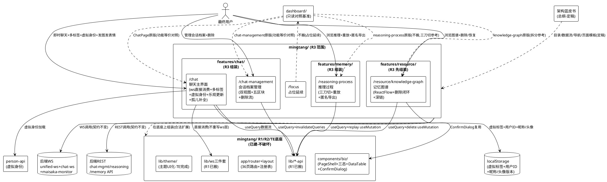
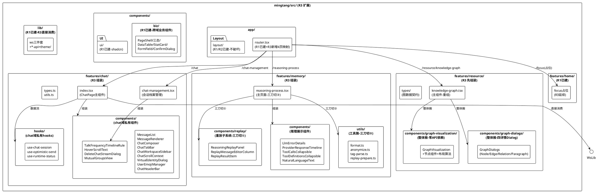
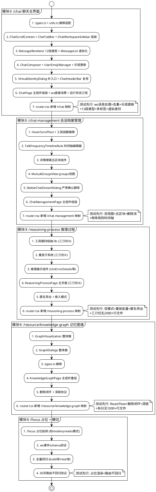
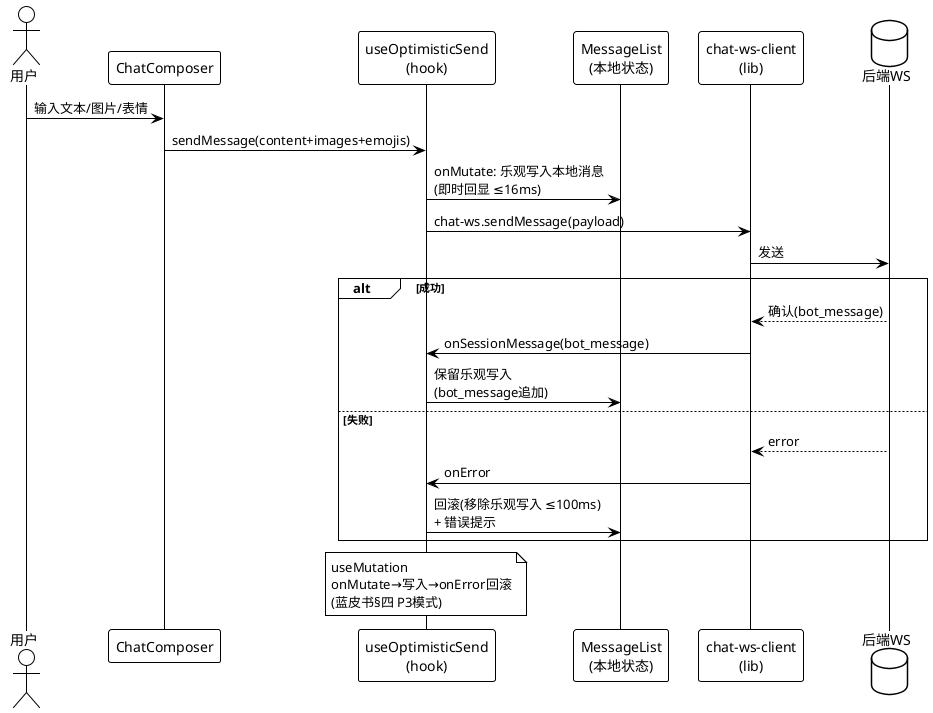
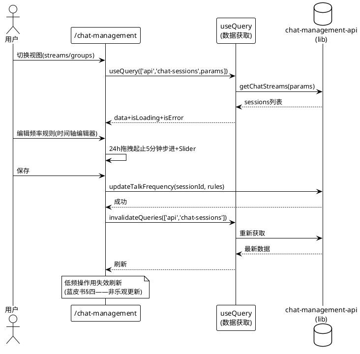

# 明堂前端重写 R3：chat 域 2 页 + memory 域 2 页组装 技术设计

> SSD 阶段：design.md（技术设计——"怎么建"）
> 版本：v1.0  日期：2026-08-09
> 作者：技术设计代理
> 提交标记：[CA]
> 前置：spec.md v1.0 已完成（21 条 EARS 需求 REQ-R3-01~21 + 5 个核心能力模块 + 7 条硬决策落实）；R1/R2/TE 已验收通过（build 绿 + 433 tests 绿 + 主题 UI 化完成 + 12 层级色板 + 5 语义点）；架构蓝皮书已定稿；R3 输入双盘点已完成（chat 域 + memory 域）；R2 SSD + TE SSD 已就绪作为格式与粒度对齐基准
> 范围：R3 = chat 域 2 页（/chat 聊天主界面 + /chat-management 会话档案管理）+ memory 域 2 页（/reasoning-process 推理过程 + /resource/knowledge-graph 记忆图谱）+ /focus 占位延续（~1.5-2 周）——在 R1/R2/TE 底座上组装聊天与记忆/推理域并完成核心交互能力接轨
> 关键约束：**focus 不搬**（硬决策 #1）；**reasoning-process 3415 行三刀切**（硬决策 #2）；**knowledge-graph 拆分**（硬决策 #3）；**ws 三件套直接消费**（硬决策 #4）；**两个孤儿组件补全**（硬决策 #5）；**乐观更新**（硬决策 #6）；**纪律沿用**（硬决策 #7）；目录结构以架构蓝皮书为准（不一致 = 打回）

---

# 一、需求与存量功能关系分析

## 1.1 需求功能与存量功能对比

> 存量功能有两层：① R1/R2/TE 已建的 mingtang/ 底座（36 页路由/注册表/搜索/Layout/lib/三态/PageShell/主题 UI）——R3 在此底座上组装；② dashboard/ 原版（只读对照基准）——R3 chat/memory 4 页功能等价对照来源。匹配度 100% = 底座直接复用或 dashboard 行为等价搬移；75% = 复用后需适配/扩展；50% = 设计可复用但需按新结构重写/拆分；25% = 仅作对照参考需全新实现。

### 1.1.1 已实现功能（底座直接复用）

| 需求功能 | 存量功能 | 代码位置 | 匹配度 |
|---------|---------|---------|--------|
| ws 三件套（unified-ws/chat-ws-client/maisaka-monitor-client） | R1 已搬移 lib/ 完整三件套（op 信封 + 心跳 + 重连 + 回放 + 16 事件订阅） | `mingtang/src/lib/unified-ws.ts`（426 行）+ `chat-ws-client.ts`（289 行）+ `maisaka-monitor-client.ts`（426 行） | 100% |
| chat-management-api（sessions CRUD/resolve-targets/talk-frequency/learning/prompts/adapters/delete） | R1 已搬移 lib/chat-management-api.ts | `mingtang/src/lib/chat-management-api.ts`（349 行） | 100% |
| reasoning-process-api（files/stages/clear/getReasoningPromptFile/html/replay） | R1 已搬移 lib/reasoning-process-api.ts | `mingtang/src/lib/reasoning-process-api.ts`（6 函数） | 100% |
| memory-api（graph/search/node-detail/edge-detail/paragraph-detail/delete） | R1 已搬移 lib/memory-api.ts | `mingtang/src/lib/memory-api.ts`（50KB——6 函数 + 类型） | 100% |
| person-api（虚拟身份数据源） | R1 已搬移 lib/person-api.ts | `mingtang/src/lib/person-api.ts` | 100% |
| user-emoji-api + avatar-url + chat-display | R1 已搬移 lib/ | `mingtang/src/lib/user-emoji-api.ts` + `avatar-url.ts` + `chat-display.ts` | 100% |
| 36 页路由表（含 chat 域 2 页 + memory 域 3 页路径登记） | R1 已建 app/router.tsx + route-definitions.ts（36 页路由表，chat/memory 页面本体占位） | `mingtang/src/app/router.tsx` + `route-definitions.ts` | 100% |
| Layout 框架（侧边栏收起 + 顶栏 + 搜索框 + SearchDialog） | R1/R2 已建 app/layout/ | `mingtang/src/app/layout/` | 100% |
| shadcn/ui 基础组件 + 公共业务组件（PageShell/三态/DataTable/StatCard/FormField/ConfirmDialog/ErrorBoundary/Placeholder） | R1 已建 components/ui/ + components/biz/ | `mingtang/src/components/ui/` + `components/biz/` | 100% |
| TanStack Query 数据流基座（QueryClient + QueryClientProvider） | R1 已建 app/query-client.ts | `mingtang/src/app/query-client.ts` | 100% |
| i18n 四语言运行时 | R1 已建 i18n/ | `mingtang/src/i18n/` | 100% |
| 主题 UI 化（12 层级色板 + 5 语义点 + future-retro + FOUC + 跨标签页同步） | TE 批次已完成 | `mingtang/src/lib/theme/` + `app/theme-provider.tsx` | 100% |
| framer-motion 动画基座 | R1 已装 | `mingtang/package.json` | 100% |
| @tanstack/react-virtual 虚拟化基座 | R1 已装 | `mingtang/package.json` | 100% |
| ReactFlow 图谱可视化基座 | R1 已装 | `mingtang/package.json` | 100% |

### 1.1.2 需要扩展的功能

| 需求功能 | 存量功能 | 差异说明 | 扩展方向 |
|---------|---------|---------|---------|
| chat 域 2 页本体 | R1 路由表已登记 2 页路径（占位组件） | R1 仅占位，无页面本体；dashboard 原版 ChatPage 1093 行 + 13 子组件 + chat-management 2397 行 | features/chat/ 组装 2 页本体——PageShell + 三态 + ws 直接消费 + 组件组装；功能等价对照 dashboard |
| memory 域 2 页本体 | R1 路由表已登记 3 页路径（占位组件——含 /focus） | R1 仅占位，无页面本体；dashboard 原版 reasoning-process 3415 行 + knowledge-graph 2031 行 + focus 2028 行（不搬） | features/memory/ 组装 reasoning-process（三刀切）+ features/resource/ 组装 knowledge-graph（拆分）+ /focus 占位延续 |
| 路由表 chat/memory 域占位→实际组件 | R1 router.tsx actualPageComponents 仅 config 域 9 页 | R1 其余域占位，R3 需将 chat/memory 4 页占位替换为实际组件 | router.tsx actualPageComponents 新增 4 页映射（合法扩展，不破坏 36 页路由） |
| 注册表 chat/memory 域条目 | R1 已建 settings-registry（manual 登记含 menuSections） | R1 manual 登记已含 chat/memory 域菜单项；R3 页面组装后需确认注册表条目完整 | settings-registry 确认 chat/memory 域条目完整（合法扩展，不破坏已有登记） |
| 乐观更新（聊天发送） | R1/R2 无乐观更新实现（config 域低频用失效刷新） | 聊天发送是高频交互需乐观更新（蓝皮书 §四） | features/chat/ 聊天发送 onMutate→写入本地→onError 回滚（useMutation + onMutate/onError） |

### 1.1.3 需要新增的功能或接口

> 按五大模块分组：① /chat 聊天主界面 ② /chat-management 会话档案管理 ③ /reasoning-process 推理过程 ④ /resource/knowledge-graph 记忆图谱 ⑤ /focus 占位 + 横切

#### /chat 聊天主界面（REQ-R3-01~05）

| 功能点 | 输入 | 输出 | 核心逻辑 | 依赖 |
|--------|------|------|----------|------|
| ChatPage 主组件 | ws 三件套 + 13 子组件 | 聊天主界面 | tabs 状态 + activeTabId + WS 消息流订阅 + 运行状态订阅 + 本地身份 | lib/chat-ws-client + maisaka-monitor-client |
| MessageList 虚拟化 | Message[] | 虚拟化消息列表 | @tanstack/react-virtual estimateSize 96/overscan 8 + 分组/滚动锚点/scrollToMessage 高亮/状态指示/空态欢迎页 | @tanstack/react-virtual |
| MessageRenderer 12 段类型 | MessageSegment | 段渲染 | 12 型 switch（text/image/emoji/voice/video/face/music/file/forward/unknown/reply/at）+ reply 独立块 + scrollToMessage | — |
| ChatComposer 发送 | 文本/图片/表情 | 发送 + 乐观更新 | 自适应 Textarea 36-160px + Enter 发送 + 图片预览条 8 张 + 表情按钮 + onMutate 乐观写入 | lib/chat-ws-client + useMutation |
| ChatTabBar 移动标签 | ChatTab[] | 横向标签条 | 标签切换 + 头像上传 | framer-motion |
| ChatWorkspaceSidebar 桌面侧栏 | ChatTab[] + 用户身份 | 桌面会话列表 + 身份卡 | 会话列表 + 内联编辑昵称 + 新建虚拟会话入口 | person-api |
| ChatScrollContext | — | scrollToMessage 跨组件接口 | Context 提供 scrollToMessage | — |
| VirtualIdentityDialog | person-api | 虚拟会话创建 Dialog | 身份数据加载 + 创建 + localStorage 持久化 | lib/person-api |
| UserEmojiManager | user-emoji-api | 自定义表情管理 Popover | add ≤2MB/4 列网格/删除/发送 | lib/user-emoji-api |
| ChatHeaderBar（孤儿补全） | 运行状态 + 连接状态 | 页面头部 | 头像/状态/重连指示——复用到 /chat 头部 | maisaka-monitor |
| 消息去重 | WsMessage | 去重后的消息 | processedMessagesMapRef hash（user-/bot-{content}-{timestamp}）上限 100 条 | — |
| 运行状态推断 | stage 事件 | ChatRuntimeStatus | resolveStatusKind 按 stage 关键词推断 + matchesMonitorTarget 三级匹配 | — |

#### /chat-management 会话档案管理（REQ-R3-06~09）

| 功能点 | 输入 | 输出 | 核心逻辑 | 依赖 |
|--------|------|------|----------|------|
| ChatManagementPage 主组件 | chat-management-api | 双视图页面 | streams/groups 双视图 + URL ?view= 直达 + 头部统计卡 | lib/chat-management-api |
| streams 视图 | sessions 列表 | 数据表 + 搜索 + 分页 | 搜索 12 字段 + 类型过滤 + DataTable 10 列 + HoverScrollText + 分页 + 三态 | components/biz/DataTable |
| 详情弹窗五区块 | session 详情 | 五区块编辑 | 基本信息 + 适配器放行 + 频率规则时间轴编辑器 + Prompt 增删改 + 学习双开关 | lib/chat-management-api |
| TalkFrequencyTimelineRule | 频率规则 | 时间轴编辑器 | 24h 拖拽起止 5 分钟步进 + Slider 0-1 + 概览三格 + 生效规则栈（691 行三层级——按新结构重组） | — |
| groups 视图 | 共享组 | 三类共享组管理 | 表达/黑话/记忆三类 + 新建/添加/删除 + 搜索多选 50 条 + 成员徽章 | lib/chat-management-api |
| DeleteChatStreamDialog | session_id | 严肃确认删除 | 危险说明框 + 必须输入完整 session_id + 分阶段进度 12→35→82→100% + 明细汇总 | components/biz/ConfirmDialog |
| HoverScrollText | 长文本 | 横向滚动文本 | HoverScrollText 组件（按新结构重组） | — |

#### /reasoning-process 推理过程（REQ-R3-10~13）

| 功能点 | 输入 | 输出 | 核心逻辑 | 依赖 |
|--------|------|------|----------|------|
| ReasoningProcessPage 主组件 | reasoning-process-api | 双模式页面 | 类型总览/浏览模式切换 + 三栏 + ~35 useState + 副作用链 | lib/reasoning-process-api |
| 类型总览 | stages | stage 卡片网格 | STAGE_LABELS 13 项 + 会话数 + 最新时间 + hover 清空 | — |
| 浏览三栏 | files 列表 | 三栏布局 | 记录列表 280px + 内容预览 + 重放面板 420-460px 动画 | — |
| 内容预览 Tabs | reasoning file | 结构化/文本/HTML | LlmErrorDetails + jargon 多轮调用卡 + ProviderResponseTimeline + 消息流时间线 + NaturalLanguageText + ToolCallsCollapsible + ToolDefinitionsCollapsible + HTML sandbox iframe | — |
| 重放子系统（三刀切①） | replay API | 重放面板 | ReasoningReplayPanel + ReplayMessageEditorColumn + ReplayResultItem + handleReplay 批量 1-20 + 模型 Select + 温度 | lib/reasoning-process-api |
| 工具簇四组（三刀切②） | — | lib 工具函数 | 格式化（URL 解析/stage 分类行）+ 匿名化（eraseReasoningNicknames）+ tag 解析（<msg> 标签）+ 重放准备 | — |
| 匿名导出 | reasoning file + 抹昵称 Switch | JSON 下载 | eraseReasoningNicknames 抹除 + JSON 下载 | — |
| 嵌入模式 | URL 深链 | createPortal 挂外部容器 | embedded + URL 深链 stage/session/stem/returnTo | — |

#### /resource/knowledge-graph 记忆图谱（REQ-R3-14~17）

| 功能点 | 输入 | 输出 | 核心逻辑 | 依赖 |
|--------|------|------|----------|------|
| KnowledgeGraphPage 主组件 | memory-api | 图谱页面 | 状态编排 + 数据转换 + 删除闭环 + 头部 UI（1112 行按新结构重组） | lib/memory-api |
| GraphVisualization（整体搬） | 图数据 | ReactFlow 画布 | 三种自绘节点 + 自研布局（黄金角螺旋 + 三层锚定）+ 边样式（410 行零 API 依赖） | ReactFlow |
| GraphDialogs（整体搬） | node/edge/relation/paragraph | 四详情 Dialog | Node/Edge/Relation/Paragraph Dialog（459 行仅依赖 API 类型） | lib/memory-api |
| 删除闭环 | deleteDraft | preview → execute → 恢复 | deleteDraft（mode mixed + selector）→ preview → execute → restoreGraphTarget + 级联清理 | lib/memory-api + ConfirmDialog |
| 搜索定位 + 深链 | search + initialParagraphHash | 定位 + 下钻 | 搜索定位 + 逐级下钻 + 深链协议（embedded + initialParagraphHash） | lib/memory-api |

#### /focus 占位 + 横切（REQ-R3-18~21）

| 功能点 | 输入 | 输出 | 核心逻辑 | 依赖 |
|--------|------|------|----------|------|
| /focus 占位延续 | — | 占位页 | 标题 + 虚线卡片"功能开发中" + 即将推出列表（如 R2 model-presets 模式） | components/biz/Placeholder |
| 乐观更新 | 聊天发送 | 即时回显 + 回滚 | useMutation onMutate→写入本地→onError 回滚 | @tanstack/react-query |
| ws 事件 schema 测试 | ws 事件 | schema 校验 | 每个事件 payload schema 校验 + 覆盖测试（zulip 调研沿用） | vitest |

## 1.2 存量功能详细分析

### 1.2.1 lib/ws 三件套（R1 已搬移——R3 直接消费地基）

**unified-ws.ts（426 行）**：
- `UnifiedWsClient` 类——op 信封（event/response/pong）+ domain 路由 + 30s 心跳 90s 超时 + ws-token 鉴权 + 主题订阅 + since_event_id 回放
- 接口：`connect()` / `send(op, domain, payload)` / `subscribe(domain, handler)` / `close()`
- R3 聊天页通过 chat-ws-client 间接消费，不直接操作 op 信封

**chat-ws-client.ts（289 行）**：
- `ChatWsClient` 类——openSession（幂等/并发复用/restore:true）/releaseSession（延迟 5 分钟）/sendMessage（content+images+emojis+user_name）/onSessionMessage 订阅
- 重连自动重发 session.open
- R3 聊天页直接消费：`openSession(sessionId)` + `onSessionMessage(handler)` + `sendMessage(payload)`

**maisaka-monitor-client.ts（426 行）**：
- `MaisakaMonitorClient` 类——16 种事件订阅（session.start/stage.*/llm.*/message.*/planner.*/tool.execution 等）
- 退订 200ms 延迟防 StrictMode 竞态
- R3 聊天页只消费 5 种：stage.snapshot/status/removed + llm.retry/error

### 1.2.2 lib/chat-management-api.ts（R1 已搬移——/chat-management 地基）

**接口契约**：
- `getChatStreams(params)` / `resolveStreamTargets(sessionId)` / `updateTalkFrequency(sessionId, rules)` / `updateLearningConfig(sessionId, config)` / `updatePrompts(sessionId, prompts)` / `updateAdapters(sessionId, adapters)` / `deleteChatStream(sessionId)`（返回明细）
- R3 /chat-management 页面 useQuery + 写操作 invalidateQueries

### 1.2.3 lib/reasoning-process-api.ts（R1 已搬移——/reasoning-process 地基）

**接口契约**（6 函数）：
- `getReasoningFiles(params)` / `getReasoningStages()` / `clearReasoningStage(stage)` / `getReasoningPromptFile(stem)` / `getReasoningHtml(stem)` / `replayReasoning(payload)`
- R3 /reasoning-process 页面 useQuery + 重放 useMutation

### 1.2.4 lib/memory-api.ts（R1 已搬移——/resource/knowledge-graph 地基）

**接口契约**（6 函数 + 类型）：
- `getGraphData(params)` / `searchGraph(query)` / `getNodeDetail(id)` / `getEdgeDetail(id)` / `getParagraphDetail(id)` / `deleteGraphTargets(payload)`
- R3 /resource/knowledge-graph 页面 useQuery + 删除 useMutation

### 1.2.5 dashboard 原版 chat 域（只读对照基准——功能等价来源）

**ChatPage（routes/chat/index.tsx 1093 行）**：
- 状态模型：tabs（ChatTab[]）+ activeTabId + inputValue + selectedImages + userIdRef
- WS 消息流 8 类型 + 消息去重 + 多标签 + 虚拟身份 + 运行状态订阅
- 13 子组件清单（见 spec.md §1.2 核心输入 #2）

**ChatManagementPage（chat-management.tsx 2397 行）**：
- 双视图 + 详情弹窗五区块 + groups 视图 + 删除流
- 内部结构：工具函数（105-198）+ 组件 17 个——组件化程度好，切分抓手清晰

### 1.2.6 dashboard 原版 memory 域（只读对照基准——功能等价来源）

**reasoning-process.tsx（3415 行——全站最大页）**：
- 大文件结构切分抓手已明确（见 spec.md §1.2 核心输入 #3）
- 三刀切：重放子系统（1502-2148 约 650 行自包含）+ 工具簇四组 + 主页面

**resource/knowledge-graph/（2031 行）**：
- index.tsx 1112 + GraphVisualization 410（零 API 依赖）+ GraphDialogs 459（仅依赖 API 类型）+ types 50
- 天然独立拆分

**focus.tsx（2028 行——不搬）**：
- 3D VRM 番茄钟娱乐页——three.js + VRM 依赖重——用户拍板不搬

---

# 二、增量设计方案

## 2.1 实现模型

### 2.1.1 上下文视图

> 展示 mingtang/（R3 范围）与外部的交互关系。



**交互说明**：
- **上游调用方**：最终用户在 /chat 即时聊天（多标签/虚拟身份/发图发表情/看运行状态）；在 /chat-management 管理会话档案（适配器/频率规则/Prompt/学习/共享组/删除）；在 /reasoning-process 浏览推理记录 + 重放 LLM 请求 + 匿名导出；在 /resource/knowledge-graph 浏览记忆图谱 + 删除/恢复
- **下游依赖**：
  - 后端 WS：unified-ws + chat-ws + maisaka-monitor——R1 lib 搬移后契约不变，R3 页面直接消费
  - 后端 REST：chat-management-api + reasoning-process-api + memory-api——R1 lib 搬移后契约不变，R3 页面组装复用
  - person-api（虚拟身份数据源）：VirtualIdentityDialog 创建虚拟会话时加载
  - localStorage：虚拟标签恢复 + 用户 ID（maibot_webui_user_id）+ 昵称/头像版本
  - dashboard/（只读）：提供 chat 域 2 页 + memory 域 2 页原版（功能等价对照基准 + 重写/拆分参考）
- **设计引用**：架构蓝皮书（目录 / 8 域 / 组件 / 数据流 / 导航 / 页面模板定稿）
- **通信协议**：HTTP（REST API）+ WebSocket（ws 三件套）+ localStorage（纯前端存储）
- **调用频率**：WS 消息流实时 + maisaka-monitor 事件订阅 + REST 按操作触发（chat-management 编辑/删除、reasoning 重放、graph 删除）

### 2.1.2 服务/组件总体架构

> 展示 mingtang/src/ 内部的组成结构（按架构蓝皮书 §二 目录定稿——R3 在 R1/R2/TE 底座上扩展 chat/memory/resource 域）。



### 2.1.3 实现设计文档

#### 2.1.3.1 R3 五模块实现流程



#### 2.1.3.2 /chat 数据流与乐观更新



#### 2.1.3.3 /chat-management 数据流（TanStack Query 规范——蓝皮书 §四）



#### 2.1.3.4 /reasoning-process 三刀切拆分流程

```plantuml
@startuml
!theme plain
skinparam componentStyle rectangle

rectangle "dashboard原版\nreasoning-process.tsx\n(3415行-不搬)" as Original {
  rectangle "1-204 imports+常量+类型" as O1
  rectangle "204-944 工具函数区①②\n(格式化/匿名化/tag解析)" as O2
  rectangle "944-1502 推理展示组件\n(LlmErrorDetails等)" as O3
  rectangle "1502-2148 重放子系统\n(自包含~650行)" as O4
  rectangle "2148-3415 主页面\n(~35 useState)" as O5
}

rectangle "mingtang新结构\n(三刀切)" as New {
  rectangle "features/memory/utils/\nformat.ts+anonymize.ts\ntag-parse.ts+replay-prepare.ts\n(三刀切②工具簇四组)" as N2
  rectangle "features/memory/components/\nLlmErrorDetails+\nProviderResponseTimeline等\n(推理展示组件)" as N3
  rectangle "features/memory/components/replay/\nReasoningReplayPanel+\nReplayMessageEditorColumn+\nReplayResultItem\n(三刀切①重放子系统\n≤650行自包含)" as N4
  rectangle "features/memory/reasoning-process.tsx\n(三刀切③主页面)" as N5
}

O2 ..> N2 : 抽lib(四组)
O3 ..> N3 : 重组
O4 ..> N4 : 整体搬(自包含)
O5 ..> N5 : 重组(~35 useState)

note over New : 无2000+行文件\n(对齐§4.2可靠性#9)
@enduml
```

#### 2.1.3.5 /resource/knowledge-graph 拆分流程

```plantuml
@startuml
!theme plain
skinparam componentStyle rectangle

rectangle "dashboard原版\nresource/knowledge-graph/\n(2031行)" as Original {
  rectangle "index.tsx\n(1112行-主组件)" as O1
  rectangle "GraphVisualization.tsx\n(410行-零API依赖)" as O2
  rectangle "GraphDialogs.tsx\n(459行-仅依赖API类型)" as O3
  rectangle "types.ts\n(50行)" as O4
}

rectangle "mingtang新结构\n(拆分)" as New {
  rectangle "features/resource/knowledge-graph.tsx\n(主组件重组\n无1000+行)" as N1
  rectangle "features/resource/components/\ngraph-visualization/\n(整体搬-零API依赖)" as N2
  rectangle "features/resource/components/\ngraph-dialogs/\n(整体搬-四详情Dialog)" as N3
  rectangle "features/resource/types/\n(图数据契约)" as N4
}

O1 ..> N1 : 重组(状态编排+删除闭环)
O2 ..> N2 : 整体搬(纯展示)
O3 ..> N3 : 整体搬(四Dialog)
O4 ..> N4 : 搬移

note over New : 无1000+行文件\n(对齐§4.2可靠性#9)
@enduml
```

## 2.2 接口设计

### 2.2.1 总体设计

**R3 接口分三层**：
1. **页面接口**（features/chat/ + features/memory/ + features/resource/）——4 页主组件导出
2. **域私有组件/hooks 接口**（features/*/components/ + hooks/）——域内组装
3. **lib 直接消费接口**（lib/ws 三件套 + *-api）——R1 已搬，R3 直接消费不重写

### 2.2.2 接口清单

#### 2.2.2.1 /chat 聊天主界面接口（REQ-R3-01~05）

```typescript
// features/chat/index.tsx
export function ChatPage(): React.ReactElement

// features/chat/types.ts
export interface ChatTab {
  id: string
  type: 'webui-default' | 'virtual'
  personInfo: PersonInfo | null
  active: boolean
  messages: Message[]
}
export interface MessageSegment {
  type: 'text' | 'image' | 'emoji' | 'voice' | 'video' | 'face' | 'music' | 'file' | 'forward' | 'unknown' | 'reply' | 'at'
  content: string
  replyTarget?: string | null
}
export interface WsMessage {
  type: 'session_info' | 'system' | 'user_message' | 'bot_message' | 'typing' | 'error' | 'history'
  content: string | Message[]
  timestamp: number
  sessionId: string
}
export interface ChatRuntimeStatus {
  kind: 'thinking' | 'typing' | 'acting' | 'error'
  stage: string
  timestamp: number
}

// features/chat/hooks/use-optimistic-send.ts
export function useOptimisticSend(sessionId: string): {
  sendMessage: (payload: { content: string; images?: string[]; emojis?: string[]; user_name: string }) => void
  isPending: boolean
  error: Error | null
}

// features/chat/hooks/use-chat-session.ts
export function useChatSession(sessionId: string): {
  messages: Message[]
  isConnected: boolean
  runtimeStatus: ChatRuntimeStatus | null
}

// features/chat/hooks/use-runtime-status.ts
export function useRuntimeStatus(sessionId: string): {
  status: ChatRuntimeStatus | null
  resolveStatusKind: (stage: string) => ChatRuntimeStatus['kind']
}

// features/chat/utils.ts
export function resolveStatusKind(stage: string): ChatRuntimeStatus['kind']
export function matchesMonitorTarget(event: any, tab: ChatTab): boolean
export function deduplicateMessage(msg: WsMessage, seen: Map<string, boolean>): boolean
```

#### 2.2.2.2 /chat-management 会话档案管理接口（REQ-R3-06~09）

```typescript
// features/chat/chat-management.tsx
export function ChatManagementPage(): React.ReactElement

// features/chat/components/talk-frequency-timeline-rule.tsx
export function TalkFrequencyTimelineRule(props: {
  rules: TalkFrequencyRule[]
  onChange: (rules: TalkFrequencyRule[]) => void
}): React.ReactElement

// features/chat/components/delete-chat-stream-dialog.tsx
export function DeleteChatStreamDialog(props: {
  sessionId: string
  open: boolean
  onOpenChange: (open: boolean) => void
  onDeleted: () => void
}): React.ReactElement

// features/chat/components/mutual-groups-view.tsx
export function MutualGroupsView(props: {
  kind: 'expression' | 'jargon' | 'memory'
}): React.ReactElement

// features/chat/components/hover-scroll-text.tsx
export function HoverScrollText(props: { text: string; max_width?: number }): React.ReactElement
```

#### 2.2.2.3 /reasoning-process 推理过程接口（REQ-R3-10~13）

```typescript
// features/memory/reasoning-process.tsx
export function ReasoningProcessPage(): React.ReactElement

// features/memory/components/replay/reasoning-replay-panel.tsx
export function ReasoningReplayPanel(props: {
  file: ReasoningPromptFile
  onReplayComplete: (results: ReplayResult[]) => void
}): React.ReactElement

// features/memory/components/replay/replay-message-editor-column.tsx
export function ReplayMessageEditorColumn(props: {
  messages: Message[]
  onEdit: (messages: Message[]) => void
}): React.ReactElement

// features/memory/components/replay/replay-result-item.tsx
export function ReplayResultItem(props: { result: ReplayResult }): React.ReactElement

// features/memory/utils/format.ts
export function parseReasoningUrl(url: string): ReasoningUrlParams
export function classifyStageRow(row: string): StageClassification

// features/memory/utils/anonymize.ts
export function eraseReasoningNicknames(content: string, nicknames: string[]): string

// features/memory/utils/tag-parse.ts
export function parseMsgTags(content: string): ParsedMsg
export function normalizeToolCalls(calls: any[]): NormalizedToolCall[]
export function getSessionDisplayName(session: any): string

// features/memory/utils/replay-prepare.ts
export function prepareReplayData(file: ReasoningPromptFile): ReplayPayload
```

#### 2.2.2.4 /resource/knowledge-graph 记忆图谱接口（REQ-R3-14~17）

```typescript
// features/resource/knowledge-graph.tsx
export function KnowledgeGraphPage(): React.ReactElement

// features/resource/components/graph-visualization/graph-visualization.tsx
export function GraphVisualization(props: {
  nodes: GraphNode[]
  edges: GraphEdge[]
  onNodeClick: (node: GraphNode) => void
  onEdgeClick: (edge: GraphEdge) => void
  selectedId?: string
}): React.ReactElement

// features/resource/components/graph-dialogs/graph-dialogs.tsx
export function GraphDialogs(props: {
  selectedNode?: GraphNode
  selectedEdge?: GraphEdge
  onClearSelection: () => void
}): React.ReactElement

// features/resource/types/graph-types.ts
export interface GraphNode {
  type: 'entity' | 'relation' | 'paragraph'
  id: string
  label: string
  evidence: string[]
  layoutIndex: number
}
export interface GraphEdge {
  kind: string
  source: string
  target: string
  weight: number
  smoothstep: boolean
}
export interface DeleteDraft {
  mode: 'mixed'
  selector: GraphNode | GraphEdge | GraphRelation
  preview: GraphSnapshot
  restorable: boolean
}
```

#### 2.2.2.5 /focus 占位 + 横切接口（REQ-R3-18~21）

```typescript
// features/home/focus.tsx（占位——如 model-presets 模式）
export function FocusPage(): React.ReactElement  // 占位渲染

// router.tsx 新增映射
// '/chat': () => <ChatPage />
// '/chat-management': () => <ChatManagementPage />
// '/reasoning-process': () => <ReasoningProcessPage />
// '/resource/knowledge-graph': () => <KnowledgeGraphPage />
// '/focus': () => <FocusPage />  // 占位
```

### 2.2.3 不变接口（lib 直接消费——R3 不重写）

| lib 接口 | R3 消费方 | 说明 |
|---------|---------|------|
| `lib/chat-ws-client.ts` | features/chat/hooks/use-chat-session | openSession/onSessionMessage/sendMessage |
| `lib/unified-ws.ts` | lib/chat-ws-client（间接） | op 信封/心跳/回放——R3 不直接操作 |
| `lib/maisaka-monitor-client.ts` | features/chat/hooks/use-runtime-status | 5 事件订阅 |
| `lib/chat-management-api.ts` | features/chat/chat-management.tsx | sessions CRUD + 五区块 API |
| `lib/reasoning-process-api.ts` | features/memory/reasoning-process.tsx | files/stages/clear/replay |
| `lib/memory-api.ts` | features/resource/knowledge-graph.tsx | graph/search/delete |
| `lib/person-api.ts` | features/chat/components/virtual-identity-dialog | 虚拟身份数据源 |
| `lib/user-emoji-api.ts` | features/chat/components/user-emoji-manager | 自定义表情管理 |
| `lib/avatar-url.ts` | features/chat/utils | 头像 URL + ?v= 破缓存 |

## 2.3 数据模型

### 2.3.1 设计目标

R3 数据模型按 spec.md §6 数据约束定义（10 个核心领域对象），实现时：
1. **类型定义位置**：chat 域类型 → `features/chat/types.ts`；memory 域类型 → `features/memory/types.ts`；resource 域类型 → `features/resource/types/graph-types.ts`
2. **与 lib 类型关系**：lib/*-api.ts 已有 API 响应类型，R3 页面类型消费 lib 类型 + 扩展 UI 状态类型
3. **不变性**：types.ts 的 PersonInfo 与 lib/person-api.ts 类型统一为一份（避免重复——spec.md REQ-R3-05 约束）

### 2.3.2 模型实现

#### ChatTab（聊天标签——spec.md §6.1）

```typescript
// features/chat/types.ts
export interface ChatTab {
  id: string                    // 标签唯一标识（webui-default 固定首标签 id）
  type: 'webui-default' | 'virtual'  // 虚拟标签 localStorage 持久化
  personInfo: PersonInfo | null // 虚拟身份信息（虚拟标签时 person-api 加载）
  active: boolean               // 是否当前激活（activeTabId 匹配）
  messages: Message[]           // 消息列表（history 只保留最近 1000 条）
}
```

#### MessageSegment（消息段——12 型——spec.md §6.2）

```typescript
export type MessageSegmentType =
  | 'text' | 'image' | 'emoji' | 'voice' | 'video'
  | 'face' | 'music' | 'file' | 'forward' | 'unknown' | 'reply' | 'at'

export interface MessageSegment {
  type: MessageSegmentType
  content: string               // text/emoji/at 文本；image/voice/video/music/file URL；reply 目标消息 id
  replyTarget?: string | null   // 仅 reply 型，scrollToMessage 跳转
}
```

#### WsMessage（WS 消息——8 类型——spec.md §6.3）

```typescript
export type WsMessageType =
  | 'session_info' | 'system' | 'user_message' | 'bot_message'
  | 'typing' | 'error' | 'history'

export interface WsMessage {
  type: WsMessageType
  content: string | Message[]   // history 型为 Message[]
  timestamp: number             // 去重 hash user-/bot-{content}-{timestamp}
  sessionId: string             // maisaka-monitor matchesMonitorTarget 三级匹配
}
```

#### ChatRuntimeStatus（运行状态——spec.md §6.4）

```typescript
export type RuntimeStatusKind = 'thinking' | 'typing' | 'acting' | 'error'

export interface ChatRuntimeStatus {
  kind: RuntimeStatusKind       // resolveStatusKind 按 stage 关键词推断
  stage: string                 // maisaka-monitor stage.snapshot/status
  timestamp: number
}
```

#### ReasoningPromptFile（推理记录——spec.md §6.5）

```typescript
export interface ReasoningPromptFile {
  stage: string                 // STAGE_LABELS 13 项之一
  sessionId: string
  stem: string                  // URL 深链 stage/session/stem/returnTo
  format: 'txt' | 'json' | 'html'  // html 形态 sandbox iframe 渲染
  nicknames: string[]           // eraseReasoningNicknames 匿名导出抹除
}
```

#### ReplayRequest（重放请求——spec.md §6.6）

```typescript
export interface ReplayRequest {
  model: string                 // 模型 Select
  temperature: number           // 0-2 滑块
  count: number                 // 1-20 批量
  sourcePrompt: ReasoningPromptFile  // 重放数据准备
}
```

#### GraphNode / GraphEdge / DeleteDraft（图谱——spec.md §6.7~6.9）

```typescript
export interface GraphNode {
  type: 'entity' | 'relation' | 'paragraph'  // Entity 蓝/Relation 橙/Paragraph 绿
  id: string
  label: string
  evidence: string[]            // paragraph→relation/entity 牵引
  layoutIndex: number           // 黄金角螺旋 sqrt(index)*radiusScale
}

export interface GraphEdge {
  kind: string                  // kind 配色
  source: string
  target: string
  weight: number                // 权重线宽
  smoothstep: boolean           // smoothstep 边样式
}

export interface DeleteDraft {
  mode: 'mixed'                 // mixed 模式 + selector
  selector: GraphNode | GraphEdge | GraphRelation
  preview: GraphSnapshot        // 删除前快照
  restorable: boolean           // restoreGraphTarget 快照恢复选中态
}
```

#### ChatManagementSession（会话档案——spec.md §6.10）

```typescript
export interface ChatManagementSession {
  sessionId: string             // 删除流必须输入完整 session_id 匹配
  platform: string
  type: 'group' | 'private'     // 群聊/私聊统计卡
  adapters: { allow: string[]; block: string[]; useDefault: boolean }
  talkFrequency: TalkFrequencyTimelineRule  // 24h 拖拽起止 5 分钟步进 + Slider 0-1
  prompts: { base: Prompt; custom: Prompt[]; hasChange: boolean }
  learning: { expression: SwitchPair; jargon: SwitchPair; behavior: SwitchPair }
}
```

---

# 三、横切设计

## 3.1 测试策略（测试先行——REQ-R3-21）

### 3.1.1 测试文件布局

```
mingtang/src/
├── features/chat/
│   ├── __tests__/
│   │   ├── chat-page.test.tsx              # /chat 主组件+ws消息流+多标签
│   │   ├── message-list.test.tsx           # 虚拟化+去重+1000条
│   │   ├── message-renderer.test.tsx       # 12段类型switch
│   │   ├── chat-composer.test.tsx          # 发送+图片8张+表情
│   │   ├── use-optimistic-send.test.ts     # 乐观更新+回滚（重点）
│   │   ├── use-runtime-status.test.ts      # 5事件订阅+resolveStatusKind
│   │   ├── virtual-identity-dialog.test.tsx # 孤儿补全+person-api
│   │   ├── chat-header-bar.test.tsx        # 孤儿复用
│   │   ├── chat-management-page.test.tsx   # 双视图+五区块+删除流
│   │   ├── talk-frequency-timeline-rule.test.tsx # 时间轴编辑器
│   │   └── delete-chat-stream-dialog.test.tsx    # 严肃确认+分阶段进度
│   └── ...
├── features/memory/
│   ├── __tests__/
│   │   ├── reasoning-process-page.test.tsx # 双模式+三栏+嵌入模式
│   │   ├── reasoning-replay-panel.test.tsx # 重放批量1-20+进度
│   │   ├── anonymize.test.ts               # eraseReasoningNicknames（重点）
│   │   ├── tag-parse.test.ts               # <msg>标签解析+tool call归一化
│   │   └── replay-prepare.test.ts          # 重放数据准备
│   └── ...
├── features/resource/
│   ├── __tests__/
│   │   ├── knowledge-graph-page.test.tsx   # 搜索+深链+删除闭环
│   │   ├── graph-visualization.test.tsx    # ReactFlow+自研布局+三节点
│   │   └── graph-dialogs.test.tsx          # 四详情Dialog
│   └── ...
├── lib/
│   └── __tests__/
│       └── ws-event-schema.test.ts         # ws事件schema校验（zulip沿用）
└── app/
    └── __tests__/
        └── r3-routes.test.tsx              # 4页路由可达+36页不回归
```

### 3.1.2 测试覆盖矩阵

| 需求 | 测试文件 | 关键用例 | 优先级 |
|------|---------|---------|--------|
| REQ-R3-01 WS 消息流 | chat-page.test.tsx + message-list.test.tsx + message-renderer.test.tsx | 8 类型渲染 + 虚拟化 1000 条 + 12 段类型 + 去重无重复 + history 1000 条 | P0 |
| REQ-R3-02 多标签 | chat-page.test.tsx | 打开/切换/关闭/恢复 + 首个固定 webui-default + 虚拟标签 localStorage | P0 |
| REQ-R3-03 发送+乐观更新 | chat-composer.test.tsx + use-optimistic-send.test.tsx | 自适应 + Enter 发送 + 图片 8 张 + 乐观回显 ≤16ms + 失败回滚 ≤100ms + 一致性 | P0 |
| REQ-R3-04 身份+运行状态 | use-runtime-status.test.tsx | 昵称/头像 5MB + 5 事件订阅 + resolveStatusKind + matchesMonitorTarget + 三圆点脉冲 | P0 |
| REQ-R3-05 孤儿补全 | virtual-identity-dialog.test.tsx + chat-header-bar.test.tsx | ChatHeaderBar 复用 + VirtualIdentityDialog 补入口 + person-api + localStorage | P0 |
| REQ-R3-06 双视图 | chat-management-page.test.tsx | 双视图 + URL ?view= + 统计卡 + streams 搜索/过滤/数据表/分页 | P0 |
| REQ-R3-07 五区块 | chat-management-page.test.tsx + talk-frequency-timeline-rule.test.tsx | 五区块完整 + 适配器 + 频率时间轴 + Prompt 增删改 + 学习双开关 | P0 |
| REQ-R3-08 groups | chat-management-page.test.tsx | 三类共享组 + 新建/添加/删除 + 搜索多选 50 条 | P1 |
| REQ-R3-09 删除流 | delete-chat-stream-dialog.test.tsx | 严肃确认 + 输入 session_id 启用 + 分阶段进度 + 明细汇总 | P0 |
| REQ-R3-10 三刀切 | reasoning-process-page.test.tsx | 三刀切拆分 + 重放 ≤650 行 + 无 2000+ 行文件 | P0 |
| REQ-R3-11 双模式 | reasoning-process-page.test.tsx | 类型总览 13 stage + 浏览三栏 + 50 条/页 + 筛选 + 嵌入模式 | P0 |
| REQ-R3-12 重放 | reasoning-replay-panel.test.tsx | 模型/温度/次数 1-20 + 批量不阻塞 + 结果展示 | P0 |
| REQ-R3-13 匿名导出 | anonymize.test.ts | 抹昵称 Switch + JSON 下载 + 昵称抹除 | P0 |
| REQ-R3-14 拆分 | knowledge-graph-page.test.tsx | GraphVisualization 整体搬 + GraphDialogs 整体搬 + 无 1000+ 行 | P0 |
| REQ-R3-15 ReactFlow | graph-visualization.test.tsx | ReactFlow + 三节点 + 自研布局 + 边样式 + ≤500 节点 | P0 |
| REQ-R3-16 删除闭环 | knowledge-graph-page.test.tsx | deleteDraft → preview → execute → 恢复 + 级联清理 | P0 |
| REQ-R3-17 搜索+深链 | knowledge-graph-page.test.tsx + graph-dialogs.test.tsx | 搜索 + 逐级下钻 + 四 Dialog + initialParagraphHash | P0 |
| REQ-R3-18 /focus 占位 | r3-routes.test.tsx | 占位渲染 + 路由可达 + 无 3D/VRM 依赖 | P1 |
| REQ-R3-19 ws 直接消费 | ws-event-schema.test.ts | ws 三件套直接消费 + 事件 schema 测试 | P0 |
| REQ-R3-20 乐观更新 | use-optimistic-send.test.tsx | 即时回显 ≤16ms + 失败回滚 ≤100ms + 一致性 + 低频用失效刷新 | P0 |
| REQ-R3-21 横切纪律 | r3-routes.test.tsx + 全量 | 大文件不搬 + 测试先行 + 蓝皮书一致 + 36 页不回归 | P0 |

### 3.1.3 测试约束（TE 教训沿用——spec.md §4.4 #8）

1. **vi.mock 工厂用 vi.hoisted()**（R2 教训沿用）
2. **不全局 mock react-query**（OOM——R2 教训沿用）
3. **禁止 expect(true).toBe(true)**（明堂-1 教训——测试凑绿红旗）
4. **hook 改 Context 消费后测试需包裹 Provider**（TE W-1）
5. **Partial<T> 非深 Partial——嵌套部分需 cast**（TE W-2）
6. **测试文件 noUnusedLocals 约束**（TE W-3）
7. **测试避免 Node.js 模块（fs/path/__dirname）——用 Vite ?raw 导入**（TE W-4/W-5）
8. **Set<字面量联合> 用 Set<string>**（TE W-6）
9. **spread 不验证接口属性——用内联属性**（TE W-9）
10. **HSL 低饱和度色相不稳定——测试排除低饱和度层级**（TE W-10）

## 3.2 行为等价设计（功能等价对照——spec.md §4.2 #4）

### 3.2.1 chat 域 2 页功能等价

| 功能点 | dashboard 原版行为 | mingtang R3 行为 | 等价验证 |
|--------|-------------------|-----------------|---------|
| WS 消息流 8 类型 | chat-ws onSessionMessage 8 类型 | 同（lib 直接消费） | chat-page.test.tsx 8 类型渲染 |
| 消息去重 | processedMessagesMapRef hash 上限 100 | 同 | message-list.test.tsx 去重无重复 |
| 多标签 | tabs + activeTabId + 首个固定 webui-default | 同 | chat-page.test.tsx 多标签 |
| 虚拟身份 | VirtualIdentityDialog + localStorage 恢复 | 同 + 补入口 | virtual-identity-dialog.test.tsx |
| 发送 | ChatComposer + sendMessage | 同 + 乐观更新 | chat-composer.test.tsx + use-optimistic-send.test.tsx |
| 运行状态 | maisaka-monitor 5 事件 + resolveStatusKind | 同（lib 直接消费） | use-runtime-status.test.tsx |
| 双视图 | streams/groups + URL ?view= | 同 | chat-management-page.test.tsx |
| 五区块 | 详情弹窗五区块 | 同 | chat-management-page.test.tsx |
| 删除流 | 严肃确认 + 分阶段进度 | 同 | delete-chat-stream-dialog.test.tsx |

### 3.2.2 memory 域 2 页功能等价

| 功能点 | dashboard 原版行为 | mingtang R3 行为 | 等价验证 |
|--------|-------------------|-----------------|---------|
| 双模式 | 类型总览 + 浏览模式 | 同（三刀切后） | reasoning-process-page.test.tsx |
| 重放 | ReasoningReplayPanel + 批量 1-20 | 同（三刀切①自包含） | reasoning-replay-panel.test.tsx |
| 匿名导出 | eraseReasoningNicknames + JSON | 同 | anonymize.test.ts |
| ReactFlow | 三节点 + 自研布局 | 同（整体搬） | graph-visualization.test.tsx |
| 删除闭环 | deleteDraft → preview → execute → 恢复 | 同 | knowledge-graph-page.test.tsx |
| 深链 | embedded + initialParagraphHash | 同 | knowledge-graph-page.test.tsx |

### 3.2.3 /focus 占位延续（非功能等价——占位）

- dashboard 原版 focus.tsx 2028 行 3D VRM 番茄钟——**不搬**
- mingtang /focus 占位延续（如 R2 model-presets 模式——标题 + 虚线卡片"功能开发中" + 即将推出列表）
- 验证：路由可达 + 占位三态齐全 + 无 3D/VRM 依赖

## 3.3 新写法基线设计（spec.md §4.4 #3）

### 3.3.1 新写法选型表（R1/R2/TE 沿用）

| 场景 | 新写法 | 旧写法（不引入） |
|------|--------|----------------|
| ref 传递 | React 19 ref 直传（forwardRef 不再必需） | forwardRef + ref 回调 |
| 异步数据 | use() + Suspense + ErrorBoundary | useEffect + useState 手动 |
| 表单提交 | Actions（useActionState + useTransition） | useEffect + 手动 loading |
| Context | Context 直接当 provider（<Context value={...}>） | <Context.Provider value={...}> |
| useRef | useRef 永远传参（useRef<T>(initial)） | useRef<T>() 无参 |
| useEffect | useEffect 不传 async（内部 async 或独立函数） | useEffect(async () => ...) |
| 类型注解 | TS 7 新写法（satisfies / as const / NoInfer） | 旧 cast 滥用 |

### 3.3.2 存量处置

- **lib/ 已搬代码**：保持原写法（行为等价——不重构）
- **R3 新写代码**：用新写法基线（上表）
- **dashboard 原版对照**：只读参考——不搬旧写法

## 3.4 目录结构设计（蓝皮书 §二 定稿——spec.md §4.6）

```
mingtang/src/
├── app/                          # R1/R2 已建 + R3 扩展
│   ├── router.tsx                # R1 已建（R3 新增 chat/memory 4 页映射）
│   ├── query-client.ts           # R1 已建
│   └── layout/                   # R1/R2 已建（不破坏）
├── components/                   # R1 已建（不破坏）
│   ├── ui/                       # shadcn/ui（R1 已建）
│   └── biz/                      # 跨域业务组件（R1 已建——R3 复用 ConfirmDialog/DataTable/PageShell）
├── features/
│   ├── config/                   # R2 已组装（不破坏）
│   ├── chat/                     # R3 组装（蓝皮书 §一 chat 域）
│   │   ├── index.tsx             # ChatPage 主组件（/chat）
│   │   ├── chat-management.tsx   # ChatManagementPage（/chat-management）
│   │   ├── components/           # chat 域私有组件
│   │   │   ├── message-list.tsx
│   │   │   ├── message-renderer.tsx
│   │   │   ├── chat-composer.tsx
│   │   │   ├── chat-tab-bar.tsx
│   │   │   ├── chat-workspace-sidebar.tsx
│   │   │   ├── chat-scroll-context.tsx
│   │   │   ├── virtual-identity-dialog.tsx
│   │   │   ├── user-emoji-manager.tsx
│   │   │   ├── chat-header-bar.tsx       # 孤儿补全
│   │   │   ├── talk-frequency-timeline-rule.tsx
│   │   │   ├── hover-scroll-text.tsx
│   │   │   ├── delete-chat-stream-dialog.tsx
│   │   │   └── mutual-groups-view.tsx
│   │   ├── hooks/                # chat 域私有 hooks
│   │   │   ├── use-chat-session.ts
│   │   │   ├── use-optimistic-send.ts   # 乐观更新（重点）
│   │   │   └── use-runtime-status.ts
│   │   ├── types.ts              # ChatTab/MessageSegment/WsMessage/ChatRuntimeStatus
│   │   └── utils.ts              # resolveStatusKind/matchesMonitorTarget/deduplicateMessage
│   ├── memory/                   # R3 组装（蓝皮书 §一 memory 域）
│   │   ├── reasoning-process.tsx # ReasoningProcessPage（三刀切③主页面）
│   │   ├── components/
│   │   │   ├── replay/           # 重放子系统（三刀切①——≤650 行自包含）
│   │   │   │   ├── reasoning-replay-panel.tsx
│   │   │   │   ├── replay-message-editor-column.tsx
│   │   │   │   └── replay-result-item.tsx
│   │   │   ├── llm-error-details.tsx
│   │   │   ├── provider-response-timeline.tsx
│   │   │   ├── tool-calls-collapsible.tsx
│   │   │   ├── tool-definitions-collapsible.tsx
│   │   │   └── natural-language-text.tsx
│   │   ├── utils/                # 工具簇四组（三刀切②）
│   │   │   ├── format.ts         # URL 解析/stage 分类行/头部元数据提取
│   │   │   ├── anonymize.ts      # eraseReasoningNicknames 匿名化
│   │   │   ├── tag-parse.ts      # <msg> 标签解析/tool call 归一化/会话显示名
│   │   │   └── replay-prepare.ts # 重放数据准备
│   │   └── types.ts              # ReasoningPromptFile/ReplayRequest
│   ├── resource/                 # R3 先组装 knowledge-graph（蓝皮书 §一 resource 域）
│   │   ├── knowledge-graph.tsx   # KnowledgeGraphPage（主组件重组）
│   │   ├── components/
│   │   │   ├── graph-visualization/  # 整体搬（零 API 依赖）
│   │   │   │   ├── graph-visualization.tsx
│   │   │   │   ├── entity-node.tsx
│   │   │   │   ├── relation-node.tsx
│   │   │   │   ├── paragraph-node.tsx
│   │   │   │   └── layout.ts         # 黄金角螺旋 + 三层锚定
│   │   │   └── graph-dialogs/        # 整体搬（四详情 Dialog）
│   │   │       └── graph-dialogs.tsx
│   │   └── types/
│   │       └── graph-types.ts    # GraphNode/GraphEdge/DeleteDraft
│   ├── home/                     # R1 已建（R3 /focus 占位延续）
│   │   └── focus.tsx             # 占位页（如 model-presets 模式）
│   └── ...                       # 其余域 R4 组装（不破坏）
├── lib/                          # R1 已建（R3 直接消费 ws 三件套 + *-api）
├── i18n/                         # R1 已建（R3 新增 key 沿用结构）
├── styles/                       # R1 已建
├── settings-registry/            # R1 已建（R3 确认 chat/memory 域条目完整）
└── types/                        # R1 已建
```

**蓝皮书一致性验证**：
- ✅ chat 域 2 页归属 features/chat/（蓝皮书 §一）
- ✅ reasoning-process 归 features/memory/（蓝皮书 §一）
- ✅ knowledge-graph 归 features/resource/（蓝皮书 §一——R3 先组装）
- ✅ /focus 占位归 features/home/（蓝皮书 §一 home 域）
- ✅ 公共组件复用 components/biz/（蓝皮书 §三——ConfirmDialog/DataTable/PageShell）
- ✅ 数据流 TanStack Query（蓝皮书 §四）
- ✅ 导航注册表驱动（蓝皮书 §五——router.tsx 新增映射）
- ✅ 页面模板 PageShell + 三态（蓝皮书 §六）

## 3.5 依赖版本锁定表设计（spec.md §4.4 #3 新写法基线沿用）

| 依赖 | 版本 | R3 用途 | 备注 |
|------|------|---------|------|
| react / react-dom | 19.2.8 | R3 新写法（ref 直传 / use() / Actions） | R1 基线 |
| typescript | 7.0.2 | R3 类型注解（satisfies / as const） | R1 基线（lint 豁免沿用） |
| vite | 8.2.1 | R3 构建 | R1 基线 |
| @tanstack/react-router | 1.170.23 | R3 路由（4 页映射） | R1 基线 |
| @tanstack/react-query | 5.101.4 | R3 数据流 + 乐观更新（useMutation） | R1 基线 |
| @tanstack/react-virtual | （R1 已装） | MessageList 虚拟化 | R3 消费 |
| @xyflow/react（reactflow v12 新名） | **R3-4 新增**（2026-08-09 修正——原写'R1 已装'有误，从未安装） | GraphVisualization 画布 | R3 消费 |
| framer-motion | （R1 已装） | ChatTabBar / 重放面板动画 | R3 消费 |

## 3.6 乐观更新设计（REQ-R3-20——硬决策 #6）

### 3.6.1 三段式实现

```typescript
// features/chat/hooks/use-optimistic-send.ts
import { useMutation } from '@tanstack/react-query'
import { chatWsClient } from '@/lib/chat-ws-client'

export function useOptimisticSend(sessionId: string) {
  return useMutation({
    mutationFn: (payload: SendMessagePayload) =>
      chatWsClient.sendMessage(sessionId, payload),
    onMutate: async (payload) => {
      // ① 乐观写入本地消息列表（即时回显 ≤16ms——一帧内）
      const optimisticMessage: Message = {
        role: 'user',
        content: payload.content,
        images: payload.images,
        emojis: payload.emojis,
        timestamp: Date.now(),
        _optimistic: true,  // 标记乐观写入
      }
      // 追加到本地消息列表（即时回显）
      return { optimisticMessage }
    },
    onError: (error, _payload, context) => {
      // ③ 回滚（移除乐观写入 ≤100ms）+ 错误提示
      if (context?.optimisticMessage) {
        // 从本地消息列表移除 _optimistic 标记的消息
        // + 错误提示（toast）
      }
    },
    // ② 成功：后端确认后保留乐观写入（bot_message 追加——onSessionMessage 处理）
  })
}
```

### 3.6.2 一致性保证

- **不出现"乐观回显但后端未收到"**：onMutate 写入 + sendMessage 发送是同步触发（onMutate 在 mutationFn 前执行）
- **不出现"后端收到但未回显"**：onMutate 总是先写入本地（即使 mutationFn 失败也已写入——onError 回滚）
- **成功后保留**：bot_message 通过 onSessionMessage 追加——乐观写入的 user_message 保留（_optimistic 标记可清除）

### 3.6.3 仅高频交互用乐观更新（蓝皮书 §四）

| 交互 | 频率 | 策略 |
|------|------|------|
| 聊天发送 | 高频（用户实时聊天） | **乐观更新**（onMutate→写入→onError 回滚） |
| chat-management 编辑 | 低频（管理操作） | 失效刷新（invalidateQueries） |
| chat-management 删除 | 低频（严肃确认） | 失效刷新（invalidateQueries） |
| reasoning 重放 | 低频（批量操作） | 失效刷新（invalidateQueries） |
| graph 删除 | 低频（删除闭环） | 失效刷新（invalidateQueries） |

## 3.7 ws 事件 schema 测试设计（REQ-R3-19——zulip 调研沿用）

```typescript
// lib/__tests__/ws-event-schema.test.ts
import { describe, it, expect } from 'vitest'

// 每个 ws 事件 payload schema 校验（zulip 调研沿用——防事件格式静默回归）
describe('ws 事件 schema 校验', () => {
  it('session_info 事件 schema', () => { /* ... */ })
  it('user_message 事件 schema', () => { /* ... */ })
  it('bot_message 事件 schema', () => { /* ... */ })
  it('typing 事件 schema', () => { /* ... */ })
  it('error 事件 schema', () => { /* ... */ })
  it('history 事件 schema', () => { /* ... */ })
  it('system 事件 schema', () => { /* ... */ })
  it('stage.snapshot 事件 schema', () => { /* ... */ })
  it('stage.status 事件 schema', () => { /* ... */ })
  it('stage.removed 事件 schema', () => { /* ... */ })
  it('llm.retry 事件 schema', () => { /* ... */ })
  it('llm.error 事件 schema', () => { /* ... */ })
})
```

---

# 四、关键设计决策（ADR 风格）

## ADR-1：reasoning-process 3415 行三刀切拆分（硬决策 #2）

**日期**：2026-08-09
**状态**：已定（用户拍板 + CC 交接）

**背景**：reasoning-process.tsx 3415 行是全站最大页，直接搬移违反"不搬大文件"纪律（spec.md §4.2 #9），且 3415 行单文件可维护性差。

**决策**：按**三刀切**拆分：
- ① **重放子系统**（1502-2148 约 650 行自包含——ReasoningReplayPanel/ReplayMessageEditorColumn/ReplayResultItem，只依赖 API + 类型）→ features/memory/components/replay/
- ② **工具簇四组**（格式化/匿名化/tag 解析/重放准备——抽 lib）→ features/memory/utils/
- ③ **主页面**（ReasoningProcessPage ~35 useState + 副作用链）→ features/memory/reasoning-process.tsx

**rationale**：
- 重放子系统 1502-2148 自包含（只依赖 API + 类型）——最干净切分点
- 工具簇四组是纯函数——抽 lib 可独立测试
- 主页面 ~35 useState 保留（主组件状态编排——拆分反而增加 prop 传递复杂度）
- 延续 R2 fieldHooks 不搬 3385 行先例（硬决策 #2 对齐）

**后果**：
- 正面：无 2000+ 行文件 + 重放子系统可独立测试 + 工具簇可复用
- 负面：拆分增加文件数（但每个文件职责清晰——可维护性提升）

**验证**：reasoning-process-page.test.tsx 验证三刀切拆分 + 无 2000+ 行文件

## ADR-2：knowledge-graph GraphVisualization + GraphDialogs 整体搬 + index 重组（硬决策 #3）

**日期**：2026-08-09
**状态**：已定（用户拍板 + CC 交接）

**背景**：knowledge-graph/ 2031 行——index.tsx 1112 + GraphVisualization 410 + GraphDialogs 459 + types 50。GraphVisualization 零 API 依赖、GraphDialogs 仅依赖 API 类型——天然独立。

**决策**：
- ① GraphVisualization（410 行零 API 依赖）整体搬 → features/resource/components/graph-visualization/
- ② GraphDialogs（459 行仅依赖 API 类型）整体搬 → features/resource/components/graph-dialogs/
- ③ index.tsx 1112 行按新结构重组（状态编排 + 数据转换 + 删除闭环 + 头部 UI）→ features/resource/knowledge-graph.tsx

**rationale**：
- GraphVisualization 零 API 依赖——纯展示组件可整体搬（行为等价）
- GraphDialogs 仅依赖 API 类型——四 Dialog 可整体搬（行为等价）
- index.tsx 1112 行需重组（状态编排 + 删除闭环——按新结构拆分更清晰）
- 整体搬比拆分重写风险低（行为等价保证）

**后果**：
- 正面：无 1000+ 行文件 + GraphVisualization/GraphDialogs 行为等价保证
- 负面：index.tsx 重组需理解原版状态编排（但 dashboard 只读对照）

**验证**：knowledge-graph-page.test.tsx 验证拆分 + 无 1000+ 行文件

## ADR-3：ws 三件套直接消费不重写（硬决策 #4）

**日期**：2026-08-09
**状态**：已定（用户拍板 + CC 交接）

**背景**：R1 已搬 lib ws 三件套（unified-ws 426 + chat-ws-client 289 + maisaka-monitor-client 426），R3 聊天页需要 WS 消息流 + 运行状态订阅。

**决策**：R3 页面**直接消费 lib ws 三件套**，不重写 ws 协议/心跳/重连/回放。

**rationale**：
- ws 三件套已在 R1 搬移并测试通过（行为等价）
- 重写 ws 层违反"不搬大文件"精神（三件套 1141 行——重写风险高）
- 页面只需消费 openSession/sendMessage/onSessionMessage + 订阅——不需要重写协议

**后果**：
- 正面：零重写风险 + 工作量减少 + ws 行为等价保证
- 负面：无（直接消费是最佳策略）

**验证**：ws-event-schema.test.ts 事件 schema 校验 + chat-page.test.tsx ws 消息流

## ADR-4：乐观更新三段式 onMutate→写入→onError 回滚（硬决策 #6）

**日期**：2026-08-09
**状态**：已定（用户拍板 + CC 交接 + supabase 调研）

**背景**：聊天消息发送是高频交互，用户期望即时回显。supabase 调研给出乐观更新三段式（onMutate→写入→onError 回滚）。

**决策**：聊天发送用**乐观更新**（useMutation onMutate→写入本地→onError 回滚），非高频交互用失效刷新。

**rationale**：
- 聊天发送高频——乐观更新即时回显 ≤16ms（一帧内）体验最佳
- supabase 调研 P3 模式成熟（onMutate→写入→onError 回滚三段式）
- 蓝皮书 §四：仅高频交互用乐观更新，低频用失效刷新（简单优先）
- 一致性保证：onMutate 总先写入 + onError 回滚——不出现"回显但未收到/收到但未回显"

**后果**：
- 正面：聊天发送即时回显 ≤16ms + 失败回滚 ≤100ms + 体验提升
- 负面：乐观写入需 _optimistic 标记 + onError 回滚逻辑（但简单——移除标记消息）

**验证**：use-optimistic-send.test.tsx 乐观回显 + 回滚 + 一致性

## ADR-5：focus 不搬占位延续（硬决策 #1）

**日期**：2026-08-09
**状态**：已定（用户拍板）

**背景**：focus.tsx 2028 行是 3D VRM 番茄钟专注陪伴页（three.js + VRM 角色——娱乐型非记忆管理语义），依赖重 + 资源体积大 + 与 mingtang 軻量基线不符。

**决策**：**不搬 focus.tsx**，/focus 路由占位延续（如 R2 model-presets 模式——标题 + 虚线卡片"功能开发中" + 即将推出列表）。

**rationale**：
- 用户拍板不搬（娱乐页——3D VRM 依赖重）
- three.js + @pixiv/three-vrm 依赖重 + 资源体积大 + 与 mingtang 軻量基线不符
- R3 聚焦记忆管理语义（chat/memory 4 页）
- 占位延续保持 36 页路由可达不破坏

**后果**：
- 正面：无 3D/VRM 依赖 + 包体积小 + 聚焦核心功能
- 负面：focus 功能不可用（但用户拍板——娱乐页非核心）
- **彩蛋概念收下**：轻量版专注陪伴排期主体完成后可选（非 R3 范围）

**验证**：r3-routes.test.tsx /focus 占位渲染 + 路由可达 + 无 3D/VRM 依赖

## ADR-6：两个孤儿组件补全策略（硬决策 #5）

**日期**：2026-08-09
**状态**：已定（用户拍板 + CC 交接）

**背景**：dashboard 原版 chat 域两个孤儿组件——ChatHeaderBar（127 行未挂载）+ VirtualIdentityDialog（224 行无入口）。

**决策**：
- **ChatHeaderBar**：复用到 /chat 页面头部（头像/状态/重连——与运行状态订阅衔接）——选项 A
- **VirtualIdentityDialog**：补"新建虚拟会话"入口（ChatWorkspaceSidebar 加按钮触发 Dialog）+ person-api 加载身份数据源

**rationale**：
- ChatHeaderBar 原版组件完整只是未挂载——复用比删除价值高（头像/状态/重连是聊天页需要的能力）
- VirtualIdentityDialog 组件完整但无入口——补入口即可激活（person-api 已在 lib 搬移）
- 虚拟会话创建后 localStorage 持久化（与 REQ-R3-02 虚拟标签恢复衔接）

**后果**：
- 正面：无孤儿组件遗留 + 虚拟会话功能可用 + ChatHeaderBar 复用
- 负面：ChatHeaderBar 需适配运行状态订阅衔接（但简单——消费 useRuntimeStatus）

**验证**：virtual-identity-dialog.test.tsx + chat-header-bar.test.tsx

## ADR-7：chat-management 2397 行按切分抓手拆分（硬决策 #7）

**日期**：2026-08-09
**状态**：已定（CC 交接）

**背景**：chat-management.tsx 2397 行——组件化程度好（17 组件），切分抓手清晰。

**决策**：按切分抓手拆分——工具函数（105-198）+ 组件 17 个按新结构重组：
- HoverScrollText / TalkFrequencyTimelineRule（691 行三层级）/ MutualGroupsView（1258 行）/ DeleteChatStreamDialog（1919 行）/ ChatManagementPage（2067 行）

**rationale**：
- 原版组件化程度好——17 组件天然独立
- 按新结构重组比整体搬更清晰（每个组件职责单一）
- 延续"不搬大文件"纪律（spec.md §4.2 #9）

**后果**：
- 正面：无 2397 行大文件 + 组件职责单一 + 可维护性提升
- 负面：重组需理解原版组件关系（但 dashboard 只读对照）

**验证**：chat-management-page.test.tsx 双视图 + 五区块 + 删除流

## ADR-8：蓝皮书一致 + 不碰 dashboard + lint 豁免沿用（硬决策 #7）

**日期**：2026-08-09
**状态**：已定（R1/R2 沿用）

**背景**：R3 需在 R1/R2/TE 底座上组装 chat/memory 4 页，纪律要求蓝皮书一致 + 不碰 dashboard + lint 豁免沿用。

**决策**：
- **蓝皮书一致**：目录/组件/数据流/导航/页面模板以蓝皮书定稿为准——不一致 = 打回
- **不碰 dashboard/**：只读对照基准——不修改不删除
- **lint 豁免沿用**：TS 7.0 lint 豁免（R1 决策沿用——typescript-eslint 8.66.0 未适配 TS 7.0）
- **[CA] 提交标记**：R3 提交只含 mingtang/ 内容
- **TE 编码教训沿用**：11 个问题教训（spec.md §4.4 #8）

**rationale**：
- 蓝皮书是 R1-R4 SSD 总纲——一致性防止批次拼出割裂
- dashboard 只读保证功能等价对照基准可信
- lint 豁免是 R1 用户拍板决策——R3 沿用不重复询问

**后果**：
- 正面：架构一致 + 对照基准可信 + lint 豁免明确
- 负面：无（纪律沿用是最佳策略）

**验证**：r3-routes.test.tsx 36 页路由不回归 + 全量 build 绿 + test 绿

---

# 五、风险与缓解

| # | 风险 | 缓解 | 阶段 |
|---|------|------|------|
| 1 | ws 三件套直接消费遇契约不匹配 | R1 已搬移测试通过（行为等价）+ ws-event-schema.test.ts 事件 schema 校验 | 模块① |
| 2 | 乐观更新一致性失效（回显但未收到/收到但未回显） | onMutate 总先写入 + onError 回滚 + use-optimistic-send.test.tsx 一致性测试 | 模块① |
| 3 | 三刀切拆分遗漏原版功能 | dashboard 只读对照 + reasoning-process-page.test.tsx 功能等价测试 | 模块③ |
| 4 | knowledge-graph 重组状态编排错误 | GraphVisualization/GraphDialogs 整体搬（行为等价）+ index 重组对照 dashboard | 模块④ |
| 5 | 孤儿组件补全引入新 bug | ChatHeaderBar 复用（不重写）+ VirtualIdentityDialog 补入口（不重写） | 模块① |
| 6 | 36 页路由回归 | r3-routes.test.tsx 36 页路由不回归测试 + router.tsx 只新增映射不删 | 模块⑤ |
| 7 | 大文件搬移违规（>2000/1000 行） | 三刀切 + 拆分 + 切分抓手 + 代码审查打回 | 全程 |
| 8 | 测试未先行 | 每任务配套测试先行编写 + 代码审查打回（明堂-1 教训） | 全程 |
| 9 | TE 编码教训重犯 | 11 个教训沿用（spec.md §4.4 #8）+ 测试约束 §3.1.3 | 全程 |
| 10 | 蓝皮书不一致 | 目录/组件/数据流/导航对照蓝皮书 + 不一致 = 打回 | 全程 |

---

# 六、非目标（Out of Scope）

| # | 非目标 | 归属 | 理由 |
|---|--------|------|------|
| 1 | R4 页面组装（resource 其余/monitor/agent/plugin/home 域） | R4 | R3 仅组装 chat/memory 4 页（spec.md §1.4 #1） |
| 2 | dashboard/ 修改 | 不做 | 只读对照基准（spec.md §1.4 #2） |
| 3 | 后端改动 | 不做 | 纯前端方案 A 沿用（spec.md §1.4 #4） |
| 4 | ws 层重写 | 不做 | lib 直接消费（spec.md §1.4 #5——硬决策 #4） |
| 5 | focus.tsx 搬移 | 不做 | 用户拍板不搬（spec.md §1.4 #6——硬决策 #1） |
| 6 | 新旧并行切换 | R5 | R3 仅组装（spec.md §1.4 #8） |
| 7 | ConfirmDialog 统一组件本体 | 明堂-4 | R3 复用 R1 已建（spec.md §1.4 #10） |
| 8 | 依赖用法调研 | 编码时查 | SSD 不含（spec.md §1.4 #9） |
| 9 | 3D VRM 彩蛋实现 | 主体完成后可选 | 轻量版专注陪伴排期（spec.md §5.5.1 REQ-R3-18 约束） |

---

# 七、PlantUML 图（关键流程汇总）

> 关键流程图已在 §2.1.3 实现设计文档中给出：
> - §2.1.3.1 R3 五模块实现流程
> - §2.1.3.2 /chat 数据流与乐观更新
> - §2.1.3.3 /chat-management 数据流
> - §2.1.3.4 /reasoning-process 三刀切拆分流程
> - §2.1.3.5 /resource/knowledge-graph 拆分流程
>
> spec.md §3.3 交互上下文 + §5.1.2/§5.2.2/§5.3.2/§5.4.2/§5.5.2 各模块交互流程已给出。

---

# 八、引用

| # | 引用 | 用途 |
|---|------|------|
| 1 | spec.md（本目录） | 21 条 EARS 需求 + 5 能力模块 + 7 硬决策 |
| 2 | `.shared/decisions/WebUI_Plan/mingtang_architecture_blueprint_0808.md` | 架构蓝皮书（R1-R4 总纲） |
| 3 | `.shared/decisions/WebUI_Plan/mingtang_r3_chat_inventory_0809.md` | chat 域功能点盘点 |
| 4 | `.shared/decisions/WebUI_Plan/mingtang_r3_memory_inventory_0809.md` | memory 域功能点盘点 |
| 5 | `.shared/handoff/cc2ca_mingtang_r3_ssd_0809.md` | CC 交接（R3 范围 + 硬决策 + 验收） |
| 6 | `.shared/handoff/cc2ca_mingtang_r1_notes_0808.md` | R1 编码注意点（lint 豁免 + 视觉需求 + 搬移纪律） |
| 7 | `.shared/decisions/typescript_new_code_cheatsheet.md` | TS 速查（React 19.2 + TS 7 新写法） |
| 8 | `.shared/research/2026-08/zulip_arch_0807.md` | zulip ws 事件 schema 测试制度 |
| 9 | `.shared/research/2026-08/cockpit_arch_0807.md` | 通道注册表 |
| 10 | `.codeartsdoer/specs/mingtang_theme_enhance/te_coding_issues.md` | TE 编码问题记录（11 个教训） |
| 11 | `.codeartsdoer/specs/mingtang_r2_config_domain/design.md` | R2 design.md（格式与粒度对齐基准） |
| 12 | `.codeartsdoer/specs/mingtang_theme_enhance/design.md` | TE design.md（ADR + PlantUML 格式对齐基准） |
| 13 | dashboard/src/routes/chat/ | chat 域原版（只读对照基准） |
| 14 | dashboard/src/routes/reasoning-process.tsx | reasoning-process 原版（三刀切参考） |
| 15 | dashboard/src/routes/resource/knowledge-graph/ | knowledge-graph 原版（拆分参考） |

---

# 九、变更记录

| 日期 | 版本 | 变更 | 作者 |
|------|------|------|------|
| 2026-08-09 | v1.0 | 初版——21 条 EARS 需求设计 + 8 ADR + 5 PlantUML + 接口/数据模型/测试策略 | 技术设计代理 |