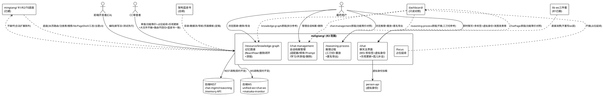
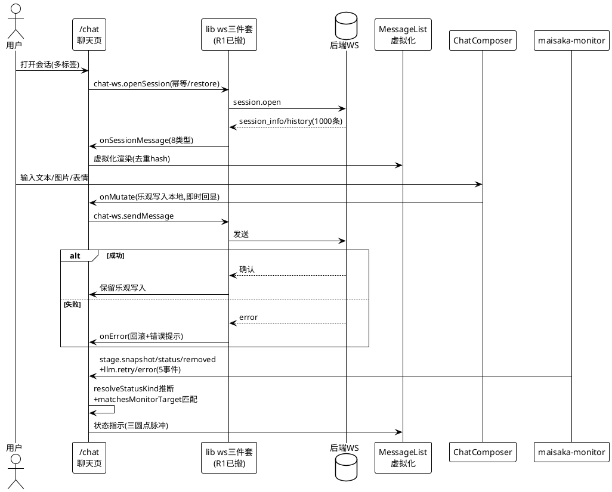
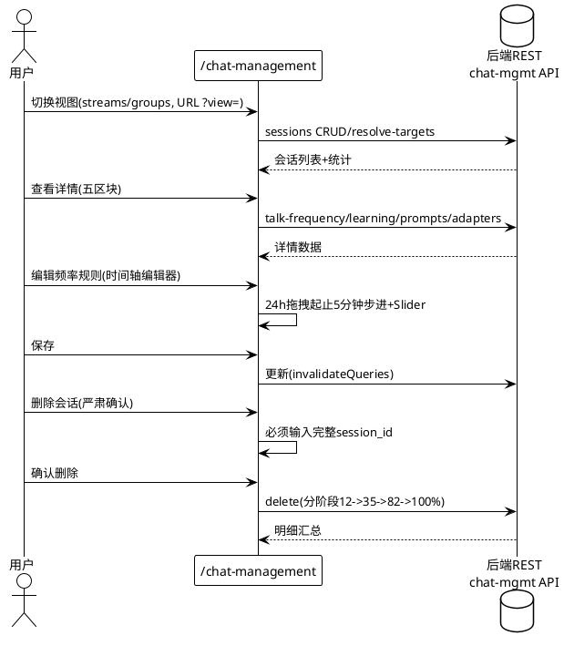
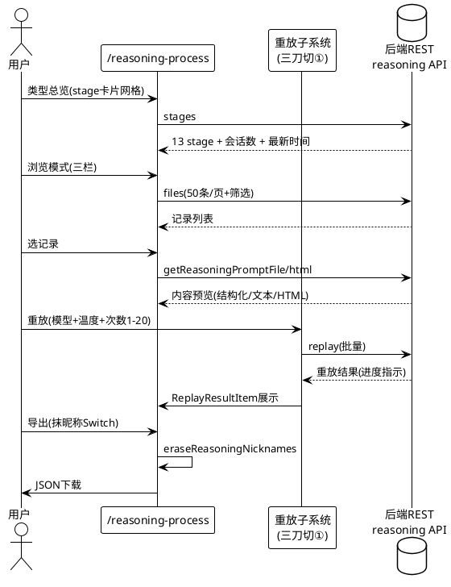
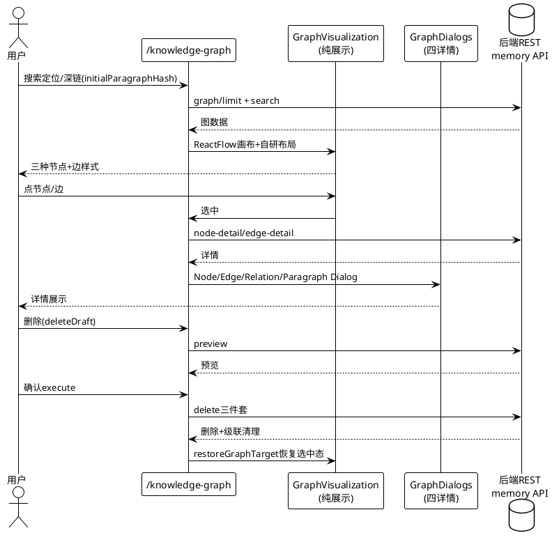
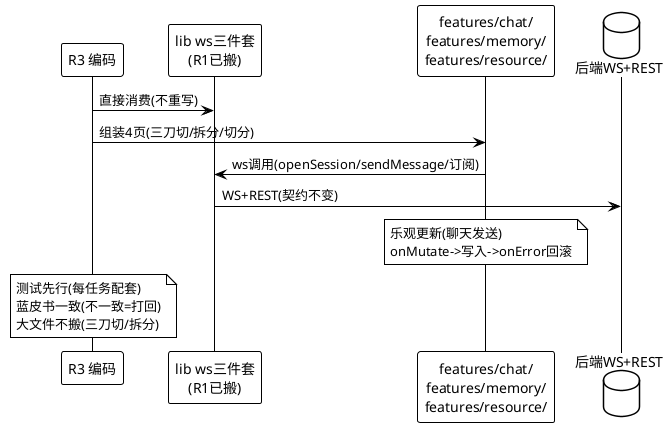

# 明堂前端重写 R3：chat 域 2 页 + memory 域 2 页组装 需求规格

> SSD 阶段：spec.md（需求规格——"建什么"）
> 版本：v1.0  日期：2026-08-09
> 作者：需求规格设计代理
> 提交标记：[CA]
> 前置：R1/R2/TE 主题增强已验收通过（build 绿 + 433 tests 绿 + 验收完成）；**架构蓝皮书已定稿（`.shared/decisions/WebUI_Plan/mingtang_architecture_blueprint_0808.md`——R1-R4 SSD 总纲）**；R3 输入双盘点已完成（chat 域 ChatPage 1093 行 + 13 子组件 + chat-management 2397 行 + ws 三件套；memory 域 reasoning-process 3415 行 + knowledge-graph 2031 行 + focus 决策）；R2 SSD（spec/design/tasks）+ TE SSD（spec/design/tasks/te_coding_issues）已就绪作为格式与粒度对齐基准
> 范围：R3 = chat 域 2 页（/chat 聊天主界面 + /chat-management 会话档案管理）+ memory 域 2 页（/reasoning-process 推理过程 + /resource/knowledge-graph 记忆图谱）+ /focus 占位延续（~1.5-2 周）——在 R1/R2/TE 底座上组装聊天与记忆/推理域并完成核心交互能力接轨
> 关键决策：**focus 不搬**（用户拍板——3D VRM 娱乐页——占位延续）；**reasoning-process 3415 行三刀切**（重放子系统 + 工具簇四组抽 lib + 主页面——不搬大文件）；**knowledge-graph 拆分**（GraphVisualization + GraphDialogs 整体搬 + index.tsx 按新结构重组）；**ws 三件套直接消费**（lib 已搬——页面不重写 ws 层）；**两个孤儿组件补全**（ChatHeaderBar 复用或删 / VirtualIdentityDialog 补入口 + person-api）；**乐观更新**（聊天消息即时回显 + 失败回滚）；**纪律**（测试先行 / 蓝皮书一致 / 不碰 dashboard / [CA] / lint 全绿——2026-08-09 更新：TS 7/6 并存已恢复 typescript-eslint，原 lint 豁免废止）；**R3 目录结构以架构蓝皮书为准（不一致 = 打回）**

---

# **1. 组件定位**

## **1.1 核心职责**

本组件负责在 R1/R2/TE 底座上组装**聊天域**（chat 域 2 页——/chat 即时聊天 + /chat-management 会话档案管理）与**记忆/推理域**（memory 域 2 页——/reasoning-process 推理过程浏览重放 + /resource/knowledge-graph 记忆图谱可视化），实现 4 页功能等价于 dashboard 原版、聊天消息发送支持乐观更新即时回显、推理过程页按三刀切拆分不搬 3415 行大文件、记忆图谱按 GraphVisualization + GraphDialogs 天然独立拆分、ws 三件套直接消费 lib 已搬层不重写、两个孤儿组件补全挂载与入口，**目录结构 / 数据流 / 导航 / 页面模板均按架构蓝皮书定稿**，不破坏 R1/R2/TE 已建的 36 页路由/注册表/搜索。

## **1.2 核心输入**

1. **R1/R2/TE 可运行底座**（来源：`.codeartsdoer/specs/mingtang_r1_frontend_base/` + `mingtang_r2_config_domain/` + `mingtang_theme_enhance/`）——mingtang/ 工程（build 绿 + 433 tests）、8 功能域目录结构（features/config/ 已组装）、TanStack Router 36 页路由表（config 域 8 页本体 + 其余占位）、TanStack Query 数据流基座、PageShell + 三态组件、shadcn/ui 基础组件、lib/ 文件搬移（含 ws 三件套 unified-ws/chat-ws-client/maisaka-monitor-client + chat-management-api + reasoning-process-api + memory-api + user-emoji-api + person-api + avatar-url + chat-display）、设置注册表 + 搜索、Layout 框架（侧边栏收起 + 语言切换）、i18n 四语言、主题 UI 化完成
2. **R3 chat 域功能点盘点**（来源：`.shared/decisions/WebUI_Plan/mingtang_r3_chat_inventory_0809.md`）——ChatPage（index.tsx 1093 行——WS 消息流 8 类型 + 多标签 + 虚拟身份 + 运行状态订阅）+ 13 子组件清单（MessageList 564 虚拟化 / MessageRenderer 282 十二段类型 / ChatComposer 146 / ChatHeaderBar 127 孤儿 / ChatTabBar 144 / ChatWorkspaceSidebar 297 / ChatScrollContext 14 / VirtualIdentityDialog 224 孤儿 / UserEmojiManager 250 / embed 44 / types 175 / utils 69）+ chat-management.tsx 2397 行（双视图 streams/groups + 详情弹窗五区块 + 删除流）+ ws 三件套 API 层（lib 已搬）
3. **R3 memory 域功能点盘点**（来源：`.shared/decisions/WebUI_Plan/mingtang_r3_memory_inventory_0809.md`）——reasoning-process.tsx 3415 行（双模式类型总览/浏览 + 三栏 + 重放 + 匿名导出 + 大文件切分抓手 1502-2148 重放子系统自包含）+ focus.tsx 2028 行（3D VRM 番茄钟——**决策不搬**）+ resource/knowledge-graph/ 2031 行（index.tsx 1112 + GraphVisualization 410 零 API 依赖 + GraphDialogs 459 + types 50——ReactFlow + 自研布局 + 删除闭环）
4. **架构蓝皮书**（来源：`.shared/decisions/WebUI_Plan/mingtang_architecture_blueprint_0808.md`）——R1-R4 SSD 总纲：功能域 8 域 / 目录定稿 / 公共组件清单 / TanStack Query 数据流规范 / 注册表驱动导航 / 标准页面模板——**R3 目录结构以蓝皮书为准**
5. **R2 编码注意点**（来源：`.shared/handoff/cc2ca_mingtang_r1_notes_0808.md`）——lint 豁免决策（TS 7.0 + typescript-eslint 未适配，R3 沿用）/ 视觉需求（深色优先 + 绿 accent + 保留原版气质）/ 搬移纪律（不碰 dashboard / 行为等价 / 测试先行）
6. **TS 速查**（来源：`.shared/decisions/typescript_new_code_cheatsheet.md`）——React 19.2 新写法（ref 直传 / use() / Actions / Context 直接当 provider）/ TS 7 新写法 / 验收三绿 / 类型规范 / 测试规范
7. **相关调研**（来源：`.shared/research/2026-08/zulip_arch_0807.md` + `cockpit_arch_0807.md` + `webui_arch/supabase_0807.md` + `webui_arch/dub_0807.md`）——zulip ws 事件 schema 测试制度 / 45s 心跳 / last_event_id 回放；supabase 乐观更新三段式（onMutate→写入→onError 回滚）/ 资源化目录 / 200-300 行切分
8. **dashboard/ 原版源码**（只读对照基准）——routes/chat/（15 文件 3444 行）+ chat-management.tsx（2397 行）+ reasoning-process.tsx（3415 行）+ focus.tsx（2028 行）+ resource/knowledge-graph/（2031 行）——**不搬大文件，按新结构重写/拆分**
9. **后端 API 契约**（WS：unified-ws op 信封 + chat-ws openSession/sendMessage + maisaka-monitor 16 事件；REST：chat-management-api sessions CRUD/resolve-targets/talk-frequency/learning/prompts/adapters/delete + reasoning-process-api files/stages/clear/getReasoningPromptFile/html/replay + memory-api graph/search/node-detail/edge-detail/paragraph-detail/delete）——R1/R2 lib 搬移后契约不变，R3 页面组装复用
10. **TE 编码问题记录**（来源：`.codeartsdoer/specs/mingtang_theme_enhance/te_coding_issues.md`）——11 个问题教训（hook 改 Context 测试需包裹 Provider / Partial<T> 非深 Partial / 测试避免 Node.js 模块用 ?raw / jsdom fetch 不可用 / Set<字面量联合> 用 Set<string> / spread 不验证接口属性用内联 / HSL 低饱和度色相不稳定）——R3 编码预警

## **1.3 核心输出**

1. **/chat 聊天主界面**——WS 消息流（8 类型）+ 多标签会话 + 虚拟身份 + 运行状态订阅 + 乐观更新（发送即时回显 + 失败回滚）+ 两个孤儿组件补全（ChatHeaderBar 复用 / VirtualIdentityDialog 补入口）——功能等价于 dashboard 原版
2. **/chat-management 会话档案管理**——双视图（streams/groups）+ 详情弹窗五区块（适配器/频率规则/聊天 Prompt/学习配置/基本信息）+ 共享组管理 + 删除流（严肃确认）——功能等价于 dashboard 原版
3. **/reasoning-process 推理过程**——双模式（类型总览/浏览）+ 三栏 + 重放子系统 + 匿名导出 + **三刀切拆分**（重放子系统自包含 + 工具簇四组抽 lib + 主页面）——功能等价于 dashboard 原版，无 2000+ 行大文件
4. **/resource/knowledge-graph 记忆图谱**——ReactFlow 可视化 + 自研布局 + 删除闭环 + 深链协议 + **拆分**（GraphVisualization + GraphDialogs 整体搬 + index.tsx 按新结构重组）——功能等价于 dashboard 原版
5. **/focus 占位延续**——3D VRM 番茄钟页保持占位（用户拍板不搬——娱乐页依赖重），路由可达占位延续如 model-presets 模式
6. **ws 三件套直接消费**——unified-ws（op 信封/心跳 30s/主题订阅 + since_event_id 回放）+ chat-ws-client（openSession 幂等/restore/重连重发）+ maisaka-monitor-client（16 事件）——页面不重写 ws 层，直接消费 lib 已搬
7. **乐观更新落地**——聊天消息发送 onMutate→写入本地→onError 回滚（webui_arch P3 模式），发送即时回显 + 失败回滚
8. **测试套件增长**——chat 域 2 页 + memory 域 2 页 + ws 消息处理 + 重放 + 图谱交互 + 乐观更新的配套测试（数量相对 TE 的 433 增长）
9. **36 页路由不回归**——R1/R2/TE 已建的 36 页路由/注册表/搜索保持可达不破坏

## **1.4 职责边界**

本组件**不负责**以下事项（防止职责蔓延——对齐 R1/R2 边界模式）：

1. **不做 R4 页面组装**——resource（emoji/expression/jargon/knowledge-base）/ monitor / agent / plugin / home 域页面由 R4 批次组装，R3 仅组装 chat 域 2 页 + memory 域 2 页
2. **不碰 dashboard/**——旧项目只读，作为功能等价对照基准与原版行为清单来源，不修改、不删除、不改名
3. **不搬大文件**——reasoning-process.tsx 3415 行不整体搬移（三刀切：重放子系统 + 工具簇四组抽 lib + 主页面）；knowledge-graph index.tsx 1112 行按新结构重组（GraphVisualization + GraphDialogs 整体搬因天然独立）；chat-management.tsx 2397 行组件化程度好按切分抓手拆分
4. **不做后端改动**——纯前端方案（沿用 R1/R2 方案 A），复用现有 WS + REST 端点，后端零改动
5. **不重写 ws 层**——unified-ws/chat-ws-client/maisaka-monitor-client 三件套已在 lib 搬移，R3 页面直接消费（openSession/sendMessage/onSessionMessage/订阅），不重写 ws 协议/心跳/重连
6. **不搬 focus.tsx**——3D VRM 番茄钟娱乐页（用户拍板不搬——three.js + VRM 依赖重 + 资源体积大 + 与 mingtang 轻量基线不符），/focus 路由占位延续
7. **不破坏 R1/R2/TE 已建**——36 页路由 / 注册表 / 搜索 / Layout / lib 搬移 / 三态组件 / PageShell / 主题 UI 保持不破坏（合法扩展除外：如注册表新增 chat/memory 域条目）
8. **不做新旧并行切换**——R3 仅组装 chat/memory 域页面，渐进切换属 R5（质量 + 对照验收）
9. **不做依赖用法调研**——依赖 API 用法在编码时查文档，SSD 不含依赖调研任务
10. **不做 ConfirmDialog 统一组件本体**——归属明堂-4（质量加固），R3 复用 R1/R2 已建的 components/biz/ 目录基座，不建本体

---

# **2. 领域术语**

**ws 三件套**
: R3 聊天页直接消费的三个 lib 已搬 WS 客户端——unified-ws（op 信封 + domain 路由 + 30s 心跳 90s 超时 + ws-token 鉴权 + 主题订阅 + since_event_id 回放）+ chat-ws-client（openSession 幂等/并发复用/restore:true + releaseSession 延迟 5 分钟 + sendMessage + onSessionMessage 订阅 + 重连自动重发 session.open）+ maisaka-monitor-client（16 种事件订阅 + 退订 200ms 延迟防 StrictMode 竞态）。
: 备注：R1 已搬移至 lib/，R3 页面直接消费不重写。

**op 信封**
: unified-ws 的消息封装格式——event/response/pong 三种 op 类型 + domain 路由 + ws-token 鉴权。聊天页通过 chat-ws-client 间接消费，不直接操作 op 信封。

**乐观更新**
: 聊天消息发送的即时回显模式（webui_arch P3 / supabase 调研）——onMutate 时先把用户消息写入本地消息列表（即时回显），后端确认后保留，onError 时回滚（移除乐观写入 + 错误提示）。非高频交互不用（蓝皮书 §四：仅高频交互用乐观更新，低频用失效刷新）。

**三刀切**
: reasoning-process.tsx 3415 行大文件的拆分策略（延续 R2 fieldHooks 不搬 3385 行先例）——① 重放子系统（1502-2148 约 650 行自包含——ReasoningReplayPanel/ReplayMessageEditorColumn/ReplayResultItem，只依赖 API + 类型）最干净切分点；② 工具簇四组（格式化/匿名化/tag 解析/重放准备——抽 lib）；③ 主页面（ReasoningProcessPage ~35 useState + 副作用链）。不搬大文件。

**孤儿组件**
: dashboard 原版 chat 域两个未挂载/无入口的完整组件——ChatHeaderBar（127 行——bars.test 引用但未挂载到页面——头像/状态/重连）+ VirtualIdentityDialog（224 行——组件完整但无"新建虚拟会话"入口，当前虚拟标签只能 localStorage 恢复）。R3 组装时补挂载/补入口。

**虚拟身份**
: 聊天页的虚拟会话标签机制——VirtualIdentityDialog 创建虚拟会话（person-api 加载身份数据源），虚拟标签 localStorage 恢复，与首个固定 webui-default 标签并存。

**运行状态订阅**
: 聊天页通过 maisaka-monitor-client 订阅的运行状态事件——stage.snapshot/status/removed + llm.retry/error，resolveStatusKind 按 stage 关键词推断 thinking/typing/acting/error，matchesMonitorTarget 三级匹配 tab。聊天页只消费 5 种事件（16 种中子集）。

**重放子系统**
: reasoning-process 页的 LLM 请求重放能力——ReasoningReplayPanel（重放侧栏 + handleReplay 批量）+ ReplayMessageEditorColumn + ReplayResultItem，支持模型 Select + 温度 + 次数 1-20 批量重放。自包含（只依赖 API + 类型），是 3415 行三刀切最干净切分点。

**删除闭环**
: knowledge-graph 页的删除/恢复机制——deleteDraft（mode mixed + selector）→ preview → execute → 恢复（restoreGraphTarget 快照恢复选中态），删除后自动删"失去全部证据的关系"。

**深链协议**
: knowledge-graph 页的嵌入定位范式——embedded + initialParagraphHash（挂载即定位段落），明堂/知识库嵌入页可复用。reasoning-process 页也有嵌入模式（createPortal 挂外部容器 + URL 深链 stage/session/stem/returnTo）。

**占位延续**
: /focus 路由保持占位（用户拍板不搬 3D VRM 番茄钟娱乐页——依赖重 + 资源体积大 + 与 mingtang 轻量基线不符），延续如 R2 model-presets 模式——路由可达占位三态齐全，不实现实际功能。彩蛋概念被用户收下（轻量版专注陪伴排期主体完成后可选）。

**功能等价对照**
: R3 chat/memory 4 页与 dashboard 原版并排对照——/chat 消息流 + /chat-management 会话管理 + /reasoning-process 推理浏览重放 + /resource/knowledge-graph 图谱交互逐项对照（非视觉像素级一致，而是功能行为等价：每个操作可达 + 结果一致）。

**lint 全绿（2026-08-09 更新）**
: 原 lint 豁免已废止——TS 7/6 并存方案已恢复 typescript-eslint（构建用 @typescript/native TS 7 + 工具链用 @typescript/typescript6 TS 6，typescript-eslint 8.66 peer 满足）——`npm run lint` 现为 0 错 0 警验收终点，三绿 = build + test + lint 全量。

**消息去重**
: 聊天页的 WS 消息去重机制——processedMessagesMapRef 以 user-/bot-{content}-{timestamp} hash 去重，上限 100 条，防 WS 重连/回放导致的重复消息。

**消息段类型**
: MessageRenderer 的 12 种消息段类型 switch——text/image/emoji/voice/video/face/music/file/forward/unknown/reply/at，reply 段独立块 + scrollToMessage 跳转。

---

# **3. 角色与边界**

## **3.1 核心角色**

- **前端开发者（CA）**：执行 R3 编码——组装 /chat + /chat-management + /reasoning-process + /resource/knowledge-graph 4 页、三刀切拆分 reasoning-process、拆分 knowledge-graph、补全两孤儿组件、落地乐观更新，按新写法基线与测试先行约束工作。
- **最终用户**：在 /chat 与机器人即时聊天（多标签/虚拟身份/发图发表情/看运行状态）；在 /chat-management 管理会话档案（适配器/频率规则/Prompt/学习/共享组/删除）；在 /reasoning-process 浏览推理记录 + 重放 LLM 请求 + 匿名导出；在 /resource/knowledge-graph 浏览记忆图谱 + 删除/恢复。
- **CC 审查者**：审查 R3 SSD 与编码产出，对照 chat/memory 4 页功能等价、/focus 占位延续、乐观更新生效、大文件不搬验证、36 页路由不回归、蓝皮书一致性。

## **3.2 外部系统**

- **后端 WS 服务**：unified-ws（op 信封 + 30s 心跳 + ws-token 鉴权 + since_event_id 回放）+ chat-ws openSession/sendMessage + maisaka-monitor 16 事件——R1 lib 搬移后契约不变，R3 页面直接消费。
- **后端 REST API**：chat-management-api（sessions CRUD/resolve-targets/talk-frequency/learning/prompts/adapters/delete）+ reasoning-process-api（files/stages/clear/getReasoningPromptFile/html/replay）+ memory-api（graph/search/node-detail/edge-detail/paragraph-detail/delete）+ user-emoji-api + person-api + avatar-url——R1 lib 搬移后契约不变，R3 页面组装复用，不改后端。
- **dashboard/（只读对照基准）**：提供 chat 域 2 页 + memory 域 2 页原版实现（含 3415 行 reasoning-process + 2397 行 chat-management + 2028 行 focus——不搬，作重写/拆分参考）；R3 期间只读。
- **lib ws 三件套（R1 已搬）**：unified-ws.ts（426 行）+ chat-ws-client.ts（289 行）+ maisaka-monitor-client.ts（426 行）——R3 页面直接消费，不重写。
- **maisaka-monitor 后端事件源**：16 种事件（session.start/stage.*/llm.*/message.*/planner.*/tool.execution 等）——聊天页只消费 5 种。
- **person-api（虚拟身份数据源）**：VirtualIdentityDialog 创建虚拟会话时加载身份数据——R1 lib 搬移复用。
- **localStorage（聊天页本地状态）**：虚拟标签恢复 + 用户 ID（maibot_webui_user_id）+ 昵称/头像版本——R3 聊天页复用。

## **3.3 交互上下文**

---

# **4. DFX约束**

## **4.1 性能**

1. **聊天消息流虚拟化**：MessageList 用 @tanstack/react-virtual 虚拟化（estimateSize 96 / overscan 8），1000 条消息滚动不卡顿（history 只保留最近 1000 条无翻页——原版语义保留）
2. **ws 心跳与回放**：unified-ws 30s 心跳 90s 超时（lib 已实现——R3 直接消费），since_event_id 回放断线补齐，重连自动重发 session.open（chat-ws-client 已实现）
3. **聊天发送即时回显**：乐观更新 onMutate 即时回显 ≤16ms（一帧内），后端确认后保留，失败 onError 回滚 ≤100ms
4. **推理重放批量**：handleReplay 批量重放次数 1-20，单次重放不阻塞 UI（async + 进度指示）
5. **记忆图谱渲染**：ReactFlow 画布 + 自研布局（黄金角螺旋 + 三层锚定）节点数 ≤500 流畅（原版语义保留——无 dagre 依赖）
6. **chat-management 列表分页**：streams 视图数据表分页 + HoverScrollText 横向滚动不卡顿
7. **maisaka-monitor 退订延迟**：退订 200ms 延迟防 StrictMode 竞态（lib 已实现——R3 直接消费）

## **4.2 可靠性**

1. **build 绿**：`pnpm run build` 必须通过（沿用 R1/R2 基线）
2. **test 绿**：`pnpm run test` 全绿，测试数量相对 TE 的 433 增长（chat 域 2 页 + memory 域 2 页 + ws 消息处理 + 重放 + 图谱交互 + 乐观更新配套测试）
3. **lint（豁免期）绿**：`pnpm run lint` 不依赖 TS API 的规则全绿（TS 类型专项规则豁免——R1 决策沿用）
4. **chat/memory 4 页功能等价**：4 页与 dashboard 原版功能行为等价（每个操作可达 + 结果一致——非视觉像素级）
5. **36 页路由不回归**：R1/R2/TE 已建的 36 页路由全部保持可达（R3 组装 chat/memory 4 页本体，其余 32 页保持占位可达）
6. **后端零改动**：`git diff src/webui/` 为空（纯前端方案 A 沿用）
7. **乐观更新一致性**：发送成功 → 消息保留；发送失败 → 乐观写入回滚 + 错误提示；不出现"乐观回显但后端未收到"或"后端收到但未回显"
8. **ws 消息去重**：processedMessagesMapRef hash 去重上限 100 条，WS 重连/回放不产生重复消息
9. **大文件不搬验证**：reasoning-process 无 2000+ 行文件（三刀切后重放子系统 ≤650 行 + 工具簇抽 lib + 主页面 ≤合理行数）；knowledge-graph index.tsx 重组后无 1000+ 行文件

## **4.3 安全性**

1. **ws-token 鉴权**：unified-ws 连接携带 ws-token 鉴权（lib 已实现——R3 直接消费），无 token 拒绝连接
2. **会话删除严肃确认**：chat-management 删除流必须输入完整 session_id 才能启用删除（危险说明框 + 分阶段进度条 12%→35%→82%→100% + 明细汇总——原版语义保留）
3. **推理记录匿名导出**：导出时抹昵称 Switch 抹去昵称（eraseReasoningNicknames——原版语义保留），防泄露用户昵称
4. **图片上传校验**：聊天发图上限 8 张 + 头像上传 5MB + 表情 ≤2MB（原版语义保留）
5. **HTML sandbox iframe**：推理记录 HTML 形态用 sandbox iframe 渲染（原版语义保留——防 XSS）

## **4.4 可维护性**

1. **ESLint 10 零新警告**（豁免期）：不依赖 TS API 的规则零新警告（R1 决策沿用）
2. **测试先行**：chat 域 2 页 + memory 域 2 页 + ws 消息处理 + 重放 + 图谱交互 + 乐观更新的配套测试先行编写（对齐 pytest 纪律——明堂-1 教训：局部当全量/测试凑绿都是红旗）
3. **新写法基线沿用**：新代码用 React 19.2 / TS 7 新写法（R1 W-1~W-8 + TE W-1~W-11 沿用），不引入旧写法（ref 直传 / use() / Actions / Context 直接当 provider / useRef 永远传参 / useEffect 不传 async）
4. **简体中文优先**：注释 / 日志 / WebUI 用户可见文本优先简体中文
5. **i18n 四语言同步**：新文案四个 locale 文件同步加 key，zh 为原文，en / ja / ko 人工翻译不机翻
6. **不提交无边界的格式化 / 导入整理**（AGENTS.md 默认原则 #1 沿用）
7. **大文件拆分清晰**：reasoning-process 三刀切（重放子系统自包含 + 工具簇四组抽 lib + 主页面），不重现 3415 行大文件；knowledge-graph 拆分（GraphVisualization + GraphDialogs + index.tsx 重组），不重现 1112 行大文件；chat-management 按切分抓手拆分（工具函数 + 17 组件），不重现 2397 行大文件
8. **TE 编码教训沿用**：hook 改 Context 测试需包裹 Provider / Partial<T> 非深 Partial 用 cast / 测试避免 Node.js 模块用 ?raw / jsdom fetch 不可用用 ?raw / Set<字面量联合> 用 Set<string> / spread 不验证接口属性用内联 / HSL 低饱和度色相不稳定测试排除低饱和度层级

## **4.5 兼容性**

1. **chat/memory 域路由路径与 dashboard 对齐**：/chat、/chat-management、/reasoning-process、/resource/knowledge-graph 路径与 dashboard 一致（R1/R2 路由表已登记，R3 组装本体）
2. **R1/R2/TE 已建不破坏**：36 页路由 / 注册表 / 搜索 / Layout / lib / 三态 / PageShell / 主题 UI 保持不破坏（合法扩展除外）
3. **ws 契约不变**：unified-ws/chat-ws/maisaka-monitor 三件套契约与后端一致（R1 lib 搬移后不变，R3 直接消费）
4. **i18n key 结构与 dashboard 对齐**：R1 已搬移，R3 新增 key 沿用结构

## **4.6 架构对齐约束（蓝皮书——R3 必须遵守）**

> 来源：架构蓝皮书 `.shared/decisions/WebUI_Plan/mingtang_architecture_blueprint_0808.md`，R1-R4 SSD 总纲（R1/R2 §4.6 沿用）

1. **目录结构以蓝皮书 §二 为准**：chat 域 2 页位于 features/chat/（index.tsx + detail/ + components/ + hooks/），memory 域 2 页位于 features/memory/（reasoning-process）+ features/resource/（knowledge-graph——按蓝皮书 §一 resource 域归属 R4，但 knowledge-graph 作为 memory 域组装在 R3——**以蓝皮书 §一 功能域划分为准，knowledge-graph 归 features/resource/ 但 R3 先组装**），不一致 = SSD 打回
2. **功能域 8 域划分以蓝皮书 §一 为准**：chat 域 2 页归属 features/chat/，reasoning-process 归 features/memory/，knowledge-graph 归 features/resource/（R3 先组装），不跨域
3. **公共组件以蓝皮书 §三 清单为准**：chat/memory 4 页需要通用能力时先查 components/biz/（PageShell/DataTable/StatCard/FormField/三态/ConfirmDialog）——没有才新写（新写后登记进清单）
4. **数据流以蓝皮书 §四 TanStack Query 规范为准**：chat/memory 4 页所有 REST API 调用走 useQuery（不裸 fetch）；queryKey 格式 `['api', 资源名, 参数]`；写操作成功后 invalidateQueries 统一失效；乐观更新仅高频交互（聊天发送）用，低频用失效刷新；Query 错误 → 页面错误态不静默
5. **导航以蓝皮书 §五 注册表驱动为准**：chat/memory 4 页新增页面 = 注册表加一行（不手改侧边栏组件）
6. **页面模板以蓝皮书 §六 标准骨架为准**：chat/memory 4 页 = PageShell + 三态齐全 + 数据流 + 组件组装，不手写 loading 状态机

---

# **5. 核心能力**

> R3 核心能力按五大模块组织：① /chat 聊天主界面 ② /chat-management 会话档案管理 ③ /reasoning-process 推理过程 ④ /resource/knowledge-graph 记忆图谱 ⑤ /focus 占位延续 + 横切约束
> EARS 格式：Given / When / Then + 约束 + 验收条件

## **5.1 /chat 聊天主界面**

> 输入：ChatPage 1093 行 + 13 子组件清单 + ws 三件套（lib 已搬）+ 两个孤儿组件
> 目标：WS 消息流 + 多标签 + 虚拟身份 + 运行状态订阅 + 乐观更新 + 孤儿组件补全——功能等价于 dashboard 原版

### **5.1.1 业务规则**

**REQ-R3-01：WS 消息流（8 类型 + 去重 + 虚拟化列表）**〔来源：chat 盘点 §1/§2 + 硬决策 #4〕

**Given** 原版 ChatPage 通过 ws 三件套接收 8 种消息类型（session_info/system/user_message/bot_message/typing/error/history——history 只保留最近 1000 条无翻页），R1 已搬 lib ws 三件套（unified-ws/chat-ws-client/maisaka-monitor-client）
**When** R3 组装 /chat 消息流
**Then** 通过 chat-ws-client.onSessionMessage 订阅消息，MessageList 虚拟化渲染（@tanstack/react-virtual estimateSize 96/overscan 8），MessageRenderer 处理 12 种消息段类型（text/image/emoji/voice/video/face/music/file/forward/unknown/reply/at），processedMessagesMapRef hash 去重（user-/bot-{content}-{timestamp}，上限 100 条），history 只保留最近 1000 条

约束：
- **ws 三件套直接消费**（硬决策 #4）：chat-ws-client.openSession/sendMessage/onSessionMessage + unified-ws 心跳/回放 + maisaka-monitor 订阅——页面不重写 ws 层
- 8 种消息类型：session_info/system/user_message/bot_message/typing/error/history
- MessageList 虚拟化（@tanstack/react-virtual estimateSize 96/overscan 8）+ 分组/滚动锚点/scrollToMessage 高亮/状态指示（三圆点脉冲）/空态欢迎页/语音播放行常驻
- MessageRenderer 12 种段类型 switch——reply 段独立块 + scrollToMessage 跳转
- 消息去重：processedMessagesMapRef hash 去重上限 100 条（防 WS 重连/回放重复）
- history 只保留最近 1000 条无翻页（原版语义保留）
- **按蓝皮书 §六 标准骨架**：PageShell + 三态齐全 + 数据流 + 组件组装

验收条件：[8 类型消息渲染 + 虚拟化列表 1000 条不卡顿 + 12 段类型 + 去重无重复 + history 1000 条 + ws 直接消费不重写 + 功能等价对照 dashboard]

---

**REQ-R3-02：多标签会话管理（打开/切换/关闭/恢复）**〔来源：chat 盘点 §1〕

**Given** 原版 ChatPage tabs 状态模型（ChatTab[]——首个固定 webui-default + 虚拟标签 localStorage 恢复）+ activeTabId
**When** 用户在 /chat 管理多标签
**Then** 提供多标签会话管理（打开/切换/关闭/恢复），首个标签固定 webui-default，虚拟标签 localStorage 恢复，桌面 ChatWorkspaceSidebar + 移动 ChatTabBar 布局，framer-motion 动画

约束：
- tabs 状态：ChatTab[]——首个固定 webui-default + 虚拟标签 localStorage 恢复
- 桌面布局：ChatWorkspaceSidebar（297 行——桌面会话列表 + 用户身份卡内联编辑昵称）+ 主区
- 移动布局：ChatTabBar（144 行——横向会话切换条 + 头像上传）
- framer-motion 动画
- ChatScrollContext（14 行——scrollToMessage 跨组件接口）

验收条件：[多标签打开/切换/关闭/恢复 + 首个固定 webui-default + 虚拟标签 localStorage 恢复 + 桌面/移动布局 + 功能等价对照 dashboard]

---

**REQ-R3-03：发送文本/图片/表情 + 乐观更新**〔来源：chat 盘点 §1/§2 + 硬决策 #6 + supabase 调研〕

**Given** 原版 ChatComposer（146 行——自适应 Textarea + 发送按钮 + 图片预览条 + 表情按钮 + 未连接态禁用）+ sendMessage（content+images+emojis+user_name），用户期望发送即时回显
**When** 用户在 /chat 发送文本/图片/表情
**Then** ChatComposer 自适应 Textarea（36-160px）+ Enter 发送（isComposing 保护中文输入法）+ 图片预览条（上限 8 张）+ 表情按钮，**乐观更新**：onMutate 时先把用户消息写入本地消息列表（即时回显 ≤16ms），chat-ws-client.sendMessage 发送，后端确认后保留，onError 时回滚（移除乐观写入 + 错误提示 ≤100ms）

约束：
- ChatComposer 自适应 Textarea（36-160px）+ 发送按钮 + 图片预览条 + 表情按钮 + 未连接态禁用
- Enter 发送（isComposing 保护中文输入法）
- 图片上限 8 张，表情通过 emojis 通道发送
- **乐观更新**（硬决策 #6——webui_arch P3 / supabase 调研）：
  - onMutate：先把用户消息写入本地消息列表（即时回显 ≤16ms——一帧内）
  - sendMessage：chat-ws-client.sendMessage（content+images+emojis+user_name）
  - 成功：后端确认后保留乐观写入
  - onError：回滚（移除乐观写入 + 错误提示 ≤100ms）
- **仅高频交互用乐观更新**（蓝皮书 §四）：聊天发送用乐观更新，低频操作用失效刷新
- UserEmojiManager（250 行——自定义表情管理 Popover——add ≤2MB/4 列网格/删除/发送）

验收条件：[ChatComposer 自适应 + Enter 发送 + 图片 8 张 + 表情 + 乐观更新即时回显 ≤16ms + 失败回滚 ≤100ms + 不出现"回显但未收到/收到但未回显" + 功能等价对照 dashboard]

---

**REQ-R3-04：本地身份（昵称/头像）+ 运行状态订阅**〔来源：chat 盘点 §1/§2 + 硬决策 #4〕

**Given** 原版 ChatPage 本地身份（昵称/头像——头像上传 5MB + ?v= 破缓存）+ 运行状态订阅（maisakaMonitorClient：stage.snapshot/status/removed + llm.retry/error）
**When** 用户在 /chat 设置身份 / 系统推送运行状态
**Then** 本地身份编辑（昵称/头像上传 5MB + ?v= 破缓存——utils.ts 工具），运行状态订阅通过 maisaka-monitor-client 消费 5 种事件（16 种中子集），resolveStatusKind 按 stage 关键词推断 thinking/typing/acting/error，matchesMonitorTarget 三级匹配 tab，状态指示三圆点脉冲

约束：
- 本地身份：昵称 + 头像（上传 5MB + ?v= 破缓存——utils.ts 用户 ID/昵称/头像版本工具）
- **运行状态订阅**（硬决策 #4——直接消费 maisaka-monitor-client）：
  - 订阅 5 种事件：stage.snapshot/status/removed + llm.retry/error（16 种中子集）
  - resolveStatusKind 按 stage 关键词推断 thinking/typing/acting/error
  - matchesMonitorTarget 三级匹配 tab
  - 退订 200ms 延迟防 StrictMode 竞态（lib 已实现）
- 状态指示：三圆点脉冲（MessageList 状态指示）
- ChatHeaderBar（127 行——孤儿组件补全，见 REQ-R3-05）

验收条件：[昵称/头像上传 5MB + ?v= 破缓存 + 运行状态 5 事件订阅 + resolveStatusKind 推断 + matchesMonitorTarget 三级匹配 + 三圆点脉冲 + ws 直接消费 + 功能等价对照 dashboard]

---

**REQ-R3-05：两个孤儿组件补全（ChatHeaderBar + VirtualIdentityDialog）**〔来源：chat 盘点 §2/§5 + 硬决策 #5〕

**Given** 原版 chat 域两个孤儿组件：ChatHeaderBar（127 行——未挂载，bars.test 引用——头像/状态/重连）+ VirtualIdentityDialog（224 行——组件完整但无"新建虚拟会话"入口，当前虚拟标签只能 localStorage 恢复）
**When** R3 组装 /chat
**Then** 补全两个孤儿组件：① ChatHeaderBar 复用到 /chat 页面头部（头像/状态/重连）或确认无价值则删除（bars.test 同步处理）；② VirtualIdentityDialog 补"新建虚拟会话"入口（按钮触发 Dialog）+ person-api 加载身份数据源

约束：
- **ChatHeaderBar**（硬决策 #5）：
  - 选项 A：复用到 /chat 页面头部（头像/状态/重连——与运行状态订阅衔接）
  - 选项 B：确认无价值则删除（bars.test 同步删除/迁移）
  - R3 组装时裁定（优先复用——原版组件完整只是未挂载）
- **VirtualIdentityDialog**（硬决策 #5）：
  - 补"新建虚拟会话"入口（按钮触发 Dialog——ChatWorkspaceSidebar 或 ChatTabBar 加入口）
  - person-api 加载身份数据源（R1 lib 搬移复用）
  - 创建后虚拟标签 localStorage 持久化（与 REQ-R3-02 虚拟标签恢复衔接）
- types.ts 的 PersonInfo 与 types/person.ts 并存——组装时确认走哪份（统一为一份避免重复）

验收条件：[ChatHeaderBar 复用或删 + VirtualIdentityDialog 补入口 + person-api 加载 + 虚拟会话创建 + localStorage 持久化 + 无孤儿组件遗留 + 功能等价对照 dashboard]

### **5.1.2 交互流程**

### **5.1.3 异常场景**

1. **WS 连接断开**
   a. 触发条件：网络断开或后端 WS 服务不可用
   b. 系统行为：unified-ws 心跳 90s 超时检测 + 重连 + since_event_id 回放断线补齐 + chat-ws 重连自动重发 session.open；ChatComposer 未连接态禁用
   c. 用户感知：连接状态提示（ChatHeaderBar 重连指示）+ 发送禁用 + 重连后消息补齐

2. **乐观更新失败回滚**
   a. 触发条件：chat-ws.sendMessage 失败（后端拒绝/超时）
   b. 系统行为：onError 回滚（移除乐观写入 ≤100ms）+ 错误提示
   c. 用户感知：消息未发送提示 + 乐观回显消失 + 可重试

3. **WS 消息重复**
   a. 触发条件：WS 重连/回放导致重复消息
   b. 系统行为：processedMessagesMapRef hash 去重（上限 100 条）
   c. 用户感知：无重复消息显示

4. **图片/表情上传超限**
   a. 触发条件：图片 >8 张 / 头像 >5MB / 表情 >2MB
   b. 系统行为：上传前校验拒绝
   c. 用户感知：超限提示 + 不上传

5. **虚拟身份加载失败**
   a. 触发条件：person-api 加载身份数据失败
   b. 系统行为：VirtualIdentityDialog 错误态 + 不创建虚拟会话
   c. 用户感知：加载失败提示 + 可重试

---

## **5.2 /chat-management 会话档案管理**

> 输入：chat-management.tsx 2397 行（双视图 + 详情弹窗五区块 + 删除流）+ chat-management-api（lib 已搬）
> 目标：会话档案管理功能等价于 dashboard 原版——组件化程度好按切分抓手拆分

### **5.2.1 业务规则**

**REQ-R3-06：双视图（streams/groups）+ 头部统计卡**〔来源：chat 盘点 §3〕

**Given** 原版 ChatManagementPage 2397 行——双视图（streams/groups——URL ?view= 直达）+ 头部统计卡（全部/群聊/私聊）
**When** R3 组装 /chat-management
**Then** 提供双视图切换（streams/groups——URL ?view= 直达）+ 头部统计卡（全部/群聊/私聊），streams 视图搜索（12 字段）+ 类型过滤 + 数据表（10 列）+ HoverScrollText + 分页 + 三态

约束：
- 双视图：streams/groups（URL ?view= 直达）
- 头部统计卡：全部/群聊/私聊
- streams 视图：搜索（12 字段）+ 类型过滤 + 数据表（10 列）+ HoverScrollText + 分页 + 三态
- **按蓝皮书 §六 标准骨架 + components/biz/ DataTable 复用**
- **2397 行按切分抓手拆分**：工具函数（105-198）+ 组件 17 个（HoverScrollText/TalkFrequencyTimelineRule 691 行三层级/MutualGroupsView 1258/DeleteChatStreamDialog 1919/ChatManagementPage 2067）——组件化程度好，按新结构重组不搬大文件
- API：chat-management-api sessions CRUD/resolve-targets（R1 lib 搬移复用）

验收条件：[双视图 + URL ?view= 直达 + 统计卡 + streams 搜索/过滤/数据表/分页/三态 + 按切分抓手拆分无 2397 行大文件 + 功能等价对照 dashboard]

---

**REQ-R3-07：详情弹窗五区块（适配器/频率规则/Prompt/学习/基本信息）**〔来源：chat 盘点 §3〕

**Given** 原版 ChatManagementPage 详情弹窗五区块
**When** 用户查看/编辑会话详情
**Then** 提供详情弹窗五区块：① 基本信息（Session ID/Platform/Type/ID）② 适配器放行（允许/阻止/使用默认——单流覆盖全局）③ 发言频率规则（概览三格 + 生效规则栈 + 时间轴编辑器——24h 拖拽起止 5 分钟步进 + Slider 0-1）④ 聊天 Prompt（基础只读 + 专属列表增删改 + 变更检测才可保存）⑤ 学习配置（表达/黑话/行为三行——使用/学习双开关 + 命中规则说明）

约束：
- 五区块：
  - ① 基本信息（Session ID/Platform/Type/ID）
  - ② 适配器放行（允许/阻止/使用默认——单流覆盖全局）
  - ③ 发言频率规则（概览三格 + 生效规则栈 + **时间轴编辑器**——TalkFrequencyTimelineRule 691 行三层级——24h 拖拽起止 5 分钟步进 + Slider 0-1）
  - ④ 聊天 Prompt（基础只读 + 专属列表增删改 + 变更检测才可保存）
  - ⑤ 学习配置（表达/黑话/行为三行——使用/学习双开关 + 命中规则说明）
- API：chat-management-api talk-frequency/learning/prompts/adapters（R1 lib 搬移复用）
- **按蓝皮书 §四 数据流**：useQuery + 写操作 invalidateQueries

验收条件：[五区块完整 + 适配器放行 + 频率规则时间轴编辑器 + Prompt 增删改 + 学习双开关 + 功能等价对照 dashboard]

---

**REQ-R3-08：groups 视图（共享组管理）**〔来源：chat 盘点 §3〕

**Given** 原版 ChatManagementPage groups 视图——表达/黑话/记忆三类共享组
**When** 用户管理共享组
**Then** 提供三类共享组（表达/黑话/记忆——URL ?kind=）——新建/添加聊天（搜索多选 50 条）/成员徽章/删除整组/全局共享记忆开关禁用态——增删即保存整节配置

约束：
- 三类共享组：表达/黑话/记忆（URL ?kind=）
- 新建/添加聊天（搜索多选 50 条）/成员徽章/删除整组
- 全局共享记忆开关禁用态
- 增删即保存整节配置
- MutualGroupsView（1258 行——按新结构重组）
- API：chat-management-api（R1 lib 搬移复用）

验收条件：[三类共享组 + 新建/添加/删除 + 搜索多选 50 条 + 增删即保存 + 功能等价对照 dashboard]

---

**REQ-R3-09：删除流（严肃确认 + 分阶段进度）**〔来源：chat 盘点 §3 + §4.3 安全性〕

**Given** 原版 ChatManagementPage 删除流——严肃确认（危险说明框 + 必须输入完整 session_id 才能启用删除 + 分阶段进度条 12%→35%→82%→100% + 明细汇总）
**When** 用户删除会话
**Then** 提供严肃确认删除流：危险说明框 + **必须输入完整 session_id 才能启用删除** + 分阶段进度条（12%→35%→82%→100%）+ 明细汇总

约束：
- 危险说明框（严肃确认——对齐 §4.3 安全性）
- **必须输入完整 session_id 才能启用删除**（防误删）
- 分阶段进度条 12%→35%→82%→100%
- 明细汇总（删除结果）
- DeleteChatStreamDialog（1919 行——按新结构重组）
- API：chat-management-api delete（返回明细——R1 lib 搬移复用）
- **复用 components/biz/ ConfirmDialog**（蓝皮书 §三——统一危险操作确认出口）

验收条件：[严肃确认 + 输入 session_id 启用 + 分阶段进度 + 明细汇总 + 功能等价对照 dashboard]

### **5.2.2 交互流程**

### **5.2.3 异常场景**

1. **会话列表加载失败**
   a. 触发条件：chat-management-api sessions 请求失败
   b. 系统行为：页面错误态（三态统一）+ 重试
   c. 用户感知：错误提示 + 重试按钮

2. **频率规则保存冲突**
   a. 触发条件：并发编辑同一会话频率规则
   b. 系统行为：invalidateQueries 刷新 + 提示覆盖
   c. 用户感知：刷新到最新 + 提示

3. **删除 session_id 不匹配**
   a. 触发条件：输入的 session_id 与目标会话不一致
   b. 系统行为：删除按钮禁用
   c. 用户感知：输入不匹配 + 删除禁用

4. **删除分阶段失败**
   a. 触发条件：delete API 分阶段执行失败
   b. 系统行为：进度条停滞 + 错误明细
   c. 用户感知：删除失败 + 明细汇总 + 可重试

---

## **5.3 /reasoning-process 推理过程**

> 输入：reasoning-process.tsx 3415 行（全站最大页）+ reasoning-process-api（lib 已搬）
> 目标：推理过程浏览/重放/匿名导出——**三刀切拆分**（硬决策 #2）不搬大文件

### **5.3.1 业务规则**

**REQ-R3-10：三刀切拆分（重放子系统 + 工具簇四组 + 主页面）**〔来源：memory 盘点 §1 + 硬决策 #2〕

**Given** 原版 reasoning-process.tsx 3415 行（全站最大页——大文件结构切分抓手已明确），延续 R2 fieldHooks 不搬 3385 行先例
**When** R3 组装 /reasoning-process
**Then** 按**三刀切**拆分不搬大文件：
- ① **重放子系统**（1502-2148 约 650 行自包含——ReasoningReplayPanel/ReplayMessageEditorColumn/ReplayResultItem，只依赖 API + 类型）最干净切分点 → features/memory/components/replay/
- ② **工具簇四组**（格式化/匿名化/tag 解析/重放准备——抽 lib）→ lib/reasoning-utils/ 或 features/memory/utils/
- ③ **主页面**（ReasoningProcessPage ~35 useState + 副作用链）→ features/memory/reasoning-process.tsx

约束：
- **不搬 3415 行大文件**（硬决策 #2——延续 R2 fieldHooks 先例）
- **重放子系统**（1502-2148 约 650 行自包含）：
  - ReasoningReplayPanel（重放侧栏 + handleReplay 批量）
  - ReplayMessageEditorColumn
  - ReplayResultItem
  - 只依赖 API + 类型——最干净切分点 → features/memory/components/replay/
- **工具簇四组抽 lib**：
  - 格式化（URL 解析/stage 分类行/头部元数据提取）
  - 匿名化（eraseReasoningNicknames 昵称抹除体系）
  - tag 解析（<msg> 标签解析/tool call 归一化/会话显示名）
  - 重放准备（重放数据准备）
  - → lib/reasoning-utils/ 或 features/memory/utils/
- **主页面**（ReasoningProcessPage ~35 useState + 副作用链）→ features/memory/reasoning-process.tsx
- 其他组件按行号区间拆分：LlmErrorDetails（351-479）/ 角色样式 + 元数据文本（479-544）/ jargon_learning_update 专用（697-787）/ ProviderResponseTimeline（1196-1389）/ ToolDefinitionsCollapsible（1389-1502）/ NaturalLanguageText（1094-1133）/ ToolCallsCollapsible（1133-1196）
- **无 2000+ 行文件**（对齐 §4.2 可靠性 #9 大文件不搬验证）

验收条件：[三刀切拆分 + 重放子系统 ≤650 行自包含 + 工具簇四组抽 lib + 主页面 + 无 2000+ 行文件 + 功能等价对照 dashboard]

---

**REQ-R3-11：双模式（类型总览 + 浏览模式）**〔来源：memory 盘点 §1〕

**Given** 原版 reasoning-process 双模式——类型总览（stage 卡片网格）+ 浏览模式（三栏）
**When** 用户在 /reasoning-process 浏览
**Then** 提供双模式：① 类型总览：stage 卡片网格（STAGE_LABELS 13 项——规划器/回复器/行为学习/表情发送等——会话数 + 最新时间 + hover 清空）② 浏览模式：三栏（记录列表 280px + 内容预览 + 重放面板 420-460px 动画过渡）

约束：
- 双模式：类型总览 / 浏览模式
- 类型总览：stage 卡片网格（STAGE_LABELS 13 项）——会话数 + 最新时间 + hover 清空
- 浏览模式三栏：记录列表 280px + 内容预览 + 重放面板 420-460px 动画过渡
- 记录列表：50 条/页 + 筛选（会话 Select/动作过滤/搜索）
- 内容预览 Tabs：结构化（LLM 异常详情/jargon 多轮调用卡/provider 响应时间线/消息流时间线——角色徽标 + 工具调用折叠）/文本/HTML（sandbox iframe）
- 操作：复制/导出/重放
- 嵌入模式：createPortal 挂外部容器 + URL 深链（stage/session/stem/returnTo）
- API：reasoning-process-api files/stages/clear/getReasoningPromptFile/html（R1 lib 搬移复用）
- **按蓝皮书 §六 标准骨架**

验收条件：[双模式 + 类型总览 13 stage + 浏览三栏 + 50 条/页 + 筛选 + 内容预览 Tabs + 嵌入模式 + 功能等价对照 dashboard]

---

**REQ-R3-12：重放子系统（模型 Select + 温度 + 批量 1-20）**〔来源：memory 盘点 §1 + 硬决策 #2〕

**Given** 原版 reasoning-process 重放能力——ReasoningReplayPanel（重放侧栏 + handleReplay 批量）
**When** 用户重放 LLM 请求
**Then** 提供重放面板：模型 Select + 温度 + 次数 1-20 批量重放，handleReplay 批量执行（async + 进度指示），重放结果 ReplayResultItem 展示

约束：
- 重放面板（重放子系统——REQ-R3-10 ① 切分点）：
  - 模型 Select + 温度 + 次数 1-20
  - handleReplay 批量执行（async + 进度指示——对齐 §4.1 性能 #4 不阻塞 UI）
  - ReplayMessageEditorColumn + ReplayResultItem
- API：reasoning-process-api replay（R1 lib 搬移复用）
- 重放子系统自包含（只依赖 API + 类型）——features/memory/components/replay/

验收条件：[重放面板 + 模型/温度/次数 1-20 + 批量不阻塞 + 结果展示 + 自包含切分 + 功能等价对照 dashboard]

---

**REQ-R3-13：匿名导出（抹昵称 + JSON 下载）**〔来源：memory 盘点 §1 + §4.3 安全性〕

**Given** 原版 reasoning-process 导出能力——抹昵称 Switch + JSON 下载
**When** 用户导出推理记录
**Then** 提供导出：抹昵称 Switch（eraseReasoningNicknames 抹去昵称——防泄露）+ JSON 下载

约束：
- 导出：复制/导出（抹昵称 Switch + JSON 下载）
- eraseReasoningNicknames 抹去昵称（对齐 §4.3 安全性——防泄露用户昵称）
- 工具簇匿名化组（REQ-R3-10 ②）

验收条件：[抹昵称 Switch + JSON 下载 + 昵称抹除 + 功能等价对照 dashboard]

### **5.3.2 交互流程**

### **5.3.3 异常场景**

1. **推理记录列表加载失败**
   a. 触发条件：reasoning-process-api files 请求失败
   b. 系统行为：页面错误态 + 重试
   c. 用户感知：错误提示 + 重试

2. **重放批量失败**
   a. 触发条件：replay API 批量执行部分失败
   b. 系统行为：进度条标注失败项 + 部分结果展示
   c. 用户感知：部分重放失败 + 失败明细 + 可重试

3. **HTML sandbox 渲染失败**
   a. 触发条件：推理记录 HTML 形态内容异常
   b. 系统行为：sandbox iframe 错误态
   c. 用户感知：HTML 渲染失败提示 + 切文本形态

4. **stage 清空误操作**
   a. 触发条件：类型总览 hover 清空误触
   b. 系统行为：清空需二次确认（复用 ConfirmDialog）
   c. 用户感知：二次确认 + 取消可恢复

---

## **5.4 /resource/knowledge-graph 记忆图谱**

> 输入：resource/knowledge-graph/ 2031 行（index.tsx 1112 + GraphVisualization 410 + GraphDialogs 459 + types 50）+ memory-api（lib 已搬）
> 目标：ReactFlow 可视化 + 删除闭环——**拆分**（硬决策 #3）GraphVisualization + GraphDialogs 整体搬 + index.tsx 重组

### **5.4.1 业务规则**

**REQ-R3-14：拆分（GraphVisualization + GraphDialogs 整体搬 + index.tsx 重组）**〔来源：memory 盘点 §3 + 硬决策 #3〕

**Given** 原版 resource/knowledge-graph/ 2031 行——index.tsx 1112（主组件）+ GraphVisualization.tsx 410（纯展示零 API 依赖）+ GraphDialogs.tsx 459（四个详情 Dialog）+ types.ts 50
**When** R3 组装 /resource/knowledge-graph
**Then** 按**拆分**：① GraphVisualization（410 行零 API 依赖可整体搬走）→ features/resource/components/graph-visualization/ ② GraphDialogs（459 行仅依赖 API 类型可整体搬走）→ features/resource/components/graph-dialogs/ ③ index.tsx 1112 行按新结构重组（状态编排 + 数据转换 + 删除闭环 + 头部 UI）→ features/resource/knowledge-graph.tsx

约束：
- **GraphVisualization 整体搬**（410 行零 API 依赖——硬决策 #3）：
  - 纯展示：节点组件 + 布局算法 + ReactFlow 画布
  - 零 API 依赖可整体搬走 → features/resource/components/graph-visualization/
- **GraphDialogs 整体搬**（459 行仅依赖 API 类型——硬决策 #3）：
  - 四个详情 Dialog（Node/Edge/Relation/Paragraph）
  - 仅依赖 API 类型可整体搬走 → features/resource/components/graph-dialogs/
- **index.tsx 重组**（1112 行按新结构重组——硬决策 #3）：
  - 状态编排 + 数据转换 + 删除闭环 + 头部 UI
  - → features/resource/knowledge-graph.tsx
  - **无 1000+ 行文件**（对齐 §4.2 可靠性 #9）
- types.ts（50 行——图数据契约）→ features/resource/types/ 或 types/
- **knowledge-graph 归 features/resource/**（蓝皮书 §一 resource 域——R3 先组装，R4 再组装 resource 域其余页）

验收条件：[GraphVisualization 整体搬 + GraphDialogs 整体搬 + index.tsx 重组 + 无 1000+ 行文件 + 功能等价对照 dashboard]

---

**REQ-R3-15：ReactFlow 可视化 + 自研布局**〔来源：memory 盘点 §3〕

**Given** 原版 knowledge-graph 用 ReactFlow（非 echarts/d3）+ 三种自绘节点 + 自研布局
**When** 用户浏览记忆图谱
**Then** ReactFlow 画布 + 三种自绘节点（Entity 蓝/Relation 橙/Paragraph 绿）+ **自研布局**（黄金角螺旋——sqrt(index)*radiusScale + 三层锚定证据布局——无 dagre 依赖）+ 边样式（kind 配色/smoothstep/权重线宽）

约束：
- **ReactFlow**（非 echarts/d3——原版选型保留）
- 三种自绘节点：Entity 蓝 / Relation 橙 / Paragraph 绿
- **自研布局**：黄金角螺旋（sqrt(index)*radiusScale）+ 三层锚定证据布局——无 dagre 依赖
- 边样式：kind 配色 / smoothstep / 权重线宽
- 节点数 ≤500 流畅（对齐 §4.1 性能 #5）
- GraphVisualization（410 行——零 API 依赖纯展示）

验收条件：[ReactFlow 画布 + 三种节点 + 自研布局 + 边样式 + ≤500 节点流畅 + 功能等价对照 dashboard]

---

**REQ-R3-16：删除闭环（deleteDraft → preview → execute → 恢复）**〔来源：memory 盘点 §3〕

**Given** 原版 knowledge-graph 删除闭环——deleteDraft（mode mixed + selector）→ preview → execute → 恢复
**When** 用户删除图谱节点/边/关系
**Then** 提供删除闭环：deleteDraft（mode mixed + selector）→ preview → execute → 恢复（restoreGraphTarget 快照恢复选中态），删除后自动删"失去全部证据的关系"

约束：
- 删除闭环：deleteDraft（mode mixed + selector）→ preview → execute → 恢复
- restoreGraphTarget 快照恢复选中态
- 删除后自动删"失去全部证据的关系"（级联清理）
- API：memory-api delete 三件套（R1 lib 搬移复用）
- **复用 components/biz/ ConfirmDialog**（蓝皮书 §三——删除预览确认）

验收条件：[删除闭环 + preview + execute + 恢复 + 级联清理 + 功能等价对照 dashboard]

---

**REQ-R3-17：搜索定位 + 深链协议 + 四详情 Dialog**〔来源：memory 盘点 §3〕

**Given** 原版 knowledge-graph 搜索定位 + 逐级下钻 + 深链协议（embedded + initialParagraphHash）
**When** 用户搜索/下钻/深链
**Then** 提供搜索定位 + 逐级下钻（Node/Edge/Relation/Paragraph 四详情 Dialog）+ 深链协议（embedded + initialParagraphHash 挂载即定位段落）

约束：
- 搜索定位 + 逐级下钻
- 四详情 Dialog（GraphDialogs 459 行——Node/Edge/Relation/Paragraph）
- **深链协议**：embedded + initialParagraphHash（挂载即定位段落——明堂/知识库嵌入页可复用范式）
- API：memory-api graph/limit + search + node-detail + edge-detail + paragraph-detail（R1 lib 搬移复用）
- **按蓝皮书 §四 数据流**：useQuery + queryKey `['api', 'memory', 'graph', 参数]`

验收条件：[搜索 + 逐级下钻 + 四 Dialog + 深链 initialParagraphHash + 功能等价对照 dashboard]

### **5.4.2 交互流程**

### **5.4.3 异常场景**

1. **图数据加载失败**
   a. 触发条件：memory-api graph 请求失败
   b. 系统行为：页面错误态 + 重试
   c. 用户感知：错误提示 + 重试

2. **节点数超限渲染卡顿**
   a. 触发条件：节点数 >500
   b. 系统行为：自研布局性能降级 + 提示
   c. 用户感知：渲染变慢提示 + 可筛选减少节点

3. **删除预览失败**
   a. 触发条件：memory-api preview 请求失败
   b. 系统行为：删除流中断 + 错误提示
   c. 用户感知：删除预览失败 + 可重试

4. **深链段落不存在**
   a. 触发条件：initialParagraphHash 对应段落已删除
   b. 系统行为：深链定位失败 + 提示
   c. 用户感知：段落不存在提示 + 回退图谱视图

---

## **5.5 /focus 占位延续 + 横切约束**

> 硬决策 #1：focus 不搬（用户拍板——3D VRM 娱乐页依赖重）
> 横切：ws 直接消费 / 乐观更新 / 大文件不搬 / 测试先行 / 蓝皮书一致

### **5.5.1 业务规则**

**REQ-R3-18：/focus 占位延续**〔来源：memory 盘点 §2 + 硬决策 #1〕

**Given** 原版 focus.tsx 2028 行——3D VRM 番茄钟专注陪伴页（three.js + VRM 角色——娱乐型非记忆管理语义），用户拍板不搬（依赖重 + 资源体积大 + 与 mingtang 轻量基线不符）
**When** R3 组装 /focus
**Then** 保持占位延续（如 R2 model-presets 模式）——路由可达占位三态齐全，不实现实际功能，不搬 three.js/VRM 依赖

约束：
- **不搬 focus.tsx**（硬决策 #1——用户拍板）
- 占位延续（如 R2 model-presets 模式——标题 + 虚线卡片"功能开发中" + 即将推出列表）
- 路由可达（R1 已登记，R3 组装占位本体）
- 不引入 three.js / @pixiv/three-vrm 依赖
- **彩蛋概念收下**（用户看过原版实机后——轻量版专注陪伴排期主体完成后可选——非 R3 范围）

验收条件：[/focus 占位渲染 + 路由可达 + 无 3D/VRM 依赖 + 36 页路由不回归]

---

**REQ-R3-19：ws 三件套直接消费（不重写 ws 层）**〔来源：chat 盘点 §4 + 硬决策 #4〕

**Given** R1 已搬 lib ws 三件套（unified-ws 426 行 + chat-ws-client 289 行 + maisaka-monitor-client 426 行），R3 聊天页需要 WS 消息流 + 运行状态订阅
**When** R3 组装 chat 域页面
**Then** **直接消费 lib ws 三件套**，不重写 ws 协议/心跳/重连/回放

约束：
- **ws 三件套直接消费**（硬决策 #4）：
  - unified-ws（op 信封 + domain 路由 + 30s 心跳 90s 超时 + ws-token 鉴权 + 主题订阅 + since_event_id 回放）
  - chat-ws-client（openSession 幂等/并发复用/restore:true + releaseSession 延迟 5 分钟 + sendMessage + onSessionMessage 订阅 + 重连自动重发 session.open）
  - maisaka-monitor-client（16 事件订阅 + 退订 200ms 延迟防 StrictMode 竞态）
- 页面不重写 ws 层（不重写协议/心跳/重连/回放）
- **zulip 调研沿用**：ws 事件 schema 测试制度（每个事件 payload schema 校验 + 覆盖测试，防事件格式静默回归）+ 45s 心跳 + last_event_id 回放

验收条件：[ws 三件套直接消费 + 不重写 ws 层 + 心跳/回放/重连沿用 lib + 事件 schema 测试]

---

**REQ-R3-20：乐观更新（聊天发送即时回显 + 失败回滚）**〔来源：硬决策 #6 + supabase 调研 + 蓝皮书 §四〕

**Given** 聊天消息发送是高频交互，用户期望即时回显，supabase 调研给出乐观更新三段式（onMutate→写入→onError 回滚）
**When** R3 组装 /chat 发送
**Then** 聊天发送用**乐观更新**（onMutate→写入本地→onError 回滚），非高频交互用失效刷新

约束：
- **乐观更新三段式**（硬决策 #6——webui_arch P3 / supabase 调研）：
  - onMutate：先把用户消息写入本地消息列表（即时回显 ≤16ms——一帧内）
  - 成功：后端确认后保留乐观写入
  - onError：回滚（移除乐观写入 + 错误提示 ≤100ms）
- **仅高频交互用乐观更新**（蓝皮书 §四）：聊天发送用乐观更新，低频操作（chat-management 编辑/删除、reasoning 重放、graph 删除）用失效刷新（invalidateQueries）
- 一致性保证：不出现"乐观回显但后端未收到"或"后端收到但未回显"（对齐 §4.2 可靠性 #7）

验收条件：[聊天发送乐观更新即时回显 ≤16ms + 失败回滚 ≤100ms + 一致性保证 + 低频用失效刷新 + 功能等价对照 dashboard]

---

**REQ-R3-21：大文件不搬 + 测试先行 + 蓝皮书一致（横切纪律）**〔来源：硬决策 #2/#3/#7 + 蓝皮书 §八〕

**Given** R3 范围含 3415 行 reasoning-process + 2397 行 chat-management + 1112 行 knowledge-graph index 大文件，纪律要求测试先行 + 蓝皮书一致
**When** R3 编码
**Then** 落实横切纪律：

约束：
- **大文件不搬**（硬决策 #2/#3）：
  - reasoning-process 3415 行三刀切（REQ-R3-10）——无 2000+ 行文件
  - knowledge-graph index.tsx 1112 行重组（REQ-R3-14）——无 1000+ 行文件
  - chat-management 2397 行按切分抓手拆分（REQ-R3-06）——无 2397 行大文件
- **测试先行**（硬决策 #7——对齐 pytest 纪律）：
  - ws 消息处理测试（8 类型 + 去重 + 乐观更新）
  - 重放测试（批量 1-20 + 进度）
  - 图谱交互测试（ReactFlow + 删除闭环 + 深链）
  - chat-management 测试（双视图 + 五区块 + 删除流）
  - 每任务配套测试先行编写
- **蓝皮书一致**（硬决策 #7——蓝皮书 §八）：目录/组件/数据流/导航/页面模板不一致 = 打回
- **不碰 dashboard/**（硬决策 #7）：只读对照基准
- **[CA] 提交标记**（硬决策 #7）：R3 提交只含 mingtang/ 内容
- **lint 豁免沿用**（硬决策 #7）：TS 7.0 lint 豁免（R1 决策沿用）
- **TE 编码教训沿用**（对齐 §4.4 #8）

验收条件：[大文件不搬验证 + 测试先行每任务配套 + 蓝皮书一致 + 不碰 dashboard + [CA] + lint 豁免 + TE 教训沿用]

### **5.5.2 交互流程**

### **5.5.3 异常场景**

1. **蓝皮书不一致**
   a. 触发条件：R3 目录/组件/数据流/导航与蓝皮书定稿不一致
   b. 系统行为：SSD 打回 / 编码打回
   c. 用户感知：不一致项 + 需修正对齐蓝皮书

2. **大文件搬移违规**
   a. 触发条件：编码时整体搬移 3415/2397/1112 行大文件未拆分
   b. 系统行为：代码审查打回
   c. 用户感知：违规 + 需按三刀切/拆分/切分抓手重写

3. **测试未先行**
   a. 触发条件：实现任务未先写配套测试
   b. 系统行为：代码审查打回（明堂-1 教训——局部当全量/测试凑绿红旗）
   c. 用户感知：需补测试先行

---

# **6. 数据约束**

> 本章节定义核心领域对象的逻辑约束（字段业务含义/取值范围/格式/关联/唯一性/必填性——非数据库实现细节）

## **6.1 ChatTab（聊天标签）**

1. **id**：标签唯一标识（string——webui-default 固定首标签 id）
2. **type**：标签类型（'webui-default' | 'virtual'——虚拟标签 localStorage 持久化）
3. **personInfo**：虚拟身份信息（PersonInfo | null——虚拟标签时 person-api 加载，默认标签 null）
4. **active**：是否当前激活（boolean——activeTabId 匹配）
5. **messages**：消息列表（Message[]——history 只保留最近 1000 条）

## **6.2 MessageSegment（消息段——12 型）**

1. **type**：段类型（'text' | 'image' | 'emoji' | 'voice' | 'video' | 'face' | 'music' | 'file' | 'forward' | 'unknown' | 'reply' | 'at'——MessageRenderer switch 12 型）
2. **content**：段内容（string——text/emoji/at 文本；image/voice/video/music/file URL；reply 目标消息 id）
3. **replyTarget**：reply 段目标消息 id（string | null——仅 reply 型，scrollToMessage 跳转）

## **6.3 WsMessage（WS 消息——8 类型）**

1. **type**：消息类型（'session_info' | 'system' | 'user_message' | 'bot_message' | 'typing' | 'error' | 'history'——chat-ws onSessionMessage 8 类型）
2. **content**：消息内容（string | Message[]——history 型为 Message[]）
3. **timestamp**：消息时间戳（number——去重 hash user-/bot-{content}-{timestamp}）
4. **sessionId**：会话 ID（string——maisaka-monitor matchesMonitorTarget 三级匹配）

## **6.4 ChatRuntimeStatus（运行状态）**

1. **kind**：状态种类（'thinking' | 'typing' | 'acting' | 'error'——resolveStatusKind 按 stage 关键词推断）
2. **stage**：阶段（string——maisaka-monitor stage.snapshot/status）
3. **timestamp**：状态时间戳（number）

## **6.5 ReasoningPromptFile（推理记录）**

1. **stage**：阶段（string——STAGE_LABELS 13 项之一：规划器/回复器/行为学习/表情发送等）
2. **sessionId**：会话 ID（string）
3. **stem**：记录标识（string——URL 深链 stage/session/stem/returnTo）
4. **format**：内容形态（'txt' | 'json' | 'html'——html 形态 sandbox iframe 渲染）
5. **nicknames**：昵称集合（string[]——eraseReasoningNicknames 匿名导出抹除）

## **6.6 ReplayRequest（重放请求）**

1. **model**：重放模型（string——模型 Select）
2. **temperature**：温度（number——0-2 滑块）
3. **count**：重放次数（number——1-20 批量）
4. **sourcePrompt**：源 prompt（ReasoningPromptFile——重放数据准备）

## **6.7 GraphNode（图谱节点——三型）**

1. **type**：节点类型（'entity' | 'relation' | 'paragraph'——Entity 蓝/Relation 橙/Paragraph 绿）
2. **id**：节点 ID（string）
3. **label**：节点标签（string）
4. **evidence**：证据（string[]——paragraph→relation/entity 牵引）
5. **layoutIndex**：布局索引（number——黄金角螺旋 sqrt(index)*radiusScale）

## **6.8 GraphEdge（图谱边）**

1. **kind**：边类型（string——kind 配色）
2. **source**：源节点 ID（string）
3. **target**：目标节点 ID（string）
4. **weight**：权重（number——权重线宽）
5. **smoothstep**：是否平滑步进（boolean——smoothstep 边样式）

## **6.9 DeleteDraft（删除草稿——knowledge-graph）**

1. **mode**：删除模式（'mixed'——mixed 模式 + selector）
2. **selector**：选择器（GraphNode | GraphEdge | GraphRelation——删除目标）
3. **preview**：预览结果（GraphSnapshot——删除前快照）
4. **restorable**：可恢复（boolean——restoreGraphTarget 快照恢复选中态）

## **6.10 ChatManagementSession（会话档案）**

1. **sessionId**：会话 ID（string——删除流必须输入完整 session_id 匹配才能启用删除）
2. **platform**：平台（string）
3. **type**：类型（'group' | 'private'——群聊/私聊统计卡）
4. **adapters**：适配器放行（{ allow: string[], block: string[], useDefault: boolean }——单流覆盖全局）
5. **talkFrequency**：发言频率规则（TalkFrequencyTimelineRule——24h 拖拽起止 5 分钟步进 + Slider 0-1）
6. **prompts**：聊天 Prompt（{ base: Prompt, custom: Prompt[], hasChange: boolean }——基础只读 + 专属列表增删改 + 变更检测才可保存）
7. **learning**：学习配置（{ expression: SwitchPair, jargon: SwitchPair, behavior: SwitchPair }——表达/黑话/行为三行使用/学习双开关）